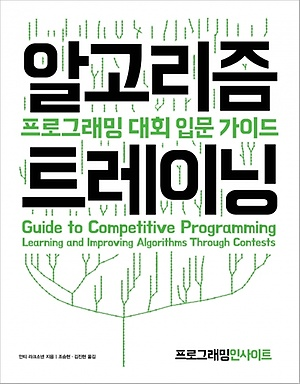

# 2020-09 1주차 - 기록 시작

예전에 유튜브를 봤습니다. `비전공자가 배민의 리드 개발자가 되기까지 ` 라는 유튜브 채널 EO의 컨텐츠였는데([링크](https://www.youtube.com/watch?v=V9AGvwPmnZU)),  거기에서 매일매일 3년동안 커밋을 끊기지 않고 했다는 것이 문득 기억이 나서,

저도 기억에 의존하기 보다는 나만의 지식 아카이브를 쌓아올려서 빠르게 쓸 수 있도록 하면 어떨까 하는 취지에서 TIL을 기록하기 시작했습니다. 나중에는 검색 엔진까지 달아서 필요한 내용들을 빠르게 검색할 수 있으면 좋겠습니다.

월~금은 쉬지 않고 그 날 배운 내용들을 TIL에서 정리할 생각이고, 토요일은 일주일 동안 배운 내용들을 정리하려고 합니다. 그리고 일요일은 쉽니다.

이번 주는 화요일부터 시작했기 때문에 완벽하게 5일을 다 채운 것은 아니지만,

그래도 첫 시작한 기록이니까 나름 의미가 있다고 생각합니다.ㅎㅎ

### Any.do(planner)

이번 주에는 가장 중요한 부분이 TIL과 더불어서, planner사용을 시작했습니다! Any.do라는 플래너인데, 무료 버젼도 충분히 사용할만합니다!

음 사실 플래너를 써야겠다고 생각한 이유는 여자친구가 하루에 얼마나 목표를 달성했는지 확인하는 걸 보고, 저도 해야되겠다고 생각했기 때문입니다. ㅎㅎㅎ (나란 따라쟁이..!!)

Any.do는 daily planning을 짜려고 시작했습니다. 하루의 목표를 설정하고, 얼마나 달성했는지를 보기 위해서..!!

그런데, Any.do가 생각보다 좋아서 구글 캘린더 연동이 돼서 daily planning말고 weekly, monthly planning도 할 수 있습니다 ㅎㅎ

저는 이번주에 사실 거의 목표한 바를 지키지 못 했습니다.

금요일에는

- MLIR 논문읽기
- React로 admin page의 (     ) 부분 구현
- XLA / tflite 써보기

이렇게 세 가지의 목표를 정했는데 하나도 지키지 못했습니다.

그래서 아쉽지만 조금씩 목표를 줄이고, 업무 속도를 빠르게 해야할 것 같습니다.

### 요즘 관심있는 것들

- 딥러닝 컴파일러
  - 딥러닝의 inference를 최적화 해서 빠른 실행 속도와 적은 저장 공간 차지 등을 하려면 결국 딥러닝 모델을 컴파일을 잘 하는 것이 핵심이라고 생각합니다.
- react의 적절한 코드 구조: 
- C++로 딥러닝 프레임워크 만들기
  - rulu라는 이름으로 side project를 시작했습니다 ㅎㅎㅎ 현재 상태는 convolution layer, pulling layer는 만들었지만 back propagation을 아직 구현하지 않았습니다. 뭔가 클래스가 짜임새 있게 만들어지지 않아서 구현하기가 조금 더딘 것 같습니다. 그래서 이 쯤에서 좀 이르긴 하지만 리팩토링을 진행하고 있습니다. 얼른 많은 기능들을 C++로 구현하고 싶습니다. 우선 첫 단추를 잘 꿰어야!!!

### 개발을 잘 한다는 것은 무엇인가?

- 코드 분석
- 프로그램 설계
- 구현
  - 논리력: 알고리즘으로 단련할 수 있음

오늘도 개발을 잘 한다는 것은 무엇인가를 고민하다가 역시 기본적인 논리력이 뒷받침 되어야, 복잡한 프로그램을 작성할 때 쉽게 작성할 수 있을 것이라 생각했습니다.

그래서 알고리즘 트레이닝(초록책)을 구매했습니다! ㅎㅎㅎ

현재 AI개발자로 있으면서, 어떻게 시간 분배를 해야할까는 고민중입니다.

지금 해야할 공부는 딥러닝, 알고리즘, 프론트엔드, dev-ops 이렇게 분산되어 있습니다. 이렇게 분산되어 있는 이유는 그냥 딱히 분야를 정하지 않고 재미있어 보이면 공부를 하고 있기 때문입니다. 좀 분야를 좁혀야 할 것 같기도 하지만, 아직은 딱히 그럴 이유가 없어서 그대로 잡캐로 무럭무럭 성장하고 있습니다 :D

알고리즘을 공부해서, top-coder에서 퍼플벨트정도 따는 것이 목표입니다 ㅎㅎㅎ

### github.io(https://noelbird.github.io/web/)

저의 github.io를 생성했습니다 ㅎㅎㅎ

앞으로 어떻게 발전할 지는 잘 모르겠지만, 일단 만들어놓고 꾸준히 관리하면 앞으로 어떤 방향이든 성장할 것이라 생각합니다.

현재 가지고 있는 생각은 markdown으로 글을 쉽게 쓸 수 있으면 좋겠고, github.io로 글을 쓰면 자동으로 커밋을 찍을 수 있으면 좋겠습니다.

본 받을만한 사이트는 velog.io 입니다. 여기에는 사람들의 글도 짜임새 있게 잘 쓴 글들이 많아서 자주 놀러가게 되고, markdown으로 깔끔하게 글을 쓰고 저장할 수 있습니다.

 