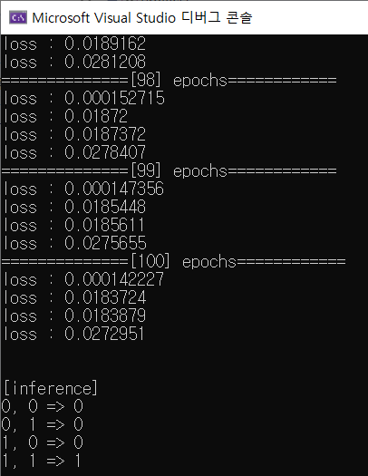

# AND/OR gate learning in C++(연습)


제 생각이 객체지향보다는 절차지향이 편했기 때문에,

엄격한 문법적 체크보다는, 빠른 로직 구현에 신경썼습니다.


### 학습 조건

- loss function: MSE(Mean Squared Error)
- batch size: 4
  - 예) AND gate의 경우
    - 거짓, 거짓 => 거짓
    - 거짓, 참 => 거짓
    - 참, 거짓 => 거짓
    - 참, 참 => 참
- learning rate: 1.0
- variable initializing method: random


### model structure


### 결과

AND 신호로 학습시





OR 신호로 학습시


### code

```c++
#include<iostream>
#include<vector>
#include<cstdio>
#include<cmath>

int main()
{
	std::vector<float> inputs;
	inputs.resize(2);

	std::vector<float> weights;
	weights.resize(2);

	float outputPredicted=0;

	float loss = 0;

	float bias = 0;

	float output = 0;

	float learningRate = 1.f;

	float dataset[4][3] = {
		{0, 0, 0},
		{0, 1, 1},
		{1, 0, 1},
		{1, 1, 1},
	};

	constexpr int INPUT_SIZE = 2;

	// initialize variables
	std::srand(0);
	for (auto& weight : weights)
	{
		weight = (float)std::rand() / RAND_MAX;
	}
	bias = (float)std::rand() / RAND_MAX;
	
	// train
	std::cout << "[train]" << std::endl;
	for (int epochs = 0; epochs < 100; ++epochs)
	{
		std::vector<float> weightsUpdate;
		weightsUpdate.resize(2);

		float biasUpdate = 0;
		std::cout << "==============[" << epochs + 1 << "] epochs============" << std::endl;
		for (const auto& data : dataset)
		{
			// forward

			// 1. 데이터 load
			inputs[0] = data[0];
			inputs[1] = data[1];
			output = data[2];

			// weigted sum
			float sum = 0;
			for (int i = 0; i < INPUT_SIZE; ++i)
			{
				sum += inputs[i] * weights[i];
			}
			sum += bias;

			std::vector<float> dSumWeights;
			dSumWeights.resize(2);
			dSumWeights[0] = inputs[0];
			dSumWeights[1] = inputs[1];

			float dSumBias = 1;

			// activate
			outputPredicted = 1.f / (1.f + exp(sum)); // sigmoid

			float dOutputPredictedSum = -1.f / pow(1.f + exp(sum), 2) * exp(sum);

			// calculate loss
			loss = 1.f / 2.f * pow(outputPredicted - output, 2); // mse

			float dLossOutputPredicted = outputPredicted - output;

			// print
			/*std::cout << "input&output : " << inputs[0] << ", " << inputs[1] << " => " << output << std::endl;
			std::cout << "FC layer : " << weights[0] << ", " << weights[1] << std::endl;
			std::cout << "  bias : " << bias << std::endl;
			std::cout << "output: " << output << ", predicted: " << (outputPredicted > 0.5f) << std::endl;*/
			std::cout << "loss : " << loss << std::endl;

			// backward
			for (int i = 0; i < weights.size(); ++i)
			{
				weightsUpdate[i] += dLossOutputPredicted * dOutputPredictedSum * dSumWeights[i];
			}
			biasUpdate += dLossOutputPredicted * dOutputPredictedSum * dSumBias;
		}
		for (int i = 0; i < weights.size(); ++i)
		{
			weights[i] -= learningRate*weightsUpdate[i];
		}
		bias -= learningRate*biasUpdate;
	}

	// inference
	std::cout << "\n\n[inference]" << std::endl;
	float sum = 0;
	float activated = 0;
	int predict = 0;

	inputs[0] = 0;
	inputs[1] = 0;

	sum = inputs[0] * weights[0] + inputs[1] * weights[1] + bias;
	
	activated = 1.f / (1.f + exp(sum));
	predict = activated > 0.5f;
	std::cout << inputs[0] << ", " << inputs[1] << " => " << predict << std::endl;

	inputs[0] = 0;
	inputs[1] = 1;

	sum = inputs[0] * weights[0] + inputs[1] * weights[1] + bias;

	activated = 1.f / (1.f + exp(sum));
	predict = activated > 0.5f;
	std::cout << inputs[0] << ", " << inputs[1] << " => " << predict << std::endl;

	inputs[0] = 1;
	inputs[1] = 0;

	sum = inputs[0] * weights[0] + inputs[1] * weights[1] + bias;

	activated = 1.f / (1.f + exp(sum));
	predict = activated > 0.5f;
	std::cout << inputs[0] << ", " << inputs[1] << " => " << predict << std::endl;
	
	inputs[0] = 1;
	inputs[1] = 1;

	sum = inputs[0] * weights[0] + inputs[1] * weights[1] + bias;

	activated = 1.f / (1.f + exp(sum));
	predict = activated > 0.5f;
	std::cout << inputs[0] << ", " << inputs[1] << " => " << predict << std::endl;

	return 0;
}
```


### insight

인자의 값들이 커질 수록, 예측값을 확신하게 됩니다.

예를 들어서, AND 게이트의 경우에

- weight0: -3
- weight1: -3
- bias: 5

위의 조건도 적절한 값들이지만, loss 값은 높습니다.

weighted sum값은 아래와 같습니다.

- 0, 0 => `-3*0-3*0+5=5`
- 1, 0 => `-3*1-3*0+5=2`
- 0, 1 => `-3*1-3*0+5=2`
- 1, 1 => `-3*1-3*1+5=-1`


즉, 위의 값에 따라서 sigmoid를 취하게 되고 그 값에 따라서 loss를 계산하게 되는데,

음수와 양수의 간격이 크지가 않습니다. 따라서 sigmoid한 후 loss를 계산해도 확신을 할 수 없는 것입니다.


반면에, weight들을 각각 -10만, bias를 15만으로 두게 된다면, loss값이 훨씬 줄어들게 됩니다.


얼핏 생각하기에 loss값이 줄어드니까 weight와 bias의 절대값이 커지는 것이 좋을 것 같지만,

이는 바람직하지 않습니다. 왜냐하면, 경계가 되는 `-3*x0 -3*x1+5=0 `의 경우와 `-30만*x0-30만*x1+50만=0`의 경우를

양함수인 `x1=-x0+5/3`으로 표시하면 결국 같기 때문입니다.


- 일반적인 방법대로 layer normalization 또는 batch normalization을 하거나
- 확신도? 라는 새로운 개념을 도입해서 얼마나 확신하고 있는지를 나타내는 지표를 둬도 좋겠습니다.
  - 예를 들어 `-3*x0-3*x1+5`를 크기와 단위벡터로 분리해서 표현하면, 확신에 대한 정보만 따로 추출할 수 있을 것 같습니다.
  - 그 크기를 확신도라고 불러도 괜찮을 것 같습니다.


### next time

다음 번에는 각 부분들을 클래스화, 함수화 시켜서 분리하고,

layer를 하나 더 넣어서 학습시킬 예정입니다.(shallow NN => deep NN)