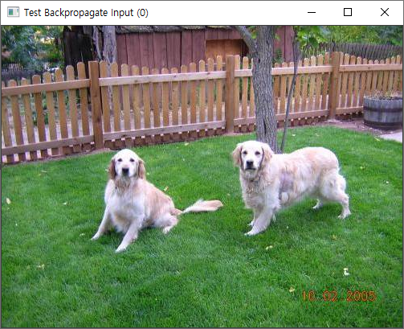

# yolo implementation in cpp


## 오늘의 기능 구현

오늘은 다음의 기능들을 구현했습니다.


- [x] normalize: 각 채널별로 normalize
  
    1. 각 채널별로 최소값, 최댓값을 찾기

    2. 예외 처리: 만약 채널 i 에 대한 val값이 0에 매우 근접한 값이라면, max_i, min_i는 각각 1, 0 으로 둬서 발산에 대한 예외 처리를 함

    $$
    val_i = max_i - min_i
    $$

    3. 각 pixel 값들에 대해서 normalize(a:  각 픽셀의 index를 의미. a는 한장의 사진에서 모든 점들을 순회 후 다음 channel로 움직입니다. j는 채널)
  $$
     data_a = \frac{(data_a - min_j)}{(max_j-min_j)}
$$
  
- [x] 이미지 복사
- [x] 이미지 메모리 할당
- [x] 이미지 0으로 초기화
- [x] 이미지 보여주기
- [x] 하나의 픽셀 가져오기


원본 멍뭉이들



normalize한 멍뭉이들


normalize하지 않은 멍뭉이들(흑화했따..)

위의 보라색이 지배적인 이미지는 저장하는 data type이 double 형이고 각 채널의 픽셀 값이 0~1까지만 표현할 수 있음에도 불구하고,

255까지의 값을 가짐으로써 잘못된 값 표현이 된 것입니다.


## 궁금한 점

- **integer overflow 가능성..?**


위와 같이 image에서 계산을 할 때, _h, _w, _c는 모두 integer type이라고 하면 계산 도중에 integer overflow가 일어나고 new operator에 음수가 들어갈 수 있습니다. 이 것을 효과적으로 처리하는 방법은 무엇일까요...?

=> 그냥 넘지 않도록 if문 몇 개 추가...?


- **array vs container**

두 가지 방법 중에서 array가 물론 속도가 더 빠르겠지만, 어떤 방법이 더 유연하게 코드 구조를 설계할 수 있는 걸까요...?

또한, modern C++방법에서는 auto 키워드를 적절하게 사용하는 것이 미덕일까요..?

=== "array"

    ```c
    void Image::normalize()
    {
        double* min = new double[_c];
        double* max = new double[_c];
        int i, j;
        for (i = 0; i < _c; ++i) min[i] = max[i] = _data[i * _h * _w];
    ```

=== "container"

    ```c++
    void Image::normalize()
    {
        vector<double> min(_c);
        vector<double> max(_c);
        int i, j;
        for (i = 0; i < _c; ++i) min[i] = max[i] = _data[i * _h * _w];
    ```


## 코드 history

[github 링크](https://github.com/NoelBird/dorai/commit/0ba567c2fb2186d36cfc51409540ec7d34dddfde)