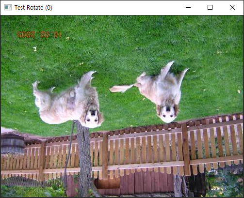

# convolve 연산까지

<br/>

## 오늘의 구현된 기능들

오늘 구현한 부분은 다음과 같습니다.

- [x] 레이어 별로 보여주기

  

  <center>Fig1. channel(layer) 분리한 경우의 이미지</center>

  

- [x] 업 샘플링(=확대 기능): 이 기능은 단순히 이미지를 확대하는 기능입니다. 이미지가 커짐에 따라서, 주변 점들을 참조해서 채워 넣지는 않고, 기본 색인 검정색으로 채워넣었습니다.

  

  <center>Fig2. 원본 멍뭉이 사진</center>

  

<center>Fig3. 업샘플링된 멍뭉이 사진</center>

- [x] 이미지 상하반전: 499(width)x375(height)x3(channels)의 이미지를 대략 천 번 정도 상하반전 시키는데, 2.3초 정도 걸렸습니다. 한 번 정도 뒤집는데, 2.3 milliseconds가 소요됩니다.




- [x] 랜덤 색상을 가진 이미지 생성: 위의 이미지에서 처럼, 3x3 랜덤이미지라고 하면, 위와 같은 랜덤 색상을 부여해서 이미지를 생성합니다.

<br/><br/>

## 오늘 잡은 버그들

오늘 잡은 버그는 다음과 같습니다.

- [x] 딥카피 문제: Image 클래스의 show 함수에서, 이미지를 보여주려면 1) 원본 이미지를 카피 후, 2) normalize 해서 보여줘야 합니다. 이 과정에서 deep copy가 이루어지지 않아서 여러 번 연산 하는 경우 문제가 있었습니다. 이것을 Image 클래스의 복사생성자에서 deep copy를 하도록 변경했습니다.


=== "shallow copy"

    ```c++
    class Image {
    public:
        Image(Image& p): _h(p._h), _w(p._w), _c(p._c), _data(p._data) {
        };
    ```

=== "deep copy"

    ```c++
    class Image {
    public:
        Image(Image& p): _h(p._h), _w(p._w), _c(p._c), _data(nullptr) {
    		    // TODO: 이런 식으로 index를 쓰는게 맞나..? 고치기
                _data = new double[(long long)_h * _w * _c];
                memcpy(_data, p._data, (long long)_h * _w * _c * sizeof(double));
        };
    ```


<br/>

<br/>

## 생각할 거리들

1. **memcpy를 할 때, data의 사이즈를 고려할 것**
    - 위의 ` memcpy(_data, p._data, (long long)_h * _w * _c * sizeof(double));`이 코드에서, `sizeof(double)`을 쓰지 않아서, 화면이 화면이 나왔습니다. 꼭 width, height, channels, 데이터 타입의 사이즈 를 고려해서 메모리 복사를 하는 것이 좋습니다.
2. **depth vs channel**: depth라고 하는 표현들이 코드에 한 번씩 나오는데, 이는 사실 **color depth**를 나타낸 것입니다. color depth는 컬러를 표현 하는데, 몇 비트를 사용해서 표현할 것일 지에 대한 것입니다.
    - 예를 들어서, 0~255 사이의 정수값을 이용해서 표현하는 것이면, 이는 8비트를 사용하는 것입니다.따라서 depth는 8입니다. 채널(=레이어)은 rgb, bgr, cmyk 처럼 어떻게 색을 분리해서 표현할 지에 대한 것입니다.

3. **integer overflow**
    - 오늘 버그를 고치면서 integer overflow 때문에 `(long long)_h * _w * _c`처럼 (long long)으로 타입 캐스팅을 했습니다. 또한, [day01](../02/)에서도 같은 고민을 했었습니다. 오늘 생각 해보니, unsigned int형식은 32비트를 사용할 수 있고, 이것은 536MB만큼을 표현할 수 있는데, 이미지의 크기는 일반적으로 500MB를 넘기가 힘드니까 예외값이 들어오지 않도록 처리하는 것이 좀 더 낫지 않나 하는 생각이 들었습니다.


## code history

[내 github 링크](https://github.com/NoelBird/dorai/commit/fcb7c4c59b8efd2810d7beac39f8598cddfb8309)


darknet의 First Commit을 C++로 변환하는 작업 중(50%)입니다.


tests.c 파일에서 8개의 함수 중에서 4개의 함수를 앞으로 더 구현해야 합니다.

```c
test_backpropagate();
test_convolve();
//test_upsample();
//test_rotate();
//test_load();
test_network();
test_convolutional_layer();
//test_color();
```

convolve => convolutional_layer => backpropagate => network 순으로 작업할 생각입니다.