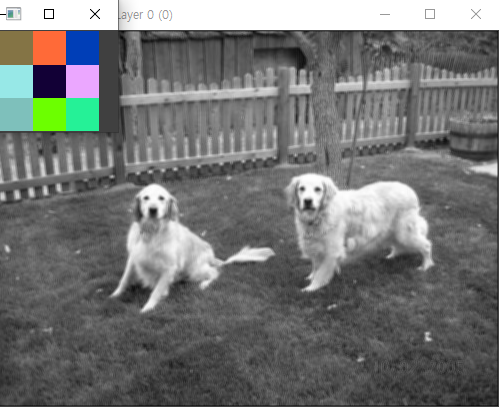

# convolution


## 오늘 한 작업: convolution

원래 yolo에서는 random한 kernel(3 x 3 matrix)을 만들 때, random seed를 주지 않았지만,

제대로 동작하는지 확인하기 위해서 제 코드에서는 random seed를 주면서 확인했습니다.





random 이라서 잘 알려진 filter(=kernel)들은 나타나지 않았습니다만, 아랫쪽 이미지에서는 풀의 색깔이 좀 연해보이고, 왼쪽 강아지 아래의 그림자도 좀 더 옅은 것 같습니다.

하지만, 위의 이미지들의 경우에는 큰 변화는 나타나지 않습니다.

이유는 RGB 세개의 채널 중에서 R 채널에만 kernel을 적용했기 때문입니다.

세 개의 채널 전부에 임의의 값을 아래와 같이 준다면, 확실하게 필터의 효과가 나타납니다.


## sobel filter를 준 경우

경계선 검출 필터 중 하나인 sobel filter를 줬습니다.
$$
G_y = \begin{bmatrix}-1 & 0 & 1\\-2 & 0 & 2 \\ -1 & 0 & 1\end{bmatrix}
$$


```c++
Image* kernel = new Image();
kernel->makeRandomImage(3, 3, dog->getChannel());
for (int i = 0; i < 3; i++) {
    kernel->setPixel(0, 0, i, -1); // setPixel(x, y, channel, value)
    kernel->setPixel(0, 1, i, 0);
    kernel->setPixel(0, 2, i, 1);
    kernel->setPixel(1, 0, i, -2);
    kernel->setPixel(1, 1, i, 0);
    kernel->setPixel(1, 2, i, 2);
    kernel->setPixel(2, 0, i, -1);
    kernel->setPixel(2, 1, i, 0);
    kernel->setPixel(2, 2, i, 1);
}
```


## 링크

오늘까지 작업한 커밋 [github](https://github.com/NoelBird/dorai/commit/35c2c505e85e000a346c5900505add5658fdc3e4)

