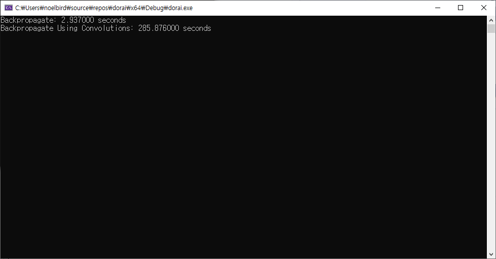
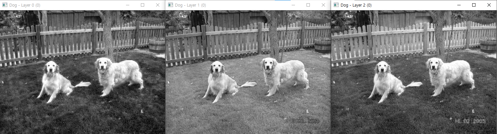
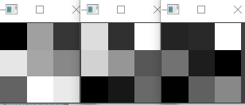
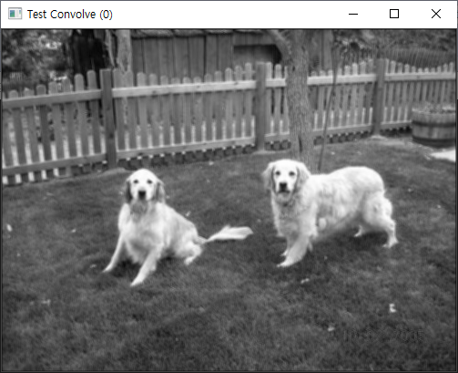
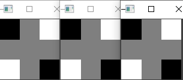
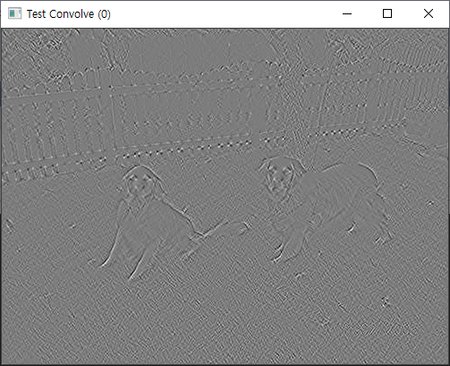
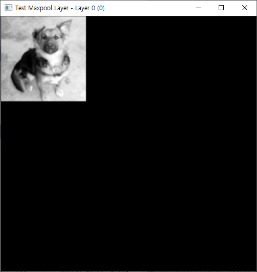

# backpropagate


## 오늘 한 일

- [x] backpropage 구현

  

- [x] yolo의 first commit 따라하기

=== "first commit에 구현된 기능"

    ```c++
    int main()
    { 
        test_load();
        test_color();
        test_upsample();
        test_rotate();
        test_convolve();
        test_convolutional_layer();
        test_network();
        test_backpropagate();
        cv::waitKey(0);
    
        return 0;
    }
    ```

- [x] ConvolutionalLayer에 초기화 오류 수정


## Yolo First Commit

이번 컨텐츠까지의 내용이 Yolo의 First Commit에 해당되는 내용이었습니다.

위의 함수들을 다시 되돌려 보면

### 1. 레이어 별로 화면 표시 테스트


### 2. 컬러 테스트

원본 이미지


각 채널 별 이미지


### 3. upsampling

화면이 좀 어둡게 보이는 것은

픽셀들 간의 거리를 멀게 했을 뿐, 멀어진 거리 안을 채우는 방법을 사용하지 않았기 때문입니다.

멀어진 픽셀들 사이를 채우는 방법은 대표적으로 bi-linear interpolation, cubic interpolation 등이 있습니다.


### 4. rotation

90도로 뒤집는 연산입니다.


### 5. convolution 연산

원본 이미지


각 레이어별 이미지




적용할 kernel(3x3, 3채널)



after(크게 티는 안 나는데, 좀 흐려진 것 같습니다.)




second order edge detection filter를 세 채널에 동일하게 적용






### 6. max pool layer



### 7. network 구성

별도의 이미지는 없습니다.

### 8. backpropage

별도의 이미지는 없습니다.


이렇게 여덟 가지의 기능이 있습니다.

이제 2013년 11월 5일까지 따라왔네요!

