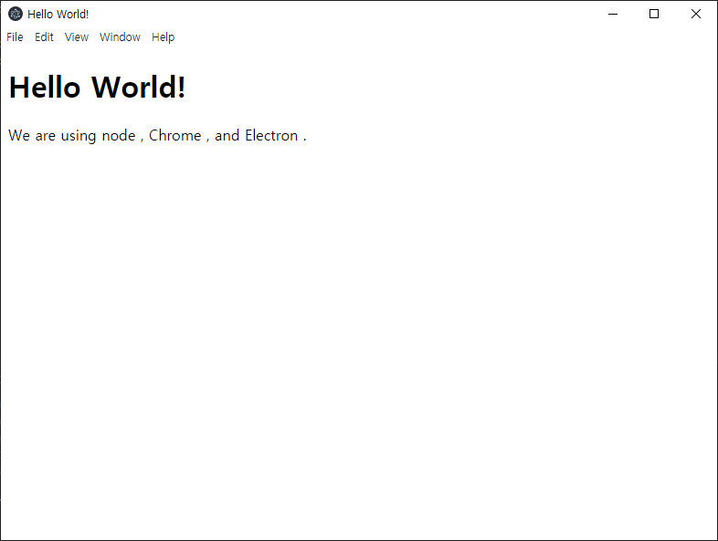

# electron 쉽게 시작하기


## 1. 준비

언어: nodejs (저는 v14.16을 사용했습니다)

패키지 매니저: yarn


## 2. 코딩

electron 설치

```bash
mkdir electron_app
cd electron_app
yarn init
yarn add electron@beta
```


폴더 구조

```
electron_app
- index.html
- main.js
- package.json
- node_modules
```


```html
<!-- index.html -->
<!DOCTYPE html>
<html>
<head>
    <meta charset="UTF-8">
    <title>Hello World!</title>
    <meta http-equiv="Content-Security-Policy" content="script-src 'self' 'unsafe-inline';" />
</head>
<body style="background: white;">
    <h1>Hello World!</h1>
    <p>
        We are using node <script>document.write(process.versions.node)</script>,
        Chrome <script>document.write(process.versions.chrome)</script>,
        and Electron <script>document.write(process.versions.electron)</script>.
    </p>
</body>
</html>
```


```javascript
// main.js
const { app, BrowserWindow } = require('electron')

function createWindow () {
  const win = new BrowserWindow({
    width: 800,
    height: 600,
    webPreferences: {
      nodeIntegration: true
    }
  })

  win.loadFile('index.html')
}

app.whenReady().then(createWindow)

app.on('window-all-closed', () => {
  if (process.platform !== 'darwin') {
    app.quit()
  }
})

app.on('activate', () => {
  if (BrowserWindow.getAllWindows().length === 0) {
    createWindow()
  }
})

```


특징으로는 electron의 javascript는 ES6문법이 아닌 ES5문법을 사용한다는 점이었습니다.

react를 올리려고 한다면, babel에 webpack을 설치해서 변환을 하는 과정이 필요할 것 같습니다.

이벤트 리스너 같은 것들을 사용해서 특정 키워드들에 대해서 함수를 정의한 코드인듯 보입니다.


## 3. 실행

```json
// package.json
{
  "devDependencies": {
    "electron": "^13.0.0-beta.3"
  },
  "name": "electron_app",
  "version": "1.0.0",
  "main": "main.js",
  "license": "MIT",
  "scripts": {
    "start": "electron ."
  }
}
```


`yarn start`

결과는 다음과 같습니다.

