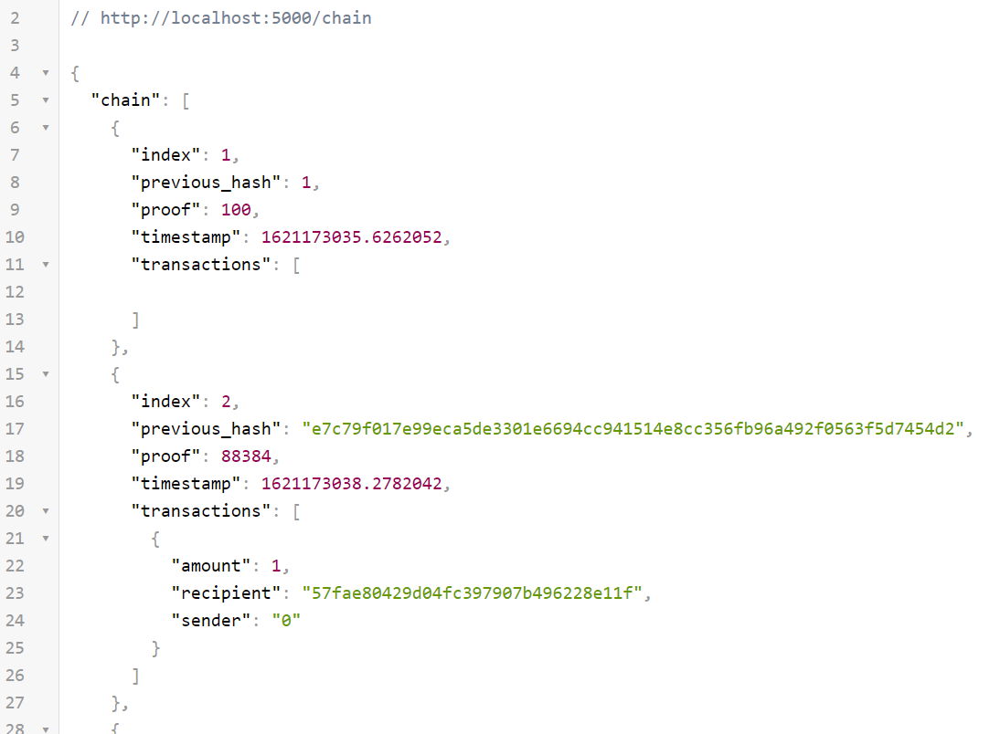
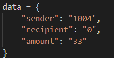

# block-chain 구현


## 오늘의 결과물

연결된 체인을 json 형식으로 확인할 수 있었습니다.

- chain: block chain의 내용을 확인



- mine: "0"(운영자)가 채굴하려는 사람에게 1개의 block을 나눠줍니다.


- transaction: sender와 recipient 사이의 거래를 기록합니다.

  


참고한 유튜브: https://www.youtube.com/watch?v=Gno15LgVbcc

참고한 소스코드: https://github.com/tr0y-kim/ez_blockchain/blob/master/blockchain.py


## 목차

1. blockchain.py
   2. 뼈대 만들기
   2. Blockchain 클래스 생성자
   3. new_block 함수
   4. new_transaction 함수
   5. hash 함수
   6. PoW 함수
   7. valid_proof 함수
2. server.py
   1. `/chain` endpoint
   2. `/transaction/new` endpoint
   3. `/mine` endpoint
3. test_new_transaction.py
4. 실행방법


## 1. blockchain.py

### 1.1. 뼈대 만들기

=== "blockchain.py"

    ```python
    class Blockchain(object):
        def __init__(self):
            self.chain = []
            self.current_transactions = []
    
        def new_block(self):
            # Creates a new Block and adds it to the chain
            pass
    
        def new_transaction(self):
            # Adds a new transaction to the list of transaction
            pass
    
        @staticmethod
        def hash(block):
            # Hashes a Block
            pass
    
        @property
        def last_block(self):
            # Returns the last Block in the chain
            pass
    ```


### 1.2. Blockchain class 생성자

```python
def __init__(self):
    self.chain = [] # chain에 여러 block들 들어옴
    self.current_transaction = [] # 임시 transaction 넣어줌

    # genesis block 생성
    self.new_block(previous_hash=1, proof=100)
```


### 1.3. new_block 함수

```python
def new_block(self, proof, previous_hash=None):
    # Creates a new Block and adds it to the chain
    block = {
        'index' : len(self.chain)+1,
        'timestamp' : time(), # timestamp from 1970
        'transactions' : self.current_transaction,
        'proof' : proof,
        'previous_hash' : previous_hash or self.hash(self.chain[-1]),
    }
    self.current_transaction = []
    self.chain.append(block)
    return block
```


### 1.4. new_transaction 함수

```python
def new_transaction(self, sender, recipient, amount):
    # Adds a new transaction to the list of transaction
    self.current_transaction.append(
        {
            'sender' : sender, # 송신자
            'recipient' : recipient, # 수신자
            'amount' : amount # 금액
        }
    )
    return self.last_block['index'] + 1
```


### 1.5. hash 함수

```python
@staticmethod
def hash(block):
    # Hashes a Block
    block_string = json.dumps(block, sort_keys=True).encode()

    # hash 라이브러리로 sha256 사용
    return hashlib.sha256(block_string).hexdigest()
```


### 1.6. pow(proof of work) 함수

```python
def pow(self, last_proof):
    proof = 0
    # valid proof 함수를 통해 맞을 때까지 반복적으로 검증
    while self.valid_proof(last_proof, proof) is False:
        proof += 1

    return proof
```


### 1.7. valid_proof 함수

```python
@staticmethod
def valid_proof(last_proof, proof):
    # 전 proof와 구할 proof 문자열 연결
    guess = str(last_proof + proof).encode()
    # 이 hash 값 저장
    guess_hash = hashlib.sha256(guess).hexdigest()
    # 앞 4자리가 0000 이면 True
    return guess_hash[:4] == "0000" # nonce
```


## 2. server.py

=== "server.py"

    ```python
    # /chain: 현재 블록체인 보여줌
    # /transaction/new: 새 트랜잭션 생성
    # /mine: server에게 새 블록 채굴 요청
    from flask import Flask, jsonify, request
    from blockchain import Blockchain
    from uuid import uuid4
    
    app = Flask(__name__)
    # Universial Unique Identifier
    node_identifider = str(uuid4()).replace("-", "")
    
    blockchain = Blockchain()
    
    @app.route("/chain", methods=["GET"])
    def full_chain():
        response = {
            "chain": blockchain.chain,
            "length": len(blockchain.chain),
        }
        return jsonify(response), 200
    
    @app.route("/mine", methods=["GET"])
    def mine():
        last_block = blockchain.last_block
        last_proof = last_block["proof"]
    
        proof = blockchain.pow(last_proof)
    
        blockchain.new_transaction(
            sender="0",
            recipient=node_identifider,
            amount=1 # coinbase transaction
        )
        # forge the new block by adding it to the chain
        previous_hash = blockchain.hash(last_block)
        block = blockchain.new_block(proof, previous_hash)
    
        response = {
            "message": "new block found",
            "index": block["index"],
            "transactions": block["transactions"],
            "proof": block["proof"],
            "previous_hash": block["previous_hash"],
        }
    
        return response, 200
    
    @app.route("/transactions/new", methods=["POST"])
    def new_transactions():
        values = request.get_json()
    
        required = ["sender", "recipient", "amount"]
        if not all(k in values for k in required):
            return "missing values", 400
    
        # Create a new Transaction
        index = blockchain.new_transaction(values["sender"], values["recipient"], values["amount"])
        response = {"message": "Transaction will be added to Block {%s}" % index}
    
        return jsonify(response), 201
    
    if __name__ == "__main__":
        app.run(host="0.0.0.0", port=5000)
    ```


## 3. test_new_transaction.py


=== "test_new_transaction.py"

    ```python
    import requests
    import json
    
    headers = {'Content-Type': 'application/json; charset=utf-8'}
    data = {
        "sender": "1004",
        "recipient": "0",
        "amount": "33"
    }
    print(requests.post("http://localhost:5000/transactions/new", headers=headers, data=json.dumps(data)).content)
    ```


## 4. 실행

```bash
python server.py
```

### 4.1. chain

browser에서 http://localhost:5000/chain 접속

### 4.2. mine

browser에서 http://localhost:5000/mine 접속

### 4.3. transaction

post 형식으로 데이터를 입력해야 하므로

새 terminal에서 아래의 명령어 실행

```bash
python test_new_transaction.py
```

