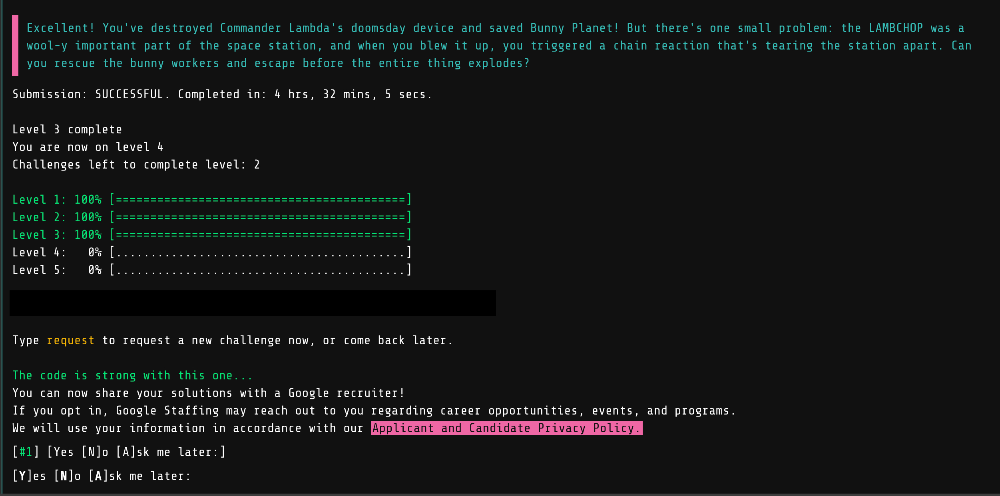

# Algorithm challenges

After work, I recently solved some computer algorithm problems

I passed facebook hackercup qualification round and

Google foobar challenge level3.

I think that fast and dirty solving method is good starting point.

And writing something down to the paper makes the problem more clear.

