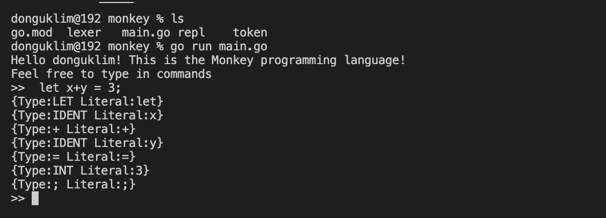

# day 02: LEXING(2) - REPL

(아직 parser가 없어서 해당 명령을 실행하지는 못 합니다.)

REPL은 Read, Eval, Print, Loop의 약어입니다.

오늘 작업한 내용

- Lexer
  - 한 글자 짜리 operator(예를 들어, =, -, + 등)를 추가했고, 두 글자 짜리 operator(!=, == 등)을 추가했습니다.
  - 여러 글자 짜리 operator를 식별할 때는 peekChar()라는 함수를 사용해서, 다음 한글자를 계속 확인하면서 반복해서 character를 읽는 방식입니다.
  - 토큰을 만들 때는 lexer가 한글자를 읽어보고 특수문자이면 해당 operator로 연결을 하고, 특수문자가 아니면 여러 글자를 읽어서 글자 처리를 합니다. keywords map에 들어있는 문자열이면 keyword로 처리되고, 없으면 식별자로 처리됩니다.

- REPR
  - REPR은 토큰 하나씩을 가져와서 프린트하는 구조로 되어 있습니다.
  - parser가 추가되면 AST(Abstract Syntax Tree)로 전달해서 실행할 예정입니다.
  - AST가 추상구문트리인 이유는 SEMICOLON, 괄호 등을 제거하고 실질적으로 동작에 필요한 것들만 추상화 해서 넣을 수 있기 때문입니다.

렉싱 끝

다음 : 파서(Parser)