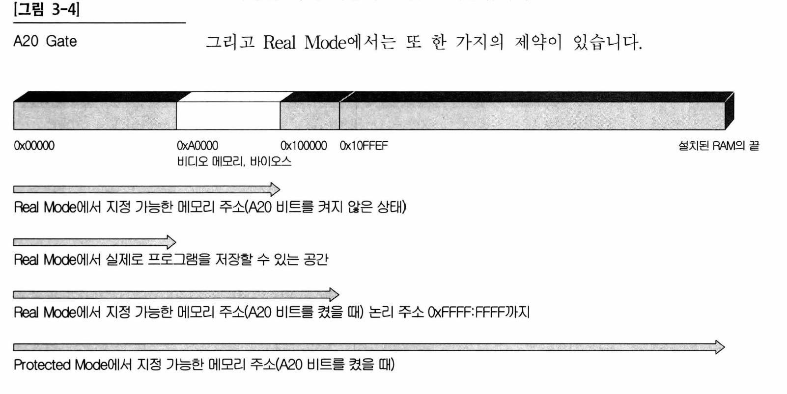

# day 03: protected mode 진입하기


## 오늘 만든 결과물


## 코드

```assembly
[org 0]
[bits 16]

start:
    mov ax, cs              ; CS에는 0x1000이 들어 있습니다.
    mov ds, ax

    xor ax, ax
    mov ss, ax

    cli                     ; EFLAGS 레지스터의 IF(interrupt flag)를 0으로 clear <=> sti: IF비트를 1로 set. inturrupt 활성화

    lgdt[gdtr]              ; gdtr 포인터에 따라서 gdt를 등록시키는 명령어

    mov eax, cr0
    or eax, 0x00000001
    mov cr0, eax

    jmp $+2                 ; 왜 이부분에서 jmp $+2 를 하지..? nop을 2개 쓰고..?
    nop
    nop
    db 0x66                 ; 0x66, 0x67, 0xEA는 잘 gdt가 등록 되었다는 의미인지..?
    db 0x67
    db 0xEA
    dd PM_Start             ; 여기로 점프..?
    dw SysCodeSelector      ; 이 GDT를 사용해서....?

;--------------------------------------------;
;********* 여기부터 Protected Mode입니다. ****;
;--------------------------------------------;
[bits 32]

PM_Start:
    mov bx, SysDataSelector
    mov ds, bx
    mov es, bx
    mov fs, bx
    mov gs, bx
    mov ss, bx

    xor eax, eax
    mov ax, VideoSelector
    mov es, ax
    mov edi, 80*2*10+2*10
    lea esi, [ds:msgPMode]
    call printf

    jmp $

;--------------------------------------------;
;************** Sub Routines ****************;
;--------------------------------------------;
printf:
    push eax

printf_loop:
    or al, al
    jz printf_end
    mov al, byte [esi]
    mov byte [es:edi], al
    inc edi
    mov byte [es:edi], 0x06
    inc esi
    inc edi
    jmp printf_loop

printf_end:
    pop eax
    ret

msgPMode db "We are in Protected Mode", 0

;-----------------------------------------;
;************** GDT Table ****************;
;-----------------------------------------;
gdtr:
    dw gdt_end - gdt - 1    ; GDT의 limit
    dd gdt+0x010000          ; GDT의 베이스 어드레스

gdt:
    dw 0                    ; limit 0 ~ 15비트
    dw 0                    ; 베이스 어드레스의 하위 두 바이트
    db 0                    ; 베이스 어드레스 16~32비트
    db 0                    ; 타입
    db 0                    ; limit 16~19비트, 플래그
    db 0                    ; 베이스 어드레스 32~24비트

; 코드 세그먼트 디스크립터
SysCodeSelector equ 0x08
    dw 0xFFFF               ; limit:0xFFFF
    dw 0x0000               ; base 0~15bit
    db 0x01                 ; base 16~32bit
    db 0x9A                 ; P:1, DPL:0, Code, non-conforming, readable
    db 0xCF                 ; G:1, D:1, limit 16~19 bit:0xF
    db 0x00                 ; base 24~32 bit

; 데이터 세그먼트 디스크립터
SysDataSelector equ 0x10
    dw 0xFFFF               ; limit 0xFFFF
    dw 0x0000               ; base 0~15 bit
    db 0x01                 ; base 16~23 bit
    db 0x92                 ; P:1, DPL: 0, data, expand-up, writable
    db 0xCF                 ; G:1, D:1, limit 16~19 bit:0xF
    db 0x00                 ; base 24~32 bit

; 비디오 세그먼트 디스크립터
VideoSelector equ 0x18
    dw 0xFFFF               ; limit 0xFFFF
    dw 0x8000               ; base 0~15 bit
    db 0x0B                 ; base 16~23 bit
    db 0x92                 ; P:1, DPL:0, data, expand-up, writable
    db 0x40                 ; G:0, D:1, limit 16~19 bit:0
    db 0x00                 ; base 24~32 bit
gdt_end:
```


## GDTR의 정의

> GDTR: The Global Descriptor Table (GDT) is a table in memory that defines the processor's memory segments. The GDT sets the behavior of the segment registers and helps to ensure that protected mode operates smoothly.

GDTR은 메모리 상에 존재하며, processor의 메모리 세그먼트를 정의하는 테이블입니다. GDT는 세그먼트 레지스터의 동작을 세팅하고 protected mode가 잘 동작하도록 보장합니다.


- GDT는 x86 칩에 들어있는 GDT Register(=GDTR)라는 특수한 레지스터에 의해 지정됩니다(GDT is pointed by ...). GDTR은 48비트로 구성되며 하위 16비트는 GDT의 size에 대해 기술하며, 상위 32비트는 GDT의 메모리 상의 위치를 기술합니다.

- GDTR의 layout

  ```
  |LIMIT|----BASE----|
  ```

  LIMIT: GDT의 사이즈

  BASE: GDT의 시작 주소

  > LIMIT의 사이즈는 GDT의 사이즈보다 1이 작습니다. 예를 들어서 GDT의 사이즈가 16 byte라면, LIMIT은 15로 지정되어야 합니다.

  (https://en.wikibooks.org/wiki/X86_Assembly/Global_Descriptor_Table)

- GDT의 layout

  

위의 Base Address, Limit, 속성을 나타내는 것을 Descriptor라고 부르고, 그것이 모여있기 때문에 `GDT-디스크립터 테이블` 이라고 부릅니다.


- GDT의 설명

  - **Limit**: 총 20비트로 구성(0~15, 16~19비트가 나뉘어져 있음). G비트와 함께 사용됩니다.

  - **DPL(Descriptor Priviledge):** 2비트로 되어 있으며, 특권 레벨 지정에 사용됩니다. 인텔 x86계열 CPU에서는 0~3의 값으로 4가지의 레벨이 있으나, 보통의 경우 커널을 제작할 때에는 0과 3레벨만 사용합니다. DPL값이 0이면 이 세그먼트가 커널 레벨이라는 것을 나타내고, 3이면 이 세그먼트가 유저레벨이라는 것을 나타냅니다.

  - **Type:** 4비트로 구성되어 있습니다. 해당 영역이 코드인지, 데이터 영역인지  + 읽기/쓰기 권한, 실행 권한에 대한 정보가 들어갑니다.

    

    - Type Field의 최상위비트는 데이터 세그먼트인지 코드 세그먼트인지를 구분합니다.
    - Type Field의 마지막 비트는 액세스 비트인데, 어떤 프로그램이 이 세그먼트에 접근했을 때 CPU가 이곳을 찾아서 A비트를 1로 바꿔줍니다. 그러나 CPU는 이 비트를 0으로 클리어 해주지는 않습니다. 커널은 메모리 관리를 할 때 이 비트가 1이 되었는지를 조사하거나, 액세스된 세그먼트의 디스크립터를 찾아 이 A비트를 어느 시간이 지나면 0으로 하거나 하는 일을 합니다.
    - Type Field의 두 번째 비트는 최상위 비트에 따라서 다르게 결정됩니다. 데이터 세그먼트(첫 번째 비트가 0인 경우)에서는 두 번째 비트가 1이면 EXPAND DOWN의 형태로 이 세그먼트가 형성된 것을 의미합니다. 두 번째 비트가 0이면 EXPAND UP 방식으로 세그먼트가 형성된 것을 의미합니다. 이 기능은 이 세그먼트를 스택으로 사용할 경우 세그먼트의 크기가 동적으로 변하도록 만들기 위함입니다. 이 비트를 1로 세팅하고 프로그램 실행 도중에 이 세그먼트의 Limit값을 바꾸면 스택의 제일 밑의 공간에 스택 공간이 추가됩니다.

  - **G비트:** Limit과 관련되어 있습니다. G비트가 0이면 세그먼트 크기를 바이트단위, 1이면 4KB단위로 합니다. 즉 0이면 Limit 그대로 표현되고, 1인 경우에는 0xFFF(4KB)를 곱하여 그 수를 한계점으로 표현합니다.

    - Limit의 20비트를 모두 채워서 0xFFFFF를 기재해 두었을 때, G가 0이면 크기는 1메가바이트, G가 1이면 0xFFFFF * 0xFFF = 0xFFFFFFFFFF바이트가 되어 4GB 영역을 갖게 됩니다.

  - **P비트:** 이 세그먼트가 메모리상에 존재하는지를 나타내는 값입니다. 이 비트는 커널 프로그램의 메모리 관리 루틴이 사용합니다. 페이징 기능과 관련이 있습니다. 처음에는 1로 기재해 둡니다.

  - **S비트:** 이 세그먼트가 시스템 세그먼트인지(=0), 코드 혹은 데이터 세그먼트인지(=1)를 지정합니다. 항상 1로 해줍니다.

  - TODO: 이 부분 작성 중..


## A20 gate

> A20 gate를 지정하게 되면, 0x100000 이상의 주소를 지정할 수 있습니다.


Real Mode에서는 최대한 지정할 수 있는 메모리 주소는

0xFFFF:0xFFFF = 0xFFFF0 + FFFF = 0x10FFEF가 됩니다.

따라서 0x10FFEF까지 밖에 메모리 지정을 못 하는데,

심지어 0x0A0000주소 보다 큰 주소는 비디오 메모리, 바이오스에 의해 예약된 메모리 공간입니다.

A20 gate를 지정하게 되면, 0x100000(640KB) 이상의 주소를 지정할 수 있습니다.

여기에 Protected Mode+ A20 비트를 키게 되면 4GB까지 메모리에 접근할 수 있습니다.




## Protected Mode 진입

Protected Mode에 진입하기 위해서는 Real Mode => Protected Mode 진입을 하기 전에 GDT(Global Descriptor Table)이라는 테이블을 준비해야 합니다. RAM의 영역 중 어디든지 기입할 수 있습니다. 이렇게 기입해 놓은 테이블은 Protected Mode로 변환 후에 컴퓨터의 전원이 내려질 때까지 그 자리에 있어야 합니다.


