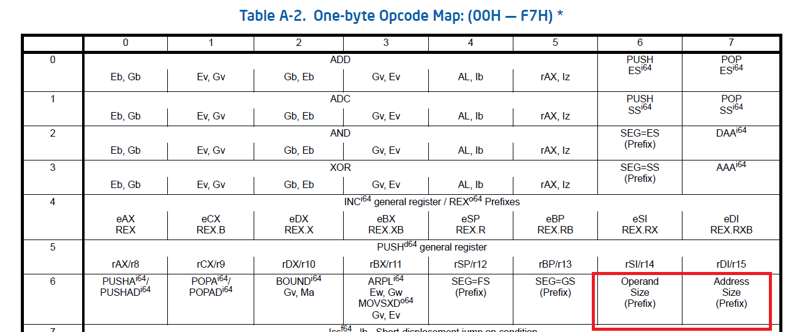

# day 04: protected mode 진입하기(2)


## 오늘의 결과물


(이미지 상으로는 day03과 다를 바가 없지만, 코드가 좀 더 간결해졌습니다.)


## 소스코드

```assembly
; init.inc
SysCodeSelector     equ 0x08
SysDataSelector     equ 0x10
VideoSelector       equ 0x18
```

```assembly
; boot2.asm
%include "src/init.inc"

[org 0]
    jmp 07C0h:start

start:
    mov ax, cs
    mov ds, ax
    mov es, ax

    mov ax, 0xB800
    mov es, ax
    mov di, 0
    mov ax, word [msgBack]
    mov cx, 0x7FF

paint:
    mov word [es:di], ax
    add di, 2
    dec cx
    jnz paint

read:
    mov ax, 0x1000
    mov es, ax
    mov bx, 0

    mov ah, 2
    mov al, 1
    mov ch, 0
    mov cl, 2
    mov dh, 0
    mov dl, 0
    int 13h

    jc read
    
    cli

    lgdt[gdtr]

    mov eax, cr0
    or eax, 0x00000001
    mov cr0, eax

    jmp $+2
    nop
    nop

    mov bx, SysDataSelector
    mov ds, bx
    mov es, bx
    mov fs, bx
    mov gs, bx
    mov ss, bx

    jmp dword SysCodeSelector:0x010000

    msgBack db '.', 0x67

gdtr:
    dw gdt_end - gdt - 1    ; GDT의 limit
    dd gdt+0x7C00           ; GDT의 베이스 어드레스

gdt:
    dd 0, 0
    dd 0x0000FFFF, 0x00CF9A00
    dd 0x0000FFFF, 0x00CF9200
    dd 0x8000FFFF, 0x0040920B
gdt_end:

times 510-($-$$) db 0
dw 0AA55h
```

```assembly
; kernel2.asm
%include "src/init.inc"

[org 0x010000]
[bits 32]

PM_Start:
    mov bx, SysDataSelector
    mov ds, bx
    mov es, bx
    mov fs, bx
    mov gs, bx
    mov ss, bx

    xor eax, eax
    mov ax, VideoSelector
    mov es, ax
    mov edi, 80*2*10+2*10
    lea esi, [msgPMode]
    call printf

    jmp $

printf:
    push eax

printf_loop:
    or al, al
    jz printf_end
    mov al, byte [esi]
    mov byte [es:edi], al
    inc edi
    mov byte[es:edi], 0x06
    inc esi
    inc edi
    jmp printf_loop

printf_end:
    pop eax
    ret

msgPMode db "We are in Protected Mode", 0
```


## protected mode의 주소 지정 방법


Real Mode에서 CS, DS등 세그먼트 레지스터가 16의 한 워드로 구성되어 있었습니다.

Protected Mode에서는 각 세그먼트 레지스터가 16비트의 셀렉터 레지스터와 64비트의 디스크립터로 다시 나뉘어집니다.

오른쪽의 디스크립터 레지스터는 GDT와 같은 형식으로 되어 있습니다.


셀렉터 레지스터의 구조

- **Index**: GDT에 있는 descriptor의 인덱스 개수를 저장합니다.
- **TI**(Table Indicator): TI는 descriptor를 어디에서 찾을지를 가리킵니다. 만약 0으로 세팅되어 있으면 GDT에서 찾고, 그렇지 않으면 LDT(Local Descriptor Talbe)에서 검색하게 됩니다.
- **RPL**(Requester's Privilege Level): 요청자의 권한 레벨


3일차에서

```assembly
mov bx, SysDataSelector
mov ds, bx
...
mov ax, VideoSelector
mov es, ax
```

이런 소스코드가 있습니다.

이 코드는 세그먼트 셀렉터에 값을 넣는 역할을 합니다.


세그먼트 레지스터가 아닌 셀렉터라고 하는 이유는 Real Mode에서는 CS, DS 등이 16비트로 되어 있는 한 개의 워드 형태의 레지스터였지만, Protected Mode에서는 세그먼트 레지스터가 셀렉터와 세그먼트 디스크립터 레지스터, 이렇게 두 개로 구성되어 있고, 실제로 프로그래머가 다룰 수 있는 것은 세그먼트 셀렉터 뿐이기 때문입니다.


세그먼트 디스크립터 레지스터는 CPU만이 사용할 수 있으며, 프로그래머는 이것을 조작할 수 없습니다.


- DS 세그먼트 셀렉터에 값을 넣었을 때의 CPU의 동작

  아래의 그림에 따라서 index와 메모리 상의 GDT 디스크립터를 찾을 때는 index에 8을 곱합니다.

  8을 곱하는 이유는 하나의 디스크립터의 사이즈가 8byte이기 때문입니다.


위의 그림에서 RPL과 DPL은 반드시 일치해야 합니다.

만약 두 값이 같다면, GDT에 있는 이 디스크립터의 내용을 그대로 DS 세그먼트 디스크립터 레지스터에 복사합니다.

세그먼트 셀렉터에 값을 넣는 일은 곧 세그먼트 디스크립터 레지스터에 값을 넣기 위한 일이었습니다.


## 세그먼트와 오프셋을 통해서 주소를 지정하는 방법

```assembly
lea esi, [ds:msgPMode]
```

3일차의 소스코드에서 위와 같은 소스코드가 있습니다.

ds에는 세그먼트의 값이 들어가 있고, msgPMode는 오프셋이 됩니다.


다음과 같은 명령어로 컴파일을 다시 해서, 컴파일된 기계어와 프로그래머가 작성한 소스코드를 같이 볼 수 있습니다.

```bash
nasm -f bin -o kernel.bin src\kernel.asm -l list.txt
```


줄 번호 / offset / Intel x86 기계어 / 어셈블리

```
     1                                  [org 0]
     2                                  [bits 16]
     3                                  
     4                                  start:
     5 00000000 8CC8                        mov ax, cs              ; CS에는 0x1000이 들어 있습니다.
     6 00000002 8ED8                        mov ds, ax
     7                                  
     8 00000004 31C0                        xor ax, ax
     9 00000006 8ED0                        mov ss, ax
    10                                  
    11 00000008 FA                          cli                     ; EFLAGS 레지스터의 IF(interrupt flag)를 0으로 clear <=> sti: IF비트를 1로 set. inturrupt 활성화
    12                                  
    13 00000009 0F0116[7C00]                lgdt[gdtr]              ; gdtr 포인터에 따라서 gdt를 등록시키는 명령어
    14                                  
    15 0000000E 0F20C0                      mov eax, cr0
    16 00000011 6683C801                    or eax, 0x00000001
    17 00000015 0F22C0                      mov cr0, eax
    18                                  
    19 00000018 EB00                        jmp $+2                 ; 왜 이부분에서 jmp $+2 를 하지..? nop을 2개 쓰고..?
    20 0000001A 90                          nop
    21 0000001B 90                          nop
    22 0000001C 66                          db 0x66                 ; 0x66, 0x67, 0xEA는 잘 gdt가 등록 되었다는 의미인지..?
    23 0000001D 67                          db 0x67
    24 0000001E EA                          db 0xEA
    25 0000001F [25000000]                  dd PM_Start             ; 여기로 점프..?
    26 00000023 0800                        dw SysCodeSelector      ; 이 GDT를 사용해서....?
    27                                  
    28                                  ;--------------------------------------------;
    29                                  ;********* 여기부터 Protected Mode입니다. ****;
    30                                  ;--------------------------------------------;
    31                                  [bits 32]
    32                                  
    33                                  PM_Start:
    34 00000025 66BB1000                    mov bx, SysDataSelector
    35 00000029 8EDB                        mov ds, bx
    36 0000002B 8EC3                        mov es, bx
    37 0000002D 8EE3                        mov fs, bx
    38 0000002F 8EEB                        mov gs, bx
    39 00000031 8ED3                        mov ss, bx
    40                                  
    41 00000033 31C0                        xor eax, eax
    42 00000035 66B81800                    mov ax, VideoSelector
    43 00000039 8EC0                        mov es, ax
    44 0000003B BF54060000                  mov edi, 80*2*10+2*10
    45 00000040 3E8D35[63000000]            lea esi, [ds:msgPMode]
    46 00000047 E802000000                  call printf
    47                                  
    48 0000004C EBFE                        jmp $
    49                                  
    50                                  ;--------------------------------------------;
    51                                  ;************** Sub Routines ****************;
    52                                  ;--------------------------------------------;
    53                                  printf:
    54 0000004E 50                          push eax
    55                                  
    56                                  printf_loop:
    57 0000004F 08C0                        or al, al
    58 00000051 740E                        jz printf_end
    59 00000053 8A06                        mov al, byte [esi]
    60 00000055 268807                      mov byte [es:edi], al
    61 00000058 47                          inc edi
    62 00000059 26C60706                    mov byte [es:edi], 0x06
    63 0000005D 46                          inc esi
    64 0000005E 47                          inc edi
    65 0000005F EBEE                        jmp printf_loop
    66                                  
    67                                  printf_end:
    68 00000061 58                          pop eax
    69 00000062 C3                          ret
    70                                  
    71 00000063 57652061726520696E-     msgPMode db "We are in Protected Mode", 0
    71 0000006C 2050726F7465637465-
    71 00000075 64204D6F646500     
    72                                  
    73                                  ;-----------------------------------------;
    74                                  ;************** GDT Table ****************;
    75                                  ;-----------------------------------------;
    76                                  gdtr:
    77 0000007C 1F00                        dw gdt_end - gdt - 1    ; GDT의 limit
    78 0000007E [82000100]                  dd gdt+0x010000          ; GDT의 베이스 어드레스(물리주소)
    79                                                              ; [org 0] 가 첫 줄에 있는데, 그것 때문에 0을 기준으로 이 어셈블리 파일 내의 메모리 계산을 함.
    80                                                              ; 실제로 진행하고 있는 물리 메모리 주소는 0x010000 이기 때문에 그 값을 더해줌
    81                                  
    82                                  gdt:
    83 00000082 0000                        dw 0                    ; limit 0 ~ 15비트
    84 00000084 0000                        dw 0                    ; 베이스 어드레스의 하위 두 바이트
    85 00000086 00                          db 0                    ; 베이스 어드레스 16~32비트
    86 00000087 00                          db 0                    ; 타입
    87 00000088 00                          db 0                    ; limit 16~19비트, 플래그
    88 00000089 00                          db 0                    ; 베이스 어드레스 32~24비트
    89                                  
    90                                  ; 코드 세그먼트 디스크립터
    91                                  SysCodeSelector equ 0x08    ; 세그먼트 셀렉터에 들어갈 값(디스크립터를 찾기 위한 인덱스 + TI + RPL)
    92 0000008A FFFF                        dw 0xFFFF               ; limit:0xFFFF
    93 0000008C 0000                        dw 0x0000               ; base 0~15bit
    94 0000008E 01                          db 0x01                 ; base 16~32bit
    95 0000008F 9A                          db 0x9A                 ; P:1, DPL:0, Code, non-conforming, readable
    96 00000090 CF                          db 0xCF                 ; G:1, D:1, limit 16~19 bit:0xF
    97 00000091 00                          db 0x00                 ; base 24~32 bit
    98                                  
    99                                  ; 데이터 세그먼트 디스크립터
   100                                  SysDataSelector equ 0x10    ; 세그먼트 셀렉터에 들어갈 값(디스크립터를 찾기 위한 인덱스 + TI + RPL)
   101 00000092 FFFF                        dw 0xFFFF               ; limit 0xFFFF
   102 00000094 0000                        dw 0x0000               ; base 0~15 bit
   103 00000096 01                          db 0x01                 ; base 16~23 bit
   104 00000097 92                          db 0x92                 ; P:1, DPL: 0, data, expand-up, writable
   105 00000098 CF                          db 0xCF                 ; G:1, D:1, limit 16~19 bit:0xF
   106 00000099 00                          db 0x00                 ; base 24~32 bit
   107                                  
   108                                  ; 비디오 세그먼트 디스크립터
   109                                  VideoSelector equ 0x18      ; 세그먼트 셀렉터에 들어갈 값(디스크립터를 찾기 위한 인덱스 + TI + RPL)
   110 0000009A FFFF                        dw 0xFFFF               ; limit 0xFFFF
   111 0000009C 0080                        dw 0x8000               ; base 0~15 bit
   112 0000009E 0B                          db 0x0B                 ; base 16~23 bit
   113 0000009F 92                          db 0x92                 ; P:1, DPL:0, data, expand-up, writable
   114 000000A0 40                          db 0x40                 ; G:0, D:1, limit 16~19 bit:0
   115 000000A1 00                          db 0x00                 ; base 24~32 bit
   116                                  gdt_end:

```

위의 45번째 줄에서 

```
    45 00000040 3E8D35[63000000]            lea esi, [ds:msgPMode]
```

63000000이라는 주소가 들어있습니다. 

인텔 CPU가 리틀엔디언이기 때문에, 위의 값은 63이라는 값이 됩니다.

```
    71 00000063 57652061726520696E-     msgPMode db "We are in Protected Mode", 0
    71 0000006C 2050726F7465637465-
    71 00000075 64204D6F646500     
```

71번째 줄에 가서 보면, msgPMode라는 이름으로 문자열이 있습니다.


즉, 현재 프로그램은 0x010000번지에 있고, 문자열은 0x10065번지에 있습니다.


- 즉 `lea easi, [ds:msgPMode]` 라는 명령어가 CPU에서 해석될 때는 다음과 같은 동작이 수행됩니다.


> Protected Mode의 주소 지정 방법을 통해 나온 주소를 선형 주소라고 합니다. 페이징이 구현되지 않은 상태에서는 선형 주소가 그대로 물리 주소를 뜻하게 됩니다. 페이징이 구현된 후에는 선형 주소가 페이징 기능을 거쳐 물리 주소가 됩니다.


## protected Mode로의 전환 방법


1. 인터럽트를 막기(아직 구현 x)
2. GDT를 만들고 lgdt 명령어를 이용해서 GDTR에 GDT를 로딩
3. PE(Protection Enable) 비트를 CR0(Control Register)에 세팅
4. Protected Mode의 코드로 점프


위에서 2번에 대해서만 살펴봤습니다. 


### Control Register

CPU에는 CR0, CR1, CR2, CR3라는 레지스터들이 존재합니다. 이 레지스터들의 역할은 CPU의 기능을 바꿔주기 위해서 프로그래머가 사용하거나, CPU에서 현재 상태를 프로그래머에게 알려주기 위해서 사용하거나, 프로그래머가 자신의 프로그램을 디버깅 할 때 등의 경우에 사용됩니다.

(자세한 내용은 Intel Architecture Manual Volume 3에서 확인할 수 있습니다. 소프트웨어 개발 관점에서 CPU를 어떻게 사용하는 지에 대해서 나와 있습니다. 이 매뉴얼의 거의 모든 내용이 Protected Mode에 대한 설명서입니다.)


CR0의 최하위 비트(0x00000001)는 PE(Protection Enable) 비트라고 해서, 이 비트가 세트된 다음 명령어부터 Protected Mode 안에서 동작하게 됩니다.

실제로는 다음과 같은 이유로 아무 일도 하지 않는 명령어를 2개 넣어줘야 합니다.


- CPU의 파이프라인 구조
  - CPU 내부 구조에서 2개의 명령어를 미리 가져와서 동시에 실행을 합니다. 따라서 CR0에서 최하위 비트를 세트하는 동시에 그 다음 명령어와 다다음 명령어가 동시에 읽혀지고 있습니다. 따라서 nop 명령어를 2개를 넣어줘야 그 다음 명령어에서는 protected mode에서 실행할 수 있습니다.


이제 Protected Mode로 진입하게 되었습니다.

하지만, 세그먼트 레지스터들이 16비트 값들을 가지고 있으므로 그것을 해결해야 합니다.

```
    22 0000001C 66                          db 0x66
    23 0000001D 67                          db 0x67
    24 0000001E EA                          db 0xEA
    25 0000001F [25000000]                  dd PM_Start
    26 00000023 0800                        dw SysCodeSelector
```

위의 명령어는 사실 FAR JMP의 의미인데,

FAR JMP는 CS레지스터에 새로운 세그먼트가 들어가게 됩니다.

IA manual(Intel Architecture Manual) Volume. 2D에서 다음과 같은 내용을 확인할 수 있었습니다.

- 0x66: Operand Size라는 Prefix(16비트 명령이 32비트 명령어로 변경되었거나 32비트 명령이 16비트로 바뀌었다는 것을 알려주는 prefix)

- 0x67: Address Size라는 Prefix(16비트 명령이 32비트 명령어로 변경되었거나 32비트 명령이 16비트로 바뀌었다는 것을 알려주는 prefix)

- 0xEA: FAR JMP [SysCodeSelector:PM_Start]

이 명령어를 거치게 되면, CS에는 SysCodeSelector(0x08)의 값이, EIP 레지스터에는 PM_Start의 주소 값이 들어가서 CPU가 PM_Start부터 명령을 실행하게 됩니다.




### prefix에 대한 테스트

- 소스코드

```assembly
[org 0]
[bits 16]
    mov ax, [si]
    mov eax, [si]
    mov ax, [esi]
    mov eax, [esi]

[bits 32]
    mov ax, [si]
    mov eax, [si]
    mov ax, [esi]
    mov eax, [esi]

```


- 컴파일

```bash
nasm -f bin -o prefix.bin src\prefix.asm -l list.txt
```


- 내용(list.txt)

```
     1                                  [org 0]
     2                                  [bits 16]
     3 00000000 8B04                        mov ax, [si]
     4 00000002 668B04                      mov eax, [si]
     5 00000005 678B06                      mov ax, [esi]
     6 00000008 66678B06                    mov eax, [esi]
     7                                  
     8                                  [bits 32]
     9 0000000C 66678B04                    mov ax, [si]
    10 00000010 678B04                      mov eax, [si]
    11 00000013 668B06                      mov ax, [esi]
    12 00000016 8B06                        mov eax, [esi]

```

위의 코드에서 16비트를 사용하고 있는 경우에,

8B04라는 instruction으로 `mov ax, [si]`를 실행했는데,

operand의 사이즈를 32비트로 바꿀 때는 66이라는 prefix를 붙이고,

address의 사이즈를 32비트로 바꿀 때는 67이라는 prefix를 붙입니다.

32비트에서 16비트로 바꾸는 반대도 마찬가지입니다.

16년 전의 리눅스 커널 코드를 github에서 참조할 수 있는데, 

https://github.com/torvalds/linux/tree/v2.6.12-rc2/arch/x86_64/boot

위의 링크에서 확인할 수 있습니다.


리눅스 커널 코드에서는 플로피디스크에 들어갈만한 작은 커널과 1MB 이상의 크기를 가진 Big Kernel이 존재합니다.

작은 커널의 경우에는 커널을 RAM의 물리 주소 0x1000에 둬서, 32bit Protected Mode로 점프할 때 이곳으로 점프합니다.


Big 커널의 경우에는 이 점프를 하기 전에 위의 .long 0x1000의 데이터 부분을 0x010000으로 바꾸어 놓아서 프로그램이 이곳에 도착했을 때 물리주소 0x010000으로 점프하도록 합니다.

리눅스에서 이렇게 한 이유는 리눅스의 어셈블리 부분이 as86이라는 어셈블러의 방식으로 제작되어 있기 때문이고, as86이 이러한 Protected Mode로의 점프를 지원하지 않기 때문에 하나의 트릭으로서 prefix를 붙이는 방법을 사용한 것입니다.

NASM에서는 다음의 명령으로 이러한 일을 수행할 수 있습니다.

```assembly
JMP DWORD SysCodeSelector:PM_Start
```

앞으로는 이 방식으로 변경하도록 하겠습니다.


이제 Protected Mode로 진입했는데, 

첫 번째로 할 일은 데이터 세그먼트를 각 세그먼트 셀렉터에 넣어주는 것입니다.

이 작업을 하기 전에는 각 데이터 세그먼트 셀렉터 레지스터에는 아직 16비트 값이 들어있습니다.


## Done

챕터 3 마무리

