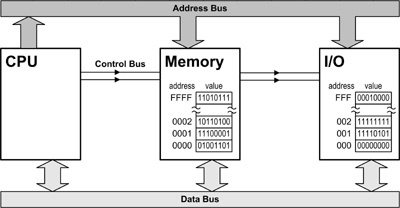

# day 05: 인터럽트와 예외


## 오늘의 결과물


inturrupt가 발생한 부분


타이머에 의한 인터럽트로 인해 floppy disk를 계속 끄고 있기 때문에, 무한으로 재부팅 되는 모습.


## 코드

```assem
; src\\init.inc
SysCodeSelector     equ 0x08
SysDataSelector     equ 0x10
VideoSelector       equ 0x18
```

```assembly
; src\\boot.asm
%include "src/init.inc"

[org 0]
    jmp 07C0h:start

start:
    mov ax, cs
    mov ds, ax
    mov es, ax

    mov ax, 0xB800
    mov es, ax
    mov di, 0
    mov ax, word [msgBack]
    mov cx, 0x7FF

paint:
    mov word [es:di], ax
    add di, 2
    dec cx
    jnz paint

read:
    mov ax, 0x1000
    mov es, ax
    mov bx, 0

    mov ah, 2
    mov al, 1
    mov ch, 0
    mov cl, 2
    mov dh, 0
    mov dl, 0
    int 13h

    jc read; 에러가 나면 다시 함

    mov dx, 0x3F2   ; 플로피디스크 드라이브의
    xor al, al      ; 모터를 끈다.
    out dx, al      
    
    cli
    mov al, 0xFF    ; PIC에서 모든 인터럽트를
    out 0xA1, al    ; 막아놓는다.

    lgdt[gdtr]

    mov eax, cr0
    or eax, 0x00000001
    mov cr0, eax

    jmp $+2
    nop
    nop

    mov bx, SysDataSelector
    mov ds, bx
    mov es, bx
    mov fs, bx
    mov gs, bx
    mov ss, bx

    jmp dword SysCodeSelector:0x010000

    msgBack db '.', 0x67

gdtr:
    dw gdt_end - gdt - 1    ; GDT의 limit
    dd gdt+0x7C00           ; GDT의 베이스 어드레스

gdt:
    dd 0, 0
    dd 0x0000FFFF, 0x00CF9A00
    dd 0x0000FFFF, 0x00CF9200
    dd 0x8000FFFF, 0x0040920B
gdt_end:

times 510-($-$$) db 0
dw 0AA55h
```

```assembly
; src\\kernel.asm
%include "src/init.inc"

[org 0x010000]
[bits 32]

PM_Start:
    mov bx, SysDataSelector
    mov ds, bx
    mov es, bx
    mov fs, bx
    mov gs, bx
    mov ss, bx

    lea esp, [PM_Start]

    mov edi, 0
    lea esi, [msgPMode]
    call printf

    cld
    mov ax, SysDataSelector
    mov es, ax
    xor eax, eax
    xor ecx, ecx
    mov ax, 256     ; IDT 영역에 256개의
    mov edi, 0      ; 디스크립터를 복사한다.

loop_idt:
    lea esi, [idt_ignore]
    mov cx, 8       ; 디스크립터 하나는 8바이트이다.
    rep movsb
    dec ax
    jnz loop_idt

    lidt [idtr]
    sti

    int 0x77
    jmp $

;*****************************
;********** Subroutines ******
;*****************************

printf:
    push eax
    push es
    mov ax, VideoSelector
    mov es, ax

printf_loop:
    mov al, byte [esi]
    mov byte [es:edi], al
    inc edi
    mov byte [es:edi], 0x06
    inc esi
    inc edi
    or al, al
    jz printf_end
    jmp printf_loop

printf_end:
    pop es
    pop eax
    ret


;*********************************
;*********** Data Area ***********
;*********************************
msgPMode db "We are in Protected Mode", 0
msg_isr_ignore db "This is an ignorable inturrupt", 0
msg_isr_32_timer db "This is the timer inturrupt", 0

;*********************************
;*** Interrupt Service Routines **
;*********************************
isr_ignore:
    push gs
    push fs
    push es
    push ds
    pushad
    pushfd

    mov ax, VideoSelector
    mov es, ax
    mov edi, (80*7*2)
    lea esi, [msg_isr_ignore]
    call printf

    popfd
    popad
    pop ds
    pop es
    pop fs
    pop gs

;*********************************
;************* IDT ***************
;*********************************
idtr:
    dw 256*8 - 1        ; IDT의 Limit
    dd 0                ; IDT의 Base Address

idt_ignore:
    dw isr_ignore
    dw SysCodeSelector
    db 0
    db 0x8E
    dw 0x0001

times 512 - ($-$$) db 0
```


## 설명


전체적인 인터럽트의 과정은 위의 그림과 같습니다.


이번 코드에는 boot.asm에서 floppy disk의 모터를 끄는 부분이 추가되었습니다.

```assembly
mov dx, 0x3F2   ; 플로피디스크 드라이브의
    xor al, al      ; 모터를 끈다.
    out dx, al
```

0x3F2번지에 I/O명령인 out으로 0의 값을 넣으면 모터가 꺼집니다.

PC의 메인보드에는 8259A라는 이름의 칩이 있습니다.

이 칩은 메인보드 전체의 하드웨어 인터럽트를 관리합니다. 요즘은 8259A라는 형태로 단일 칩이 있는 것은 아니고 메인보드의 칩셋에 로직화되어 포함되어 있습니다. 그러나 예전과 같은 동작을 한다는 면에서 호환성을 유지하고 있다고 볼 수 있습니다.

저는 out의 동작 과정이 궁금했기 때문에, stack-overflow에서 다음과 같은 부분을 더 찾아보게 되었습니다.


## CPU가 Memory와 I/O에서 데이터를 얻어오는 과정 설명

https://stackoverflow.com/questions/3215878/what-are-in-out-instructions-in-x86-used-for


You know how memory addressing works? There's an address bus, a data bus, and some control lines. The CPU puts the address of a byte (or a beginning byte) of memory on the address bus, then raises the READ signal, and some RAM chip hopefully returns the contents of memory at that address by raising or lowering individual lines (corresponding to bits in the byte(s)) on the data bus. This works for both RAM and ROM.

But then there are also I/O devices: Serial and parallel ports, the driver for a PC's tiny internal speaker, disk controllers, sound chips and so on. And those devices also get read from and written to. They also need to be addressed so the CPU accesses the correct device and (usually) the correct data location within a given device.

For some CPU models including the xxx86 series as found in most "modern" PCs, I/O devices share the address space with memory. Both RAM/ROM and IO devices are connected to the same address, data and control lines. For example, the serial port for COM1 is addressed starting at (hex) 03F8. But there's almost certainly memory at the same address.

Here's a really simple diagram:




Clearly the CPU needs to talk to either memory or the I/O device, never both. To distinguish between the two, one of the control lines called "M/#IO" asserts whether the CPU wants to talk to memory (line=high) or an I/O device (line=low).

The IN instruction reads from an I/O device, OUT writes. When you use the IN or OUT instructions, the M/#IO is not asserted (held low), so memory doesn't respond and the I/O chip does. For the memory-oriented instructions, M/#IO is asserted so CPU talks to the RAM, and IO devices stay out of the communication.

Under certain conditions the IO devices can drive the data lines and the RAM can read them at the same time. And vice versa. It's called DMA.

Traditionally, serial and printer ports, as well as keyboard, mouse, temperature sensors and so forth were I/O devices. Disks were sort of in between; data transfers would be initiated by I/O commands but the disk controller would usually direct-deposit its data in system memory.

In modern operating systems like Windows or Linux, access to I/O ports is hidden away from "normal" user programs, and there are layers of software, privileged instructions and drivers to deal with the hardware. So in this century, most programmers don't deal with those instructions.


## Done

p. 108 IDT만들기 전까지 학습했음

아직 IDT가 어떻게 동작하고, 인터럽트가 어떻게 동작하고

`out` instruction의 동작 등을 자세하게 잘 모르겠습니다.