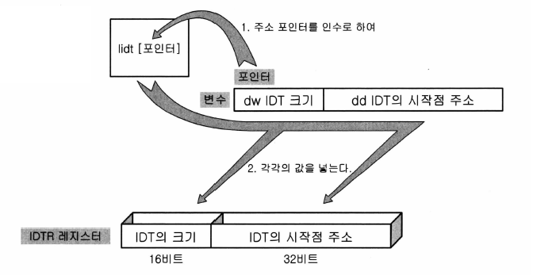

# day 06: IDT

## 오늘의 결과물

오늘은 day05와 결과물이 같습니다. 추가된 결과물은 없고, 설명만 추가했습니다.


## IDT 만들기

Protected Mode에서 인터럽트를 구현하기 위해서 테이블이 하나 필요한데, 이 것을 IDT(Interrupt Descriptor Table)가 필요합니다.

IDT는 GDT와 마찬가지로 RAM 상에 저장되며, 메모리 중 어느 곳이라도 저장이 가능합니다.

이 테이블은 256개의 디스크립터로 구성되어 있으며, GDT의 디스크립터와 유사하게 생겼습니다.

GDT의 디스크립터는 메모리의 세그먼트 영역을 포함하고 있었지만, IDT는 해당 인터럽트가 발생했을 때 어느 루틴을 실행시켜야 하는지에 대한 정보를 포함하고 있습니다.


<center>IDT 디스크립터</center>

- 핸들러의 오프셋은 핸들러가 자리하고 있는 RAM 상의 물리 주소입니다.

- 핸들러의 코드 세그먼트 셀렉터는 항상 Protected Mode상에서 동작하므로 커널 모드 코드 세그먼트 셀렉터 값을 기입하면 됩니다.

- 그 후 한 바이트는 여러 비트로 나뉘어져 있습니다.
  - **P 비트**는 GDT 디스크립터와 마찬가지의 의미를 갖습니다. **커널 모드의 코드 세그먼트가 RAM 상에 존재하는지**를 나타내는데, 항상 1로 세팅해 두시면 됩니다.
  - **DPL**은 **핸들러가 실행될 특권 레벨**을 지정하는데, 인터럽트 핸들러는 항상 커널 모드에서 동작하기 때문에 0~3 중 0레벨을 지정합니다.
  - **0과 1로 정해진 비트 값**들은 이 디스크립터가 **IDT에 위치한 인터럽트 관련 디스크립터 라는 것을 CPU에게 알려주는 값**이므로 써있는 그대로 기입해 두면 됩니다.
  - **D 비트**는 **현재 지정한 코드 세그먼트가 16비트인지 32비트인지**를 나타냅니다. 이 비트가 0이면 16비트이고, 1이면 32비트입니다. 인터럽트 핸들러는 32비트이므로 이 비트를 1로 세팅합니다.


위의 형태의 IDT 디스크립터를 메모리 상에 256개의 만들어, 하나의 IDT의 형태를 갖추게 합니다.

256개보다 많거나 적어도 상관은 없지만, 현재 우리가 사용하고 있는 PC의 메인보드의 인터럽트 관련 하드웨어가 256개의 인터럽트를 받아들이도록 디자인되어 있기 때문에 대부분의 경우 256개로 합니다.


Protected Mode에서 인터럽트를 구현하기 위해서는 1) 실제로 IDT를 RAM 상에 작성하는 루틴, 디스크립터 샘플, 인터럽트 핸들러 루틴(Interrupt Service Routine, 약자로 ISR이라고도 부릅니다.) 이렇게 세 가지가 필요합니다.


lidt [idtr] 명령어를 이용해서 idt를 레지스터에 등록해 줘야 합니다.

idtr은 다음과 같이 정의되어 있습니다.

```assembly
idtr:
  dw 256*8 - 1
  dd 0
```

lidt로 등록을 하라는 명령을 내리면 CPU의 IDTR 레지스터에 다음과 같이 이 변수의 값이 그대로 들어가게 됩니다.



<center>IDTR 레지스터에 IDT를 등록하는 과정</center>


<center>인터럽트가 호출되었을 때의 흐름</center>

위의 그림에서 1번은 CPU에 인터럽트가 들어간 상태입니다.


## 오늘 배운 nasm 어셈블리 명령어

- equ: 심볼을 정의하는 데에 사용됩니다. 한 번 정의된 심볼 값은 재정의 될 수 없습니다.

(참고 링크: https://opentutorials.org/module/1596/9765)

```assembly
symbol equ value
```

- out: I/O device에 write를 함(`The IN instruction reads from an I/O device, OUT writes`)

- cld(Clear direction flag): Direction Flag를 0으로 설정하는 어셈블리 명령어입니다.

  REP prefix가 붙어서 MOVS, LODS, SCAS, ... 등의 명령어가 사용되는데 반복 횟수는 ECX레지스터에 담기지만, 데이터가 담긴 곳의 주소는 알아서 증감합니다.(ESI, EDI)

  이 때 자동으로 증감하는 방향을 결정하는 플래그가 DF(Direction Flag)입니다.

  DF=0이라면 증가

  DF=1이라면 감소

  방향으로 증감합니다.

  이 명령어는 `rep movsb` 같은 명령어를 쓰기 전에 esi, edi의 방향을 정하기 위해 사용합니다.

- repeat 접두사

  - REP: ECX > 0 인동안 반복합니다.
  - REPZ: ZERO 플래그가 1이고 ECX > 0인동안 반복합니다.
  - REPNZ, REPNE: ZERO 플래그가 0이고 ECX > 0인동안 반복합니다.

- MOVSB, MOVSW, MOVSD: Move String Data. 데이터를 ESI에 들어있는 메모리 주소에서 EDI에 들어있는 메모리 주소로 메모리를 복사합니다.

- iret: 인터럽트가 발생한 당시의 프로그램의 다음 명령으로 돌아가서 프로그램을 재개합니다.

- lidt [idtr]: IDT도 GDT와 마찬가지로 CPU에 인터럽트가 걸렸을 때 CPU로 하여금 이 IDT를 CPU의 IDTR 레지스터에 등록시켜 주는 명령입니다.

- 상태 레지스터를 직접 컨트롤 하는 명령어

  - st와 cl: st는 set이라는 뜻이며, 레지스터 값을 1로 설정합니다. cl의 의미는 clear라는 뜻이며 레지스터의 값을 0으로 설정합니다.
  - cl과 st에 붙일 수 있는 상태 레지스터의 flag는 다음과 같습니다. c(Carry Flag), d(Direction Flag), i(Intterupt Flag)

- 인터럽트 플래그

  - IF : Interruption Flag. Set if interrupts are enabled

(참고 링크: https://stackoverflow.com/questions/3215878/what-are-in-out-instructions-in-x86-used-for)


