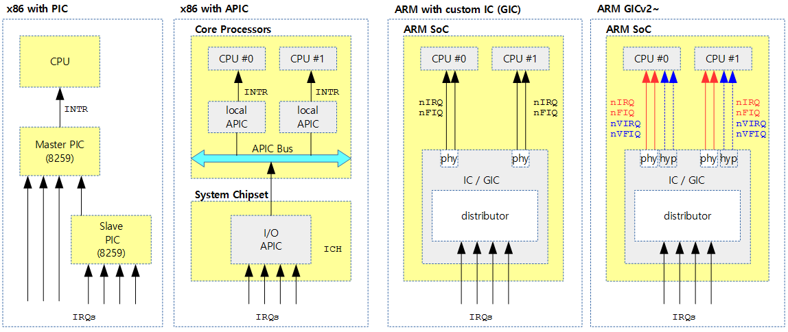
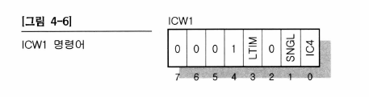
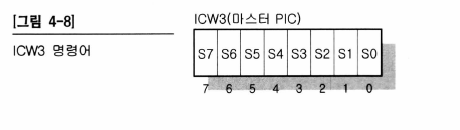
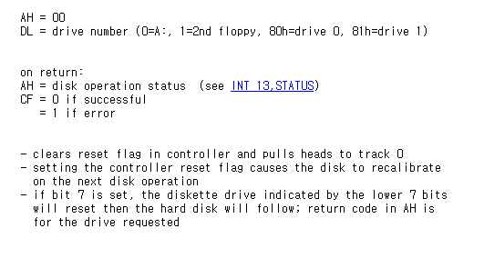

## day 09: PIC(Programmable Interrupt Controller)의 설명(2)


day 08의 소스코드를 기준으로 설명합니다.


## 변경 또는 새로 추가된 코드


## reset floppy disk

```assembly
; src/boot.asm

...

reset:			; 플로피 디스크를 리셋(controller에서 reset flag를 clear로 세팅하고, 헤드를 track 0로 가져 가는 것)
	mov ax, 0
	mov dl, 0	; drive=0 A:
	int 13h
	jc reset	; 에러가 나면 다시 합니다.

```

- 트랙이란...?

  - cylinder => track => sector 순으로 차원이 작아짐

  

  - 그림 출처: https://m.blog.naver.com/PostView.naver?isHttpsRedirect=true&blogId=capemay&logNo=220221154613


### PIC 세팅

```assembly
cli			; clear inturrpt flag. 즉, 인터럽트를 받지 않을 것을 의미

; ICW1 명령어 - 초기화
mov al, 0x11	; PIC의 초기화(0b00010001) - 4번째 비트는 1로 고정인 값, 0번째 비트는 ICW4 명령어가 필요하다는 의미입니다.
out 0x20, al		; 마스터 PIC
dw 0x00eb, 0x00eb	; jmp $+2, jmp $+2 => 단순히 다음 명령어로 가기 전에 시간을 충분히 주자는 의미. 
out 0xA0, al		; 슬레이브 PIC
dw 0x00eb, 0x00eb

; ICW2 명령어 - IRQ 번호 리매핑(remapping)
mov al, 0x20		; 마스터 PIC 인터럽트 시작점(CPU에 +0x20을 해서 IRQ번호를 매김)
out 0x21, al
dw 0x00eb, 0x00eb
mov al, 0x28		; 슬레이브 PIC 인터럽트 시작점(CPU에 +0x28을 해서 IRQ번호를 매김)
out 0xA1, al
dw 0x00eb, 0x00eb

; ICW3 명령어 - 마스터, 슬레이브 PIC 연결
mov al, 0x04		; 마스터 PIC의 IRQ 2번에
out 0x21, al		; 슬레이브 PIC가 연결되어 있습니다.(연결된 슬레이브 PIC가 마스터 PIC의 IRQ 7번이면 0x07 해당하는 핀의 비트를 1로 세팅하는 방식으로 함.)
dw 0x00eb, 0x00eb
mov al, 0x02		; 슬레이브 PIC가 마스터 PIC의
out 0xA1, al		; IRQ 2번에 연결되어 있습니다.(마스터 PIC의 IRQ 7번이면 0x07 그대로 씀)
dw 0x00eb, 0x00eb

; ICW4 명령어 - 추가적인 설정(8086 모드)
mov al, 0x01		; 8086 모드를 사용합니다.
out 0x21, al
dw 0x00eb, 0x00eb
out 0xA1, al
dw 0x00eb, 0x00eb

mov al, 0xFF		; 슬레이브 PIC의 모든 인터럽트를
out 0XA1, al		; 막아둡니다.
dw 0x00eb, 0x00eb
mov al, 0xFB		; 마스터 PIC의 IRQ 2번을 제외한
out 0x21, al		; 모든 인터럽트를 막아둡니다.
```

위의 명령어는 8259A라는 칩에 명령어를 내려주는 과정입니다.


지금 코딩에 사용된 PIC 구조는 x86에서 master, slave PIC를 두는 방법인데,

이 방법은 싱글 코어에서 사용하는 방법인 듯 합니다.

멀티코어 x86에서는 APIC 방법을 사용하는 것 같습니다.

arm에서는 각 회사별로 별도의 IP 블럭에서 인터럽트를 구현하는 것 같은데, ARM에서 제공하는 GIC(Generic interrupt Controller)를 사용하는 것으로 추세가 있는 듯 합니다.


자세한 내용은 아래의 블로그를 참고했습니다.



(참조 링크: http://jake.dothome.co.kr/ic/)


위의 8259A 칩은 PIC(Programmable Controller)라고 불리며, 이 PIC도 하나의 컨트롤러의 개념을 가지고 있어서 조그마한 프로그램을 넣어 조작할 수 있습니다. 이 프로그램에는 초기화, 여러 개의 PIC 연결 방법, 인터럽트를 받아들이는 방법, 받아들인 인터럽트에 대해 CPU에게 알려주는 방법 등이 기재되어 있어야 합니다.

- **마스터 PIC 관련 동작**

  > 마스터 PIC에 연결된 장치 중 하나에서 인터럽트가 발생한 경우

  - 마스터 PIC는 자신의 INT 핀에 신호를 실어 CPU의 INT 핀에 신호를 줍니다.
  - CPU는 이것을 받고 EFLAG 레지스터의 IE 비트가 1로 세팅되어 인터럽트를 받을 수 있는 상황이라면 /INTA를 통해 마스터 PIC에 인터럽트를 잘 받았다는 신호를 보냅니다.
  - 마스터 PIC는 /INTA 신호를 받으면 몇 번째 IRQ에 연결된 장치에서 인터럽트가 발생했는지를 숫자로 데이터 버스를 통해 CPU로 전달합니다.
  - CPU는 이 데이터를 참조하여 Protected Mode로 실행 중이라면 IDT에서 그 번호에 맞는 디스크립터를 찾아 인터럽트 핸들러를 실행합니다.

- **슬레이브 PIC 관련 동작**

  > 슬레이브 PIC에 연결된 장치 중 하나에서 인터럽트가 발생한 경우

  - 슬레이브 PIC는 자신의 INT 핀에 신호를 실어 마스터 PIC의 IRQ 2번 핀에 인터럽트 신호를 보냅니다.
  - 마스터 PIC는 자신의 IRQ 핀에서 인터럽트가 발생했으므로 자신의 INT 핀에 신호를 실어 CPU에게 알립니다.
  - CPU가 /INTA 신호를 주면 역시 데이터 버스에 숫자를 실어 CPU에게 몇 번째 IRQ에서 인터럽트가 발생했는지를 알려줍니다. 이 경우 숫자는 8~15 사이가 될 것입니다.


- PIC의 프로그래밍

  - ICW1, ICW2, ICW3, ICW4 이렇게 4가지로 구성되어 있으며, 이 순서대로 실행됩니다.

  - ICW1: ICW1은 PIC를 초기화 하는 명령어입니다.

    

    - 7~4비트는 정해진 것이므로 그대로 사용합니다.
    - LTIM은 인터럽트가 발생할 때 그 인터럽트 신호의 엣지에서 인터럽트 발생을 인정할 것인지, 혹은 HIGH LEVEL로 신호가 모두 올라간 상태에서 인터럽트 발생을 인정할 것인지를 나타냅니다. 0이면 엣지 트리거링이고, 1이면 레벨 트리거링입니다.
    - SNGL은 이 PIC가 마스터/슬레이브로 구성되어 있는지, 마스터 한 개만 사용할지를 나타냅니다. 0 => 마스터/슬레이브 형식으로 PIC 2개 사용. 1 => 마스터 하나만 사용한다는 것을 나타냅니다.
    - IC4는 ICW4 명령어가 추가적으로 필요한지를 나타냅니다. 0이면 필요하지 않다는 것, 1이면 필요하다는 것입니다.

  - ICW2: 이 PIC가 인터럽트를 받았을 때 IRQ 번호에 얼마를 더해서 CPU에게 알려줄지를 지정합니다.

    

    - 0~2비트가 0인 것은 이 숫자를 8단위로 기재해야 한다는 의미입니다.
    - 예를 들어 16진수 0x10을 넣으면 나중에 인터럽트 0번이 발생했을 때 CPU에게는 0x10의 숫자를 보내줍니다. IRQ 16번이라고 알려주는 것입니다. 인터럽트 1번이 발생했을 때에는 CPU에게 0x11의 숫자를 보내줍니다.

  - ICW3: ICW3는 각 PIC의 마스터, 슬레이브로서의 연결 방법을 나타냅니다.

    

    - S0~S7은 마스터 PIC의 각 IRQ 선에 해당됩니다.

    - 각각의 비트에 0을 넣으면 그 IRQ 선은 하드웨어 장치에 연결되어 있다는 것을 나타냅니다.

    - 각각의 비트 중 어느 비트에 1을 넣으면 그 IRQ 선은 슬레이브 PIC에 연결되어 있다는 것을 나타냅니다.

      

    - 슬레이브 PIC에서 3~7비트는 0으로 세팅합니다. ID0~ID2의 3비트를 사용해서 슬레이브 PIC가 마스터 PIC의 몇 번째 IRQ 핀에 연결되어 있는지를 나타냅니다. 마스터 PIC에서 해당 비트를 1로 세팅하는 ICW3와는 달리 여기에서는 숫자로 나타냅니다.

  - ICW4: ICW4는 추가 명령어입니다. ICW1 명령을 내릴 때 ICW4 추가 명령을 내리겠다는 표시를 한다면, ICW4 명령을 추가해야 합니다.

    

    - SFNM, BUF, M/S의 기능은 현재 우리가 사용하는 PC에서는 구현되지 않아도 무방하므로 항상 0으로 해둡니다.
    - AEOI 비트는 PIC의 Reset을 자동으로 할 지, 수동으로 할 지를 나타냅니다. PIC는 인터럽트가 발생하고 CPU에게 알린 후 리셋을 해야 그 다음부터 다른 인터럽트를 받아들일 수 있습니다. 이 리셋을 자동으로 수행하도록 한다면 CPU에게 IRQ 번호를 알린 후 바로 리셋을 합니다. 이 리셋을 수동으로 수행한다면 CPU 쪽에서 IRQ 번호를 받아들이고, 인터럽트 핸들러에서 해당 인터럽트를 처리하고 나서 PIC에 명령을 주는 형식으로 초기화를 해야 합니다.
    - uPM 비트에 0을 넣으면 이 PIC가 MCS-80/85 모드로 움직이는 것을 의미합니다. 이 비트가 1이면 PIC가 8086 모드로 움직이는 것을 의미합니다. 우리가 사용하는 PC는 8086 계열이므로 1을 넣습니다.


- 참고: I/O port map

    ```
    [I/O port map]
    Master PIC Command : 0x20
    Master PIC Data : 0x21
    Slave PIC Command : 0xA0
    Slave PIC Data : 0xA1
    ```


## 어셈블리

- 복습

  - org 0: 이 부분이 기억이 잘 안 났습니다. org 0는 이 프로그램이 로딩되는 메모리 상의 위치를 말합니다. 즉, 메모리 상에 프로그램이 올라갔을 때, 프로그램의 시작 주소를 특정 주소에서 시작 될 것이라고 가리키는 명령어 입니다. 즉 ip 포인터가 0부터 시작됩니다. 

  - https://www.csie.ntu.edu.tw/~comp03/nasm/nasmdoc6.html (6.1.1 참조)

  - `ORG`: The function of the `ORG` directive is to specify the origin address which NASM will assume the program begins at when it is loaded into memory.

    ```assembly
    [org 0]
    	jmp 07C0h:start ; 메모리의 0번 물리주소부터 시작합니다. 07C0이 코드 세그먼트이고, start의 주소는 0을 기준으로 ip가 설정됩니다.
    ```

- 새로 배운 것

  - int 13h, ah 0: reset disk system: reset 플래그를 컨트롤러에서 clear 하고, 헤드를 트랙0로 가져다 둡니다.

    

    (출처: https://stanislavs.org/helppc/int_13-0.html)


## 궁금한 점

1. day 08의 소스코드에서 reset label과 read label이 멀리 떨어져 있었습니다. 사실 floppy disk의 헤드를 처음으로 가져가고, read 하는 것인데 좀 더 가까이 붙어 있는 것이 좋지 않을까요?

2. 코드 중간에 플로피 디스크의 모터를 끄는 어셈블리 코드가 있습니다. 왜 디스크의 모터를 끄는 걸까요...?

   ```assembly
   mov dx, 0x3F2
   xor al, al
   out dx, al
   ```


## 완료

p. 133 (타이머 인터럽트 핸들러 구현 전까지 완료)