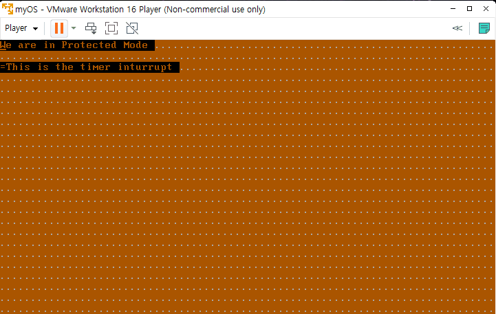
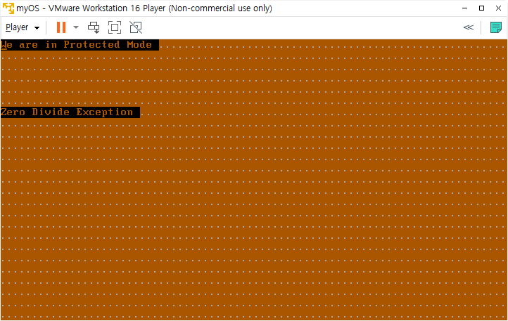

# day11: 키보드 인터럽트 핸들러, exception


## 오늘의 결과물

- keyboard 인터럽트 핸들러 - 아무 키나 누르면 키보드 인터럽트 라는 문구가 뜸(key down, key up 두 가지 경우에 다 인터럽트 걸림)




- 예외(Exception)



zero divide Exception의 ISR(Interrupt Service Routine) 실행 중에는 다른 interrupt가 걸리지 않았습니다.

## 키보드 인터럽트 핸들러 코드

=== "kernel.asm"

    ```assembly
    ; src\kernel.asm
    
    % include "init.inc"
    [org 0x010000]
    [bits 32]
    
    PM_Start:
        mov bx, SysDataSelector
        mov ds, bx
        mov es, bx
        mov fs, bx
        mov gs, bx
        mov ss, bx
        lea esp, [PM_Start]
    
        mov edi, 0
        lea esi, [msgPMode]
        call printf
    
        cld
        mov ax, SysDataSelector
        mov es, ax
        xor eax, eax
        xor ecx, ecx
        mov ax, 256			; IDT 영역에 256개의 빈 디스크립터를 복사합니다.
        mov edi, 0
    
    loop_idt:
        lea esi, [idt_ignore]
        mov cx, 8			; 디스크립터 하나는 8바이트입니다.
        rep movsb
        dec ax
        jnz loop_idt
    
        mov edi, 8*0x20		; 타이머 IDT 디스크립터를 복사합니다.
        lea esi, [idt_timer]
        mov cx, 8
        rep movsb
    
        mov edi, 8*0x21		; 키보드 IDT 디스크립터를 복사합니다.
        lea esi, [idt_keyboard]
        mov cx, 8
        rep movsb
    
        lidt [idtr]
    
        mov al, 0xFC		; 막아두었던 인터럽트 중
        out 0x21, al		; 타이머와 키보드만 다시 유효하게 합니다.
        sti
    
        jmp $
    
    printf:
        push eax
        push es
        mov ax, VideoSelector
        mov es, ax
    
    printf_loop:
        mov al, byte [esi]
        mov byte [es:edi], al
        inc edi
        mov byte [es:edi], 0x06
        inc esi
        inc edi
        or al, al
        jz printf_end
        jmp printf_loop
    
    printf_end:
        pop es
        pop eas
        ret
    
    msgPMode db "We are in Protected Mode", 0
    msg_isr_ignore db "This is an ignorable intterrupt", 0
    msg_isr_32_timer db ".This is the timer interrupt.", 0
    msg_isr_33_keyboard db ".This is the keyboard interrupt", 0
    
    idtr:
        dw 256*8-1			; IDT의 limit
        dd 0				; IDT의 Base Address
    
    isr_ignore:
        push gs
        push fs
        push es
        push ds
        pushad
        pushfd
    
        mov al, 0x20
        out 0x20, al
    
        mov ax, VideoSelector
        mov es, ax
        mov edi, (80*7*2)
        lea esi, [msg_isr_ignore]
        call printf
    
        popfd
        popad
        pop ds
        pop es
        pop fs
        pop gs
    
        iret
    
    isr_32_timer:
        push gs
        push fs
        push es
        push ds
        pushad
        pushfd
    
        moval, 0x20
        out 0x20, al
        mov ax, VideoSelector
        mov es, ax
        mov edi, (80*2*2)
        lea esi, [msg_isr_32_timer]
        call printf
        inc byte [msg_isr_32_timer]
    
        popfd
        popad
        pop ds
        pop es
        pop fs
        pop gs
    
        iret
    
    isr_33_keyboard:
        pushad
        push gs
        push fs
        push es
        push ds
        pushfd
    
        in al, 0x60
    
        mov al, 0x20
        out 0x20, al
    
        mov ax, VideoSelector
        mov es, ax
        mov esi, [msg_isr_33_keyboard]
        call printf
        inc byte [msg_isr_33_keyboard]
    
        popfd
        pop ds
        pop es
        pop fs
        pop gs
        popad
        iret
    
    ;***************************************
    ;************** IDT ********************
    ;***************************************
    idt_ignore:
        dw isr_ignore
        dw 0x08
        db 0
        db 0x8E
        dw 0x0001
    
    idt_timer:
        dw isr_32_timer
        dw 0x08
        db 0
        db 0x8E
        dw 0x0001
    
    idt_keyboard:
        dw isr_33_keyboard
        dw 0x08
        db 0
        db 0x8E
        dw 0x0001
    
    times 512-($-$$) db 0
    ```


# 설명

키보드 인터럽트 핸들러 구현을 위해서도 IDT에 디스크립터를 복사해야 합니다.

```assembly
mov edi, 8*0x21
lea esi, [idt_keyboard]
mov cx, 8
rep movsb
```


idt_keyboard는 디스크립터의 포인터입니다.

```assembly
idt_keyboard:
	dw isr_33_keyboard
	dw 0x08
	db 0
	db 0x8E
	dw 0x0001
```

여기서도 인터럽트 핸들러가 있는 주소는 0x010000+isr_33_keyboard입니다.


```assembly
isr_33_keyboard:
	pushad
	push gs
	push fs
	push es
	push ds
	pushfd
	
	in al, 0x60
	
	mov al, 0x20
	out 0x20, al
	
	mov ax, VideoSelector
	mov es, ax
	mov edi, (80*4*2)
	lea esi, [msg_isr_33_keyboard]
	call printf
	inc byte [msg_isr_33_keyboard]
	
	popfd
	pop ds
	pop es
	pop fs
	pop gs
	popad
	iret
```

isr_33_keyboard 루틴에서는 키보드에서 어떤 키가 눌렸는지를 알아야 하므로, in al, 0x60 명령으로 키보드 버퍼에 있는 문자 스캔코드를 가져옵니다.


이 스캔코드는 아스키코드와는 다릅니다.그리고 버퍼에서 문자를 가져오지 않으면 키보드에서 다음 인터럽트는 발생하지 않습니다. 그래서 이 소스에서는 일단 가져오는 행동만 합니다. 그 후 PIC를 리셋합니다.


## 예외(Exception) 코드


예외는 오류가 발생했을 때 **CPU에서 발생시키는 인터럽트**의 한 종류입니다. 하지만 실제로 대부분의 경우에 page faults 처럼 오류가 아닙니다.


### Exception의 종류

- Faults: 이 Exception은 고쳐질 수 있고, 프로그램은 아마도 아무 일도 일어나지 않았으면 계속 실행될 겁니다.
- Traps: Trap은 trapping instruction이 실행된 이후에 바로 보고됩니다.
- Aborts: 심각한 회복 불가능한 에러입니다.


Protected Mode에서 예외도 하드웨어 인터럽트, 소프트웨어 인터럽트와 함께 같은 IDT를 사용합니다.


0번 ~ 19번까지의 인터럽트는 예외	 처리를 위해 할당되어 있으며,

20번에서 31번까지는 intel에서 예약해 둔 인터럽트입니다.

32 ~ 255까지의 주소는 유저 정의 인터럽트를 사용할 수 있습니다.


- 전체 예외 종류(https://wiki.osdev.org/Exceptions#FPU_Error_Interrupt)

| Name                                                         | Vector nr.        | Type       | Mnemonic | Error code? |
| ------------------------------------------------------------ | ----------------- | ---------- | -------- | ----------- |
| [Divide-by-zero Error](https://wiki.osdev.org/Exceptions#Divide-by-zero_Error) | 0 (0x0)           | Fault      | #DE      | No          |
| [Debug](https://wiki.osdev.org/Exceptions#Debug)             | 1 (0x1)           | Fault/Trap | #DB      | No          |
| [Non-maskable Interrupt](https://wiki.osdev.org/Non_Maskable_Interrupt) | 2 (0x2)           | Interrupt  | -        | No          |
| [Breakpoint](https://wiki.osdev.org/Exceptions#Breakpoint)   | 3 (0x3)           | Trap       | #BP      | No          |
| [Overflow](https://wiki.osdev.org/Exceptions#Overflow)       | 4 (0x4)           | Trap       | #OF      | No          |
| [Bound Range Exceeded](https://wiki.osdev.org/Exceptions#Bound_Range_Exceeded) | 5 (0x5)           | Fault      | #BR      | No          |
| [Invalid Opcode](https://wiki.osdev.org/Exceptions#Invalid_Opcode) | 6 (0x6)           | Fault      | #UD      | No          |
| [Device Not Available](https://wiki.osdev.org/Exceptions#Device_Not_Available) | 7 (0x7)           | Fault      | #NM      | No          |
| [Double Fault](https://wiki.osdev.org/Exceptions#Double_Fault) | 8 (0x8)           | Abort      | #DF      | Yes (Zero)  |
| ~~[Coprocessor Segment Overrun](https://wiki.osdev.org/Exceptions#Coprocessor_Segment_Overrun)~~ | 9 (0x9)           | Fault      | -        | No          |
| [Invalid TSS](https://wiki.osdev.org/Exceptions#Invalid_TSS) | 10 (0xA)          | Fault      | #TS      | Yes         |
| [Segment Not Present](https://wiki.osdev.org/Exceptions#Segment_Not_Present) | 11 (0xB)          | Fault      | #NP      | Yes         |
| [Stack-Segment Fault](https://wiki.osdev.org/Exceptions#Stack-Segment_Fault) | 12 (0xC)          | Fault      | #SS      | Yes         |
| [General Protection Fault](https://wiki.osdev.org/Exceptions#General_Protection_Fault) | 13 (0xD)          | Fault      | #GP      | Yes         |
| [Page Fault](https://wiki.osdev.org/Exceptions#Page_Fault)   | 14 (0xE)          | Fault      | #PF      | Yes         |
| Reserved                                                     | 15 (0xF)          | -          | -        | No          |
| [x87 Floating-Point Exception](https://wiki.osdev.org/Exceptions#x87_Floating-Point_Exception) | 16 (0x10)         | Fault      | #MF      | No          |
| [Alignment Check](https://wiki.osdev.org/Exceptions#Alignment_Check) | 17 (0x11)         | Fault      | #AC      | Yes         |
| [Machine Check](https://wiki.osdev.org/Exceptions#Machine_Check) | 18 (0x12)         | Abort      | #MC      | No          |
| [SIMD Floating-Point Exception](https://wiki.osdev.org/Exceptions#SIMD_Floating-Point_Exception) | 19 (0x13)         | Fault      | #XM/#XF  | No          |
| [Virtualization Exception](https://wiki.osdev.org/Exceptions#Virtualization_Exception) | 20 (0x14)         | Fault      | #VE      | No          |
| Reserved                                                     | 21-29 (0x15-0x1D) | -          | -        | No          |
| [Security Exception](https://wiki.osdev.org/Exceptions#Security_Exception) | 30 (0x1E)         | -          | #SX      | Yes         |
| Reserved                                                     | 31 (0x1F)         | -          | -        | No          |
| [Triple Fault](https://wiki.osdev.org/Exceptions#Triple_Fault) | -                 | -          | -        | No          |
| ~~[FPU Error Interrupt](https://wiki.osdev.org/Exceptions#FPU_Error_Interrupt)~~ | IRQ 13            | Interrupt  | #FERR    | No          |


흔하게 리눅스에서 봤던 `segmentation fault` 는 0x0D번에 해당하는 general protection fault에 해당합니다.

segmentation fault 또는 access violation은 하드웨어의 memory protection에 의해서 일어나는 fault입니다. 하드웨어는 OS에 메모리에 접근 위반이 발생했다고 알려줍니다. x86 computer에서는 general protection fault의 하나의 형태입니다.

(https://en.wikipedia.org/wiki/Segmentation_fault)


### general Protection Fault

general Protection Fault는 다양한 이유로 발생할 수 있습니다. 가장 흔한 것들은 다음과 같습니다.

- Segment error (privilege, type, limit, read/write rights).
- Executing a privileged instruction while CPL != 0.
- Writing a 1 in a reserved register field or writing invalid value combinations (e.g. CR0 with PE=0 and PG=1).
- Referencing or accessing a null-descriptor.

(https://wiki.osdev.org/Exceptions#Stack-Segment_Fault)


### Legacy Exceptions

#### FPU Error Interrupt

예전에는 FPU(Floating Point Unit)은 별도의 칩으로 존재했고, 그 칩에서 오류가 발생하면 CPU로 오류를 알려줬어야 했습니다. 그렇기 때문에 IRQ 13번을 사용했었는데, 486부터는 embedded 되었기 때문에 더이상 IRQ 13번이 필요하지 않습니다. 호환성을 위해서만 존재합니다.

#### Coprocessor Segment Overrun

FPU가 processor의 외부에 있을 때, segment에서 오류가 났는지 확인을 했어야 했습니다. 486부터는 GPF(General Protection Fault) IRQ에서 처리를 합니다.


## IRQ 번호 리매핑

인터럽트 0번부터 31번까지 어떻게 사용될 지 정해져 있기 때문에, 32번부터 255번 까지 쓸 수 있습니다.

만약 PIC를 프로그래밍 하지 않았다면 IRQ는 0번부터 시작합니다. 0째 IDT 디스크립터를 참조해서 해당 인터럽트 핸들러를 실행하게 되는데, 핸들러 입장에서는 이것이 하드웨어 인터럽트인지, 예외가 발생한 것인지를 모르게 됩니다.

애초에 CPU에 지정된 예외와 PC 메인보드에 PIC가 연결된 방법이 충돌나도록 디자인 되어 있기 때문입니다.

그래서 PIC에서 IRQ 번호를 리매핑 해주는 작업이 필요합니다.


## Exception 코드

=== "src\boot.asm"

```assembly
; src/boot.asm
; ...생략...

read:
    mov ax, 0x1000          ; ES:BX = 1000:0000
    mov es, ax
    mov bx, 0

    mov ah, 2               ; 디스크에 있는 데이터를 es:bx 주소로
    mov al, 2               ; 2섹터를 읽을 것이라고 알림
    mov ch, 0               ; 0번째 실린더
    mov cl, 2               ; 2번째 섹터부터 읽기 시작합니다.
    mov dh, 0               ; Head=0
    mov dl, 0               ; Drive=0, A: 드라이브
    int 13h

; ...생략...
```

=== "src\kernel.asm"

```assembly
%include "src/init.inc"

[org 0x010000]
[bits 32]

PM_Start:
    mov bx, SysDataSelector
    mov ds, bx
    mov es, bx
    mov fs, bx
    mov gs, bx
    mov ss, bx

    lea esp, [PM_Start]

    mov edi, 0
    lea esi, [msgPMode]
    call printf

    cld
    mov ax, SysDataSelector
    mov es, ax
    xor eax, eax
    xor ecx, ecx
    mov ax, 256     ; IDT 영역에 256개의
    mov edi, 0      ; 디스크립터를 복사한다.

loop_idt:
    lea esi, [idt_ignore]
    mov cx, 8       ; 디스크립터 하나는 8바이트입니다.
    rep movsb
    dec ax
    jnz loop_idt

    mov edi, 0
    lea esi, [idt_zero_divide]
    mov cx, 8       ; 디스크립터 하나는 8바이트입니다.
    rep movsb


    mov edi, 8*0x20
    lea esi, [idt_timer]
    mov cx, 8
    rep movsb

    mov edi, 8*0x21
    lea esi, [idt_keyboard]
    mov cx, 8
    rep movsb

    lidt [idtr]
    mov al, 0xFC        ; 막아두었던 인터럽트 중
    out 0x21, al        ; 타이머와 키보드만 다시 유효하게 합니다.
    sti

    mov edx, 0
    mov eax, 0x0100
    mov ebx, 0
    div ebx

    jmp $

;*****************************
;********** Subroutines ******
;*****************************

printf:
    push eax
    push es
    mov ax, VideoSelector
    mov es, ax

printf_loop:
    mov al, byte [esi]
    mov byte [es:edi], al
    inc edi
    mov byte [es:edi], 0x06
    inc esi
    inc edi
    or al, al
    jz printf_end
    jmp printf_loop

printf_end:
    pop es
    pop eax
    ret


;*********************************
;*********** Data Area ***********
;*********************************
msgPMode db "We are in Protected Mode", 0
msg_isr_ignore db "This is an ignorable inturrupt", 0
msg_isr_zero_divide db "Zero Divide Exception", 0
msg_isr_32_timer db ".This is the timer inturrupt", 0
msg_isr_33_keyboard db ".This is the keyboard interrupt", 0

idtr:
    dw 256*8 - 1        ; IDT의 Limit
    dd 0                ; IDT의 Base Address

;*********************************
;*** Interrupt Service Routines **
;*********************************
isr_ignore:
    push gs
    push fs
    push es
    push ds
    pushad
    pushfd

    mov al, 0x20
    out 0x20, al

    mov ax, VideoSelector
    mov es, ax
    mov edi, (80*7*2)
    lea esi, [msg_isr_ignore]
    call printf

    popfd
    popad
    pop ds
    pop es
    pop fs
    pop gs

    iret

isr_zero_divide:
    push gs
    push fs
    push es
    push ds
    pushad
    pushfd

    mov al, 0x20
    out 0x20, al

    mov ax, VideoSelector
    mov es, ax
    mov edi, (80*6*2)
    lea esi, [msg_isr_zero_divide]
    call printf

    jmp $

    popfd
    popad
    pop ds
    pop es
    pop fs
    pop gs

    iret

isr_32_timer:
    push gs
    push fs
    push es
    push ds
    pushad
    pushfd

    mov al, 0x20
    out 0x20, al

    mov ax, VideoSelector
    mov es, ax
    mov edi, (80*2*2)
    lea esi, [msg_isr_32_timer]
    call printf
    inc byte [msg_isr_32_timer]

    popfd
    popad
    pop ds
    pop es
    pop fs
    pop gs

    iret

isr_33_keyboard:
    pushad
    push gs
    push fs
    push es
    push ds
    pushfd

    in al, 0x60

    mov al, 0x20
    out 0x20, al

    mov ax, VideoSelector
    mov es, ax
    mov edi, (80*4*2)
    lea esi, [msg_isr_33_keyboard]
    call printf
    inc byte [msg_isr_33_keyboard]

    popfd
    pop ds
    pop es
    pop fs
    pop gs
    popad
    iret
;*********************************
;************* IDT ***************
;*********************************

idt_ignore:
    dw isr_ignore
    dw SysCodeSelector
    db 0
    db 0x8E
    dw 0x0001

idt_zero_divide:
    dw isr_zero_divide
    dw 0x08
    db 0
    db 0x8E
    dw 0x0001

idt_timer:
    dw isr_32_timer
    dw 0x08
    db 0
    db 0x8E
    dw 0x0001

idt_keyboard:
    dw isr_33_keyboard
    dw 0x08
    db 0
    db 0x8E
    dw 0x0001

times 1024 - ($-$$) db 0
```

총 세 부분을 keyboard_interrupt 코드에서 고쳤습니다.

(추가적으로, kernel도 512바이트를 초과했기 때문에 2 섹터를 읽어오도록 변경했습니다.)


1. IDT Descriptor에 idt_zero_divide 추가

   ```assembly
   idt_zero_divide:
       dw isr_zero_divide
       dw 0x08
       db 0
       db 0x8E
       dw 0x0001
   ```

   

2. idt_zero_divide IDT descriptor를 lidt 할 때 등록

   ```assembly
   mov edi, 0
       lea esi, [idt_zero_divide]
       mov cx, 8       ; 디스크립터 하나는 8바이트입니다.
       rep movsb
   ```

   

3. ISR 루틴에 isr_zero_divide 추가

   ```assembly
   isr_zero_divide:
       push gs
       push fs
       push es
       push ds
       pushad
       pushfd
   
       mov al, 0x20
       out 0x20, al
   
       mov ax, VideoSelector
       mov es, ax
       mov edi, (80*6*2)
       lea esi, [msg_isr_zero_divide]
       call printf
   
       jmp $
   
       popfd
       popad
       pop ds
       pop es
       pop fs
       pop gs
   
       iret
   ```

   jmp $로 그 자리에서 무한루프를 돌도록 했습니다.

   

4. 0 / 0 연산을 해서, 인터럽트 발생시키는 부분

   ```assembly
   mov edx, 0
       mov eax, 0x0100
       mov ebx, 0
       div ebx
   
       jmp $
   ```

   0x100을 0으로 나누는 것을 시도합니다.

   이 프로그램을 실행시키면 타이머 인터럽트 핸들러도, 키보드 인터럽트 핸들러도 작동하지 않습니다. 이유는 PIC의 마스크를 해제하고 바로 0x100 을 0으로 나누기를 시도해서 예외가 발생했고, isr_zero_divide 핸들러에서 iret 하지 않고 jmp $로 그 자리에서 무한루프를 돌기 때문입니다.


## 알게된 점

- PIC의 비트마스크 설정으로, interrupt 별로 enable/disable 시킬 수 있습니다.
- 하나의 interrupt로 들어갔을 때, iret을 하지 않으면 다음 인터럽트로 넘어가지 않습니다.


