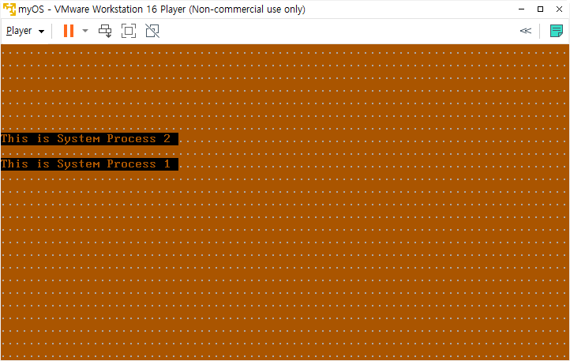

# day12: task switching


## 오늘의 결과물





## 오늘 학습 내용


task switching 방법에는 call으로 스위칭 하는 방법, jmp로 스위칭 하는 방법 두 가지가 있습니다.

오늘은 코드를 따라 치면서, 감을 익혔고, 다음 시간에 원리를 이해하도록 하겠습니다.


## 새로 배운 nasm assembly

- LTR: Load Task Register

  - 피연산자로 주어지는 segment selector에 의해 선택된 GDT 또는 LDT descriptor의 세그먼트의 base와 limit을 참조합니다. 그리고 그것들을 task register로 가져 옵니다.

    ```
    LTR r/m16                     ; 0F 00 /3             [286,PRIV]
    ```


## 오늘까지의 진도

p. 165