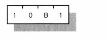
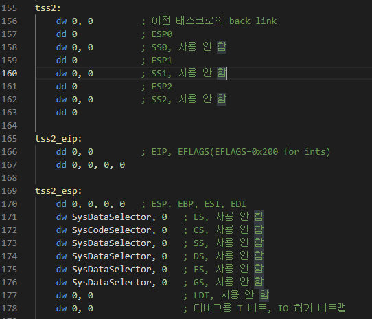

# day15: Task Switching (4)


day 13의 코드를 계속 파악하고 있습니다.


지금 이해한 흐름은

```assembly
jmp TSS2Selector:0
```

위의 구문으로 task switching을 한다는 것입니다.


TSS2Selector라는 것은 src\init.inc 에 정의된 값인데 0x28로 정의되어 있습니다.

즉, GDT의 offset 기준으로 0x28만큼 떨어진 곳에 존재하는 GDT Descriptor라는 의미입니다.


GDT + 0x28의 주소에는 descriptor5라는 것을 저장해 놓았고,


(초기에는 0으로 값을 주고, 프로그램 실행 시에 tss2의 주소를 BASE_ADDRESS로 넘겨 줍니다.)

- segment limit의 값으로는 0x68(10진수 104)이 저장되어 있습니다. TSS Descriptor의 사이즈가 0x68이기 때문에 이 값이 들어가 있습니다.

- P, DPL, S, Type을 지정하는 값으로는 0x89(0b10001001) 즉, P=1, DPL=0, S=0, Type=1001이 들어가 있습니다. Type에는 다음과 같은 값이 들어갑니다.



<center>TSS 세그먼트 디스크립터에 포함된 Type</center>

즉, 지금은 B가 0으로 세팅되어 있기 때문에, 해당 태스크가 busy task가 아니라는 의미(현재 실행되고 있거나 실행을 기다리고 있는 상태가 아니라는 의미)입니다.

TSS 세그먼트의 타입은 `0b10x1`입니다. 즉 type으로 TSS 세그먼트임을 나타내고 있습니다.


위에서 descriptor5에 tss2의 주소를 넣고 있기 때문에, tss2를 살펴보게 되면,



tss2 ~ tss_esp부분까지 총 0x68바이트를 사용하고 있습니다.


실행 시에, tss_eip에 process2라는 주소를 넣고, esp에 PM_Start의 주소를 넣어서 호출 합니다.


즉, CPU입장에서는 segment의 type이 0b10x1인 segment descriptor를 보고 jump를 하기 때문에 context switching이라는 것을 알고 있고, CPU는 TSS의 eip가 적힌 부분으로 jump를 하도록 지시합니다.

jump 직전에 이전 Segment Selector가 필요하기 때문에 TSS1Selector라는 것을 넣어 주고 있음


## 정리

```assembly
jmp TSS2Selector:0 (offset은 0이 아니어도 전혀 상관없음. TSS의 eip로 점프하기 때문)
```

라는 명령어를 실행했을 때, GDT의 TSS Descriptor가 정의되어 있고(type이 0b10x1), 그 descriptor에서 가리키는 TSS의 eip값이 정해져 있으면

TSS의 eip로 점프합니다. 


### 순서대로 실행 흐름


1. 프로그램이 Protected Mode로 넘어오고, LTR 명령으로 TSS 영역을 지정한 후 jmp TSS2Selector:0 명령이 내려집니다.
2. CPU 내부의 TR 레지스터를 참조하고 GDTR 레지스터를 참조하여 GDT에 있는 TSS1Selector(0x20) - 5번째의 디스크립터를 찾습니다.
3. TSS1Selector 디스크립터의 Base Address를 참조하여 tss1 영역을 찾습니다.
4. tss1 영역에 현재 CPU가 가지고 있는 모든 레지스터 값을 각각의 자리에 저장합니다.
5. GDT에서 TSS2Selector(0x28) - 6번째 디스크립터를 찾습니다. 이 때 TR 레지스터에는 TSS2Selector(0x28)이 들어가게 됩니다.
6. TSS2Selector 디스크립터에 있는 Base Address를 참조하여 tss2 영역을 찾습니다.
7. tss2에 있는 모든 레지스터 값을 CPU에 복원시킵니다.
8. 복원이 되었을 때 EIP 레지스터에는 process2: 루틴의 주소가 있으므로 여기서부터 프로그램이 시작됩니다. EIP에 다른 값이 있다면 그 주소부터 프로그램이 시작됩니다.


## 진도

p. 180까지 완료