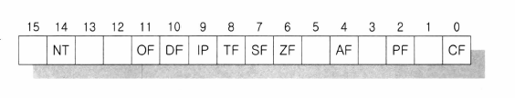

# day 16: CALL 명령에 의한 Task Switching


## 오늘의 결과

jmp를 사용한 task switching인 day 12에서의 결과와 같습니다.


jmp 명령에 의한 Task Switching과 다른 점은, 

1. 컨텍스트 스위칭을 할 때 `JMP 명령 => CALL 명령`
2. task를 처리하는 루틴에서 `JMP 명령으로 컨텍스트 스위칭 => IRET `

이 두 가지입니다(단 두 줄).


## 소스코드

=== "kernel.asm"

    ```assembly
    ; src\kernel.asm
    
    %include "src/init.inc"
    
    [org 0x010000]
    [bits 16]
    
    start:
        cld             ; Advance = inc
        mov ax, cs
        mov ds, ax
        xor ax, ax
        mov ss, ax
    
        xor ebx, ebx
        lea eax, [tss1]         ; EAX에 tss1의 물리 주소를 넣습니다.
        add eax, 0x10000
        mov [descriptor4+2], ax
        shr eax, 16
        mov [descriptor4+4], al
        mov [descriptor4+7], ah
    
        lea eax, [tss2]         ; EAX에 tss2의 물리 주소를 넣습니다.
        add eax, 0x10000
        mov [descriptor5+2], ax
        shr eax, 16
        mov [descriptor5+4], al
        mov [descriptor5+7], ah
    
        cli
    
        lgdt[gdtr]
    
        mov eax, cr0
        or eax, 0x00000001
        mov cr0, eax
    
        jmp $+2
        nop
        nop
    
        jmp dword SysCodeSelector:PM_Start
    
    [bits 32]
    
    PM_Start:
        mov bx, SysDataSelector
        mov ds, bx
        mov es, bx
        mov fs, bx
        mov gs, bx
        mov ss, bx
    
        lea esp, [PM_Start]
    
        mov ax, TSS1Selector
        ltr ax
        lea eax, [process2]
        mov [tss2_eip], eax
        mov [tss2_esp], esp
    
        call TSS2Selector:0
        ;   다시 태스크 스위칭이 되면 이곳으로 돌아옵니다.
    
        mov edi, 80*2*9
        lea esi, [msg_process1]
        call printf
        jmp $
    
    ;************************************
    ;********** Subroutines *************
    ;************************************
    printf:
        push eax
        push es
        mov ax, VideoSelector
        mov es, ax
    
    printf_loop:
        mov al, byte [esi]
        mov byte [es:edi], al
        inc edi
        mov byte [es:edi], 0x06
        inc esi
        inc edi
        or al, al
        jz printf_end
        jmp printf_loop
    
    printf_end:
        pop es
        pop eax
        ret
    
    process2:
        mov edi, 80*2*7
        lea esi, [msg_process2]
        call printf
        iret
    
    ;************************************
    ;*********** Data Area **************
    ;************************************
    
    msg_process1 db "This is System Process 1", 0
    msg_process2 db "This is System Process 2", 0
    
    gdtr:
        dw gdt_end-gdt-1
        dd gdt
    
    gdt:
        dd 0, 0
        dd 0x0000FFFF, 0x00CF9A00
        dd 0x0000FFFF, 0x00CF9200
        dd 0x8000FFFF, 0x0040920B
    
    descriptor4:
        dw 104
        dw 0
        db 0
        db 0x89
        db 0
        db 0
    
    descriptor5:
        dw 104
        dw 0
        db 0
        db 0x89
        db 0
        db 0
    
    gdt_end:
    
    tss1:
        dw 0, 0         ; 이전 태스크로의 back link
        dd 0            ; ESP0
        dw 0, 0         ; SS0, 사용 안 함
        dd 0            ; ESP1
        dw 0, 0         ; SS1, 사용 안 함
        dd 0            ; ESP2
        dw 0, 0         ; SS2, 사용 안 함
        dd 0, 0, 0      ; CR3, EIP, EFLAGS
        dd 0, 0, 0, 0   ; EAX, ECX, EDX, EBX
        dd 0, 0, 0, 0   ; ESP, EBP, ESI, EDI
        dw 0, 0         ; ES, 사용 안 함
        dw 0, 0         ; CS, 사용 안 함
        dw 0, 0         ; SS, 사용 안 함
        dw 0, 0         ; DS, 사용 안 함
        dw 0, 0         ; FS, 사용 안 함
        dw 0, 0         ; GS, 사용 안 함
        dw 0, 0         ; LDT, 사용 안 함
        dw 0, 0         ; 디버그용 T 비트, IO 허가 비트맵
    
    tss2:
        dw 0, 0         ; 이전 태스크로의 back link
        dd 0            ; ESP0
        dw 0, 0         ; SS0, 사용 안 함
        dd 0            ; ESP1
        dw 0, 0         ; SS1, 사용 안 함
        dd 0            ; ESP2
        dw 0, 0         ; SS2, 사용 안 함
        dd 0
    
    tss2_eip:
        dd 0, 0         ; EIP, EFLAGS(EFLAGS=0x200 for ints)
        dd 0, 0, 0, 0
    
    tss2_esp:
        dd 0, 0, 0, 0   ; ESP. EBP, ESI, EDI
        dw SysDataSelector, 0   ; ES, 사용 안 함
        dw SysCodeSelector, 0   ; CS, 사용 안 함
        dw SysDataSelector, 0   ; SS, 사용 안 함
        dw SysDataSelector, 0   ; DS, 사용 안 함
        dw SysDataSelector, 0   ; FS, 사용 안 함
        dw SysDataSelector, 0   ; GS, 사용 안 함
        dw 0, 0                 ; LDT, 사용 안 함
        dw 0, 0                 ; 디버그용 T 비트, IO 허가 비트맵
    
    times 1024-($-$$) db 0
    ```


## 오늘 학습 내용

GDT에 있는 TSS 디스크립터에 대하여 셀렉터를 사용한 CALL 명령에서 태스크 스위칭이 일어나고 또한 IRET 명령을 통해서도 태스크 스위칭이 일어납니다.



<center>EFLAG</center>

TSS Descriptor의 Segment type부분에는 B 비트가 있습니다. 그리고 EFLAGS 레지스터의 14번 비트는 NT(nested) 비트로 사용합니다.

NT의 의미는 IRET 명령을 실행할 때 이것이 인터럽트 핸들러의 IRET인지, 태스크 스위칭되어 다시 이전의 태스크로 돌아가는 의미의 IRET인지 CPU가 구별할 때 사용합니다.

- LTR 명령
  - TSS 디스크립터의 B 비트를 1로 세트합니다. 그리고 CPU는 현재 실행되고 있는 태스크의 B 비트는 항상 1이라고 인식합니다.
- CALL 명령
  - CALL 명령에 의한 태스크 스위칭이 일어날 때 이전 태스크의 EFLAGS에 있는 NT 비트가 1로 세트됩니다.
  - 그리고 B 비트도 1로 세트됩니다.
  - 또한 TSS 영역에 있는 "이전 태스크로의 백링크" 칸에 구태스크의 TSS 디스크립터 셀렉터를 저장해 둡니다. 이전 태스크의 B 비트는 1인 채로 남아있습니다.


## Task Switching과 Interrupt가 같이 걸리면?


위와 같이 인터럽트가 걸리더라도 EFLAGS 레지스터를 ISR(Interrupt Service Routine)에서 저장해 놓았다가 복원하기 때문에 문제가 없습니다.


## CPU에서 지원하는 Context Switching 정리

JMP 명령으로 태스크 스위칭을 하는 것은 현재 실행하는 context의 EFLAGS의 B 비트가 항상 1이 됩니다. 그리고 이전의 context EFLAGS의 B비트는 항상 0이 됩니다.

JMP 명령으로 태스크 스위칭을 하는 것은 태스크끼리의 구속성이 없습니다.

우리가 최종적으로 구현할 태스크 스위칭은 타이머를 사용한 선점형 태스크 스위칭이고, 유저 모드의 여러 태스크를 스위칭 할 것입니다. CALL 명령으로 태스크 스위칭하는 방법은 비선점형 태스크 스위칭을 위한 기능입니다. 

JMP 또는 CALL 명령을 통한 태스크 스위칭을 직접 사용하지는 않습니다. 하지만 이런 하드웨어적인(CPU에서 사용하는)방식에 대한 지식이 기반지식이 되기 때문에 좀 더 앞으로 구현할 TASK SWITCHING을 잘 이해할 수 있습니다.

