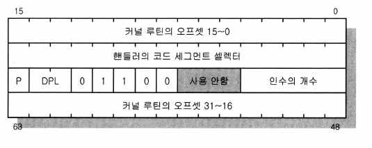
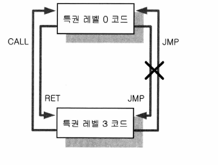
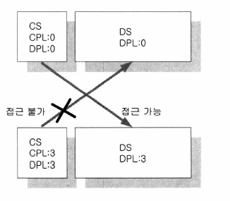
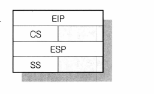
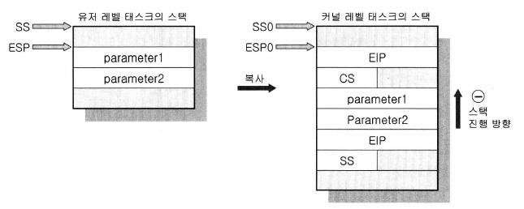

# day18: 보호(3)

## 콜게이트

낮은 특권 레벨의 프로그램이 실행 도중 높은 특권 레벨로 변경되는 수단은 대표적으로 인터럽트, 예외, 콜게이트가 있습니다. 이 중 하드웨어 인터럽트와 예외에서는 낮은 특권 레벨 프로그램이 자신의 의지와는 상관없이 특권 레벨의 변경이 이루어지고, 소프트웨어 인터럽트와 콜게이트는 낮은 특권 레벨의 프로그램이 자신의 의지에 의해 높은 특권 레벨의 루틴을 잠깐 사용하는 것입니다.

우리가 호적등본을 발급받으려 할 때 동사무소에 갑니다. 간단한 신청서를 작성하여 창구에 제출하면 동사무소 직원은 귀중한 서류들이 있는 곳으로 다녀와서 서류를 복사하고, 도장을 찍어 우리에게 건네줍니다. 우리는 정부기관에 접근할 때에는 항상 각각의 창구를 이용합니다. 동사무소는 정부기관 루틴의 일부이며, 거기에 있는 서류들은 귀중한 자료입니다. 이 자료들에는 정해진 루틴인 동사무소의 직원 외에는 아무나 접근해서는 안 됩니다. 창구에서 신청하고, 동사무소의 시스템만이 이 자료에 접근하여 신청자에게 신청자가 요구한 것의 결과물을 건네주는 순서로 일이 이루어져야만 하는 것입니다. 그리고 신청자는 창구라는 간접적인 방법으로 정부 시스템의 일부분을 사용하여 자신이 원하던 결과를 얻은 것입니다.

컴퓨터에서는 콜게이트나 소프트웨어 인터럽트를 통하여 위와 같은 일이 이루어집니다.

콜게이트도 다른 세그먼트 디스크립터와 함께 GDT 테이블에 디스크립터로서 포함되며, 또 하나의 세그먼트 정의라고 생각해도 됩니다. 낮은 특권 레벨의 프로그램이 높은 특권 레벨의 프로그램의 일부분을 사용하기 위한 창구 세그먼트입니다.

콜게이트 디스크립터

콜게이트 디스크립터는 "인수의 개수" 칸과 Type 이외의 부분은 다른 디스크립터와 비슷합니다.

이것을 GDT에 지정해 놓고, 유저 프로그램은 코드 셀렉터의 사용법과 마찬가지로 이 디스크립터를 셀렉터로 선택해서 JMP나 CALL 명령을 내립니다. 오프셋은 디스크립터에 지정되어 있으므로 아무 숫자나 사용해도 디스크립터에 지정된 오프셋의 루틴이 수행됩니다.

### 코드와 데이터의 특권 레벨 관계

특권 레벨 간의 JMP 명령은 불가능합니다. 반면에 CALL 명령은 특권 레벨 간의 이동을 가능하게 해주는데, CALL 명령은 항상 낮은 특권 레벨에서 높은 특권 레벨에 대하여 이루어져야 하고, RET 명령은 높은 특권 레벨에서 낮은 특권 레벨에 대하여 이루어져야 합니다. 특권 레벨 0의 코드가 특권 레벨 3의 코드를 불러낼 이유는 없다는 것입니다. 그리고 만약 특권 레벨 간의 JMP 명령을 굳이 사용해야 한다면 콜게이트(Call Gate)를 통하여 이루어지도록 합니다.

특권 레벨 0에서 동작하는 동안 CS 셀렉터의 0, 1비트에는 00이 들어가 있습니다. 특권 레벨 3에서 동작하는 동안의 CS 셀렉터에는 0, 1비트에 11(10진수 3)이 들어가 있게 됩니다.

특권 레벨 3에서 CALL 명령으로 특권 레벨 0의 루틴을 불러내게 되면 CS 셀렉터의 0, 1 비트에 00이 들어갑니다. 이 때의 CPL은 0입니다. 그리고 루틴이 끝나고 RET 명령으로 특권 레벨 3으로 돌아오게 되면 CS 셀렉터의 0, 1비트에 11(10진수 3)이 다시 들어가게 됩니다. 이 때의 CPL은 3이 됩니다. 코드 세그먼트 영역의 특권 레벨인 DPL과 그 때 CPL의 값은 모든 상황에서 같다고 생각하면 됩니다. **한 가지 예외가 있다면 Conforming 세그먼트일 경우인데,** 이것은 특권 레벨 0의 루틴을 불러내도 **CPL의 값이 그대로 3인 채로 실행**되었다가 RET 명령으로 돌아옵니다. Conforming 세그먼트는 콜게이트와 관련이 있습니다.

권한이 높은 곳에서는 낮은 곳으로 접근 가능. 역은 불가

## 특권 레벨 변동 시의 스택의 변화

태스크가 실행 중인 동안 인터럽트나 예외가 발생하거나 콜게이트를 거칠 때 특권 레벨의 변화가 이루어집니다. 인터럽트 핸들러나 예외 처리 루틴, 콜게이트에 지시된 커널 루틴은 커널 모드에서 실행이 되어야 하므로 현재 태스크가 유저 모드로 동작하고 있는 도중에 특권 레벨을 바꾸어 핸들러로 제어가 넘어가게 되는 것입니다. 이러한 스택 스위칭은 높은 특권 레벨의 루틴이 스택 공간의 부족 때문에 크래쉬되지 않게 하기 위한 것과 낮은 특권 레벨의 루틴이 스택을 통해 높은 특권 레벨의 루틴에 간섭하지 못하도록 하려는 이유가 있습니다.

핸들러나 커널 루틴으로 들어가기 전에 스택에 돌아올 주소 등을 넣어두었다가 핸들러나 커널 루틴이 끝나고 다시 유저 모드 태스크로 돌아오기 위해서 스택에 넣어두었던 값들을 사용합니다.

### CALL 명령이 내려졌을 때의 스택

유저 태스크가 콜게이트 등을 사용하여 커널 모드의 루틴을 불러내는 경우,

- CPU는 일단 이 태스크의 TSS 영역에 있는 SS0, ESP0의 값을 참조하여 커널 모드의 스택에 현재 유저 태스크가 사용하고 있는 SS, ESP, 그리고 유저 태스크가 현재 진행 중인 루틴의 주소인 CS, EIP를 차례로 PUSH합니다. 그리고 CPU의 SS, ESP 레지스터에는 SS0, ESP0의 값을 각각 넣습니다.
- 그리고 콜게이트에 지정된 커널 모드의 루틴 주소로 점프하고 실행합니다.
- 루틴을 마치고 돌아갈 때 RET 명령이 내려지면 현재 커널 모드의 스택에 저장된 SS, ESP, CS, EIP를 POP하여 CPU의 각각의 레지스터에 복원하여 유저 모드 태스크로 돌아갑니다. 이 때 먼저 CS를 확인한 후 현재 커널 모드보다 낮은 특권이면 SS와 ESP를 POP합니다.

커널 모드 스택(호출 인수가 없는 경우)

콜 게이트 사용 시의 스택의 변화(인수 있는 경우)

위의 경우에 GDT에 있는 콜게이트의 디스크립터의 "인수의 개수" 칸에 2가 들어 있다면 유저 레벨의 스택에서 2개를 커널 모드의 스택에 복사합니다.

커널 레벨 태스크의 스택을 호출 할 때는 유저 레벨에 있는 스택의 주소와 달라지기 때문에 POP해도 방금 전 유저 레벨에서 넣었던 인수는 나오지 않고 다른 값이 나오게 됩니다. 이러한 문제를 해결하기 위해서 콜게이트의 디스크립터에 "인수의 개수" 칸이 존재합니다. 이곳에 콜게이트를 통한 커널 루틴에서 사용할 인수의 개수를 미리 기입해 둡니다.

### 인터럽트 예외가 발생하셨을 때의 스택

EFLAGS가 추가된 것만 빼면 콜게이트의 경우와 흡사합니다.

커널 모드인 특권 레벨 0에서 인터럽트가 걸렸을 때에는 스택 변경이 일어나지 않습니다. 특권 레벨 0에서 굳이 시스템을 더 보호할 필요가 없기 때문입니다.

그러므로 특권 레벨 0에서 사용하고 있던 SS, ESP 그대로의 값을 사용하여 EFLAGS, CS, EIP를 PUSH합니다.

유저 레벨 태스크의 동작 중에 인터럽트나 예외가 발생하면 이 유저 레벨 태스크의 TSS 영역에서 SS0, ESP0을 CPU의 SS, ESP 레지스터에 복사합니다. 이로써 커널 모드의 스택을 사용하게 되는데, 이 커널 모드 스택에 콜게이트의 경우와 같이 유저 모드의 태스크가 사용하던 SS, ESP, CS, EIP 등의 레지스터 값을 PUSH하여 저장합니다. 그 후 커널 모드에 있는 인터럽트 핸들러 루틴으로 점프하고, 인터럽트 처리가 끝나면 IRET을 사용하여 방금 전에 인터럽트가 걸린 유저 모드로 돌아오는데, 이 때 스택에 있는 값들을 POP하여 CPU의 각각의 레지스터에 다시 복원합니다.

## Done

6장 끝( ~ p. 207)