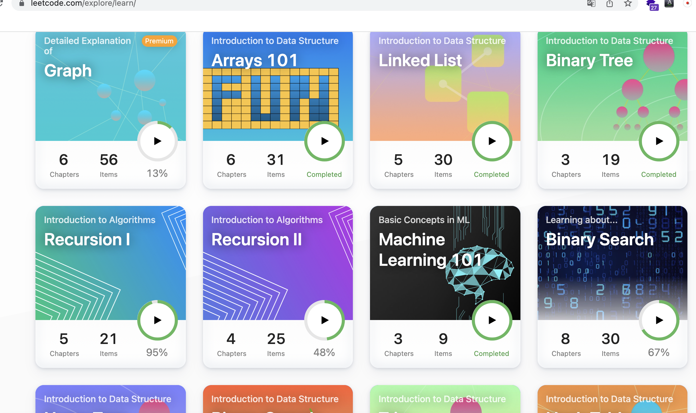

# 회고

## IT

### 개발

- Computer Science
  - Algorithm
    - FaceBook HackerCup: 2800th(round2)

    - Atcoder: 8kyu(brown)

    - CodeForce: newbie

    - Leetcode(한 전체적으로 70% 문제 푼 듯)

      

    - Google Foobar Challenge: Level5 진출(total 5/5)

  - OS
    - 운영체제 만들기: 김범준. 2005. 만들면서 배우는 OS 커널의 구조와 원리
    - https://noelbird.github.io/os-making/
    
  - versioning

    - semantic versioning: https://semver.org/lang/ko/

- 게임
  
  - 안경알run 만들었음 => 목공 선생님 선물
  - Unity로 만드는 게임(inflearn): C# 언어 강의만 완료했음.
  
- 기타 사이드 프로젝트
  - markdown editor 만들기(Mars)
    - 기본적인 기능만 구현: 렌더링, 파일 쓰기, 불러오기
  - Simple OJ(Online Judgement)
    - 한 명의 유저용: 문제 1개. 도커 사용 x
    - http://playground.noelbird.com:50080/
  - 밑바닥부터 만드는 인터프리터 in Go
    - https://noelbird.github.io/interpreter/02/
  - mytreepy 오픈 소스
    - https://github.com/NoelBird/treepy

### 딥러닝

- 네이버 부스트코스 AI tech course(upstage) 멘토링(NLP)

### 간단한 블록체인 만들기

- 파이썬으로 구현: https://noelbird.github.io/daily/2021-05-16/

### 봤던 책

- 디버깅을 통해 배우는 리눅스 커널의 구조와 원리(~2장)
- 소프트웨어 장인(완)
- 업무에 바로 쓰는 SQL 튜닝(완)
  - https://noelbird.github.io/daily/2021-07-10/
- 밑바닥부터 시작하는 딥러닝(앞부분 살짝 봤음)
- 파이썬 웹 프로그래밍
  - 이론에 치중해서, 흐름대로 따라가기가 어려웠음
- 프런트엔드 개발 시작하기(2014) - 위키북스
  - "네이버는 이렇게 한다" 라는 문구가 있어서 책을 샀는데, 사실 책의 내용이 많이 아쉬움

### 새롭게 알게된 링크

- 고퀄리티 개발 컨텐츠(아직 못 봤음): https://github.com/Integerous/goQuality-dev-contents

### 아쉬웠던 것

- 사이드 프로젝트 기간을 너무 길게 잡아서, 시작한 것은 많지만 제대로 끝낸 것이 별로 없었음
  - 계속 진행하는 긴 프로젝트랑 별개로 짧게 3~4주 내에 끝내는 사이드프로젝트를 진행하면 좋겠음
- 알고리즘에 대해서 개념은 알지만, 훈련이 되지 않은 알고리즘들이 많음
  - 한 주제 잡고 오래 해도 괜찮을 듯
- 책
  - 책 리뷰할 때, 책 읽기 시작한 시점 / 다 읽은 시점을 적어 두면 더 좋을 듯
  - 보고 싶은 책 리스트를 잘 관리하면 좋겠음.. 좋은 책들 리스트업은 많이 해뒀음

## 목공

- 빵도마 / 쟁반 / 스툴 / 오픈형 협탁

# TODO

새해에 이루고 싶은 것들

- 완결성 있는 프로그램 만들기(앱, 웹, 게임 상관 x)
- OPIc: AL
  - 말을 잘하고 싶음. 안드로이드 speak 앱으로 매일 연습하기.
- 현재 사이드 프로젝트들 완성
  - OS 만들기 => 완성
  - golang으로 인터프리터 만들기 => 완성
  - markdown editor => editor로서의 최소한의 기능 완성
- Unity로 만드는 게임(인프런) => 완강
- 포트폴리오 사이트 업데이트

