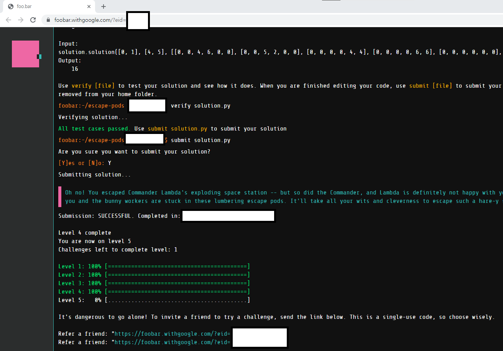
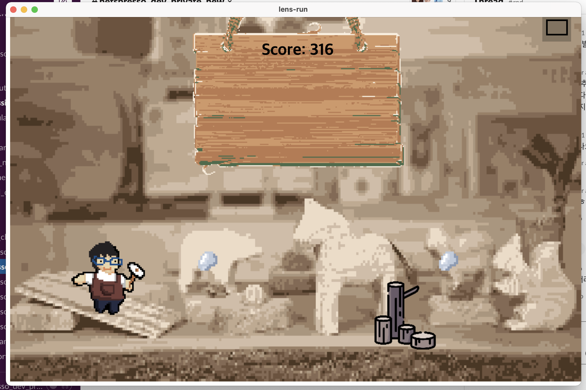
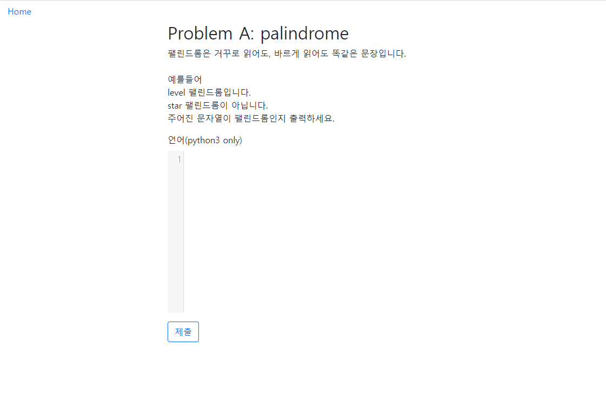
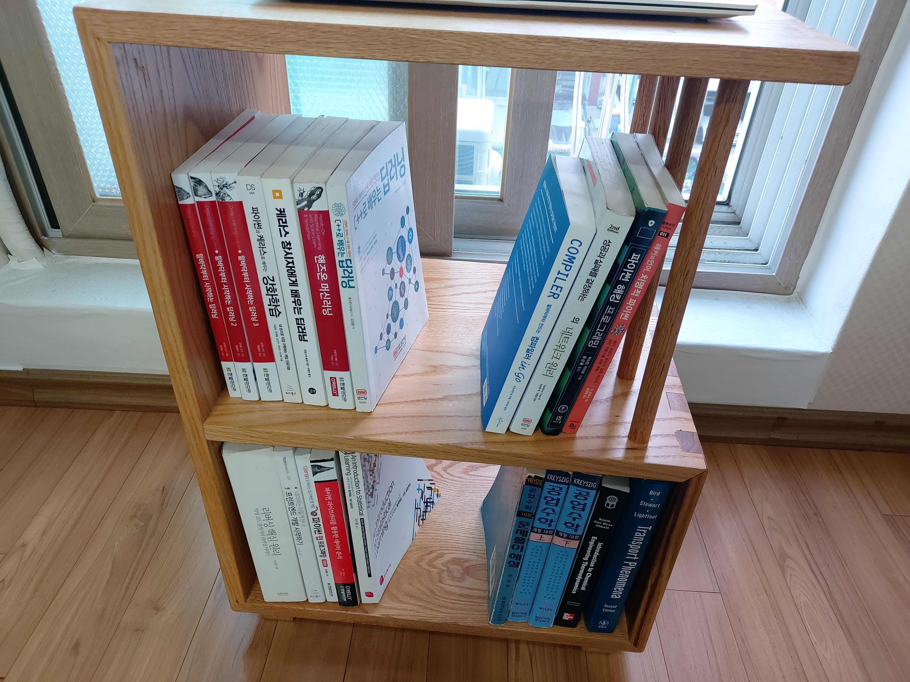

# 2021년 회고


## IT

### 개발

- Computer Science
  - Algorithm: 평소에 TIL을 찍을 것이 없을 때 알고리즘 문제를 하나씩 푸는 용도로 사용했습니다. 꾸준히 하는 기초체력 단련 정도로 열심히 했습니다.
    - FaceBook HackerCup: 2800th(round2)

    - Atcoder: 8kyu(brown)

    - CodeForce: newbie

    - Leetcode(한 전체적으로 70% 문제 푼 듯)

      

    - Google Foobar Challenge: Level5 진출(total 5/5) 
    
      
    
  - OS: 운영체제를 bootstrap부터 CUI 기반으로 만들어보는 운영체제였고, 80% 정도 완성
    - 운영체제 만들기: 김범준. 2005. 만들면서 배우는 OS 커널의 구조와 원리
    - https://noelbird.github.io/os-making/
    
  - versioning
  
    - semantic versioning: https://semver.org/lang/ko/
  
- 게임
  
  - 안경알run 만들었음 => 목공 선생님 선물(electronjs)
  
    
  
  - Unity로 만드는 게임(inflearn): C# 언어 강의만 완료했음.
  
- 기타 사이드 프로젝트
  - markdown editor 만들기(Mars)
    - 기본적인 기능만 구현: 렌더링, 파일 쓰기, 불러오기
    - https://github.com/NoelBird/mars
    
  - Simple OJ(Online Judgement)
    - 한 명의 유저용: 문제 1개. 도커 사용 x
    
    - http://playground.noelbird.com:50080/
    
      
    
  - 밑바닥부터 만드는 인터프리터 in Go
    - https://noelbird.github.io/interpreter/02/
    
  - mytreepy 오픈 소스
    - https://github.com/NoelBird/treepy

### 딥러닝

- 네이버 커넥트 재단 - 부스트코스 AI tech course(upstage) 2기 멘토링(NLP 멘토)
  - 모델 최적화
  - KLUE(Korean NLU Benchmark) 데이터셋을 활용한 ODQA(Open Domain Question & Ansering)


### 간단한 블록체인 만들기

- 파이썬으로 구현: https://noelbird.github.io/daily/2021-05-16/


### 봤던 책

작년에는 책을 3권 읽었습니다. 리팩토링 같은 좋은 책을 읽으려니까 일정에 치여서 잘 안 읽게 됩니다.

그래서 짧고 그림이 많은 책이 확실히 잘 읽히는 것을 깨달았습니다.


- 디버깅을 통해 배우는 리눅스 커널의 구조와 원리(~2장)

- 소프트웨어 장인(완)

  ```
  [켄트 벡의 "단순한 설계를 위한 네 가지 원칙"]
  1. 모든 테스트를 통과해야 한다.
  2. 명료하고, 충분히 표현되고, 일관되어야 한다.
  3. 동작이나 설정에 중복이 있어서는 안 된다.
  4. 메서드, 클래스, 모듈의 수는 가능한 적어야 한다.
  ```

- 리팩터링(~2장)

- 업무에 바로 쓰는 SQL 튜닝(완)

  - https://noelbird.github.io/daily/2021-07-10/

- 밑바닥부터 시작하는 딥러닝(앞부분 살짝 봤음)

- Tucker의 Go 언어 프로그래밍(완)

- 밑바닥부터 만드는 인터프리터 in go(~2장)

  - 작년에 제대로 못 본 것이 너무 아쉽습니다...

- 파이썬 웹 프로그래밍
  - 이론에 치중해서, 흐름대로 따라가기가 어려웠음

- 프런트엔드 개발 시작하기(2014) - 위키북스
  - "네이버는 이렇게 한다" 라는 문구가 있어서 책을 샀는데, 사실 책의 내용이 많이 아쉬움


### 새롭게 알게된 링크

- 고퀄리티 개발 컨텐츠(아직 못 봤음): https://github.com/Integerous/goQuality-dev-contents
- 기술 블로그 구독 사이트: http://daily-devblog.com/


### 아쉬웠던 것

- 사이드 프로젝트 기간을 너무 길게 잡아서, 시작한 것은 많지만 제대로 끝낸 것이 별로 없었음
  - 계속 진행하는 긴 프로젝트랑 별개로 짧게 3~4주 내에 끝내는 사이드프로젝트를 진행하면 좋겠음
- 알고리즘에 대해서 개념은 알지만, 훈련이 되지 않은 알고리즘들이 많음
  - 한 주제 잡고 오래 해도 괜찮을 듯
- 책
  - 책 리뷰할 때, 책 읽기 시작한 시점 / 다 읽은 시점을 적어 두면 더 좋을 듯
  - 보고 싶은 책 리스트를 잘 관리하면 좋겠음.. 좋은 책들 리스트업은 많이 해뒀음
- 포트폴리오 사이트
  - 취업 이후에 거의 업데이트 되지 못 했음
  - 회사에서 진행항 타임라인과 

- 일정관리
  - TODO 앱을 사용하는 것이 없어서 효율적인 일정 관리가 어려웠음


## 목공

- 빵도마 / 쟁반 / 스툴 / 오픈형 협탁 만듦

  


# TODO

새 해 계획은 작년의 피드백으로부터 나온다는 것을 깨달았습니다.

새해에 이루고 싶은 것들은 다음과 같습니다.


- 습관
  - 생활 습관
    - 일정관리
      - 불편하더라도 어떤 TODO 앱이든 일단 사용을 해 보는 것이 좋겠습니다.
  - 책 읽는 습관
    - 빨리 읽어야 하는 책이라면 그림이 많고 짧은 책으로 선택할 것
    - 꼭 필요한 책이라면, 너무 어려운 부분을 건너 뛰고 끝까지 다 볼 것
  - 코딩 프로젝트 습관
    - 매우 정확한 코딩 보다는, 일단 만들고 -> 깔끔하게 동작하도록 고치고 -> 더 빠르게 동작하도록 고치는 습관을 만들고 싶습니다.


- 개발
  - 완결성 있는 프로그램 만들기(앱, 웹, 게임 상관 x)
  - 현재 사이드 프로젝트들 완성
    - OS 만들기 => 완성
    - golang으로 인터프리터 만들기 => 완성
    - markdown editor => editor로서의 최소한의 기능 완성
  - Unity로 만드는 게임(인프런) => 완강
  - 포트폴리오: 2022년 1월까지 반영해서 포트폴리오 사이트 업데이트
    - 글을 그냥 써서 바로 업데이트 할 수 있도록 관리 페이지가 필요하다고 느꼈습니다.
    - 회사에서 진행한 타임라인과 사이드프로젝트를 진행한 타임라인을 같은 페이지에서 보여주는 페이지가 있으면 좋겠습니다.
  - 알고리즘
    - 2021년에는 기초체력 정도의 알고리즘을 했지만, 2022년에는 대회 위주의 공부로 바꾸고 싶습니다.
    - 2022년에는 HackerCup / CodeJam에서 본선에 가까이 갔으면 좋겠습니다.
  - 딥러닝
    - 강의 복습
      - 부스트캠프 강의들 복습하고 글로 남기기
      - 시간이 많이 부족하다면 코드와 설명 남기기
  - 운영체제 핵심만 가장 빠르게 배울 수 있는 사이트들 정리 => 한 페이지로
  - 트렌드
    - 2021 kakao if / naver deview에서 필요한 세미나들 모아서 보기


- 언어
  - OPIc: AL
    - 말을 잘하고 싶음. 안드로이드 speak 앱으로 매일 연습하기.

- 취미 생활 이것 들 중 하나 이상 해보기
  - 가죽 공예 / 방송 댄스 / 웹디자인 / 웹 퍼블리싱
