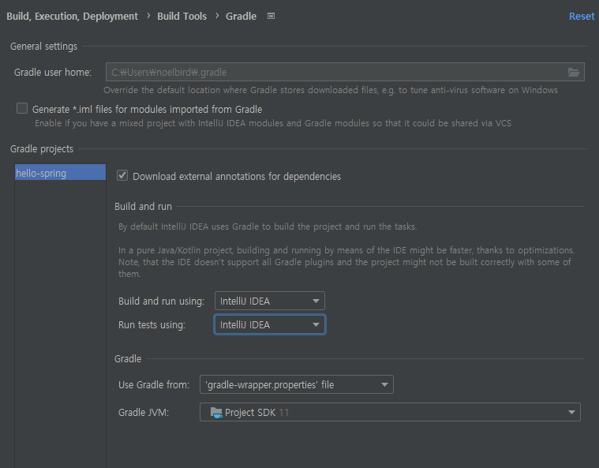
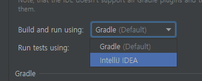
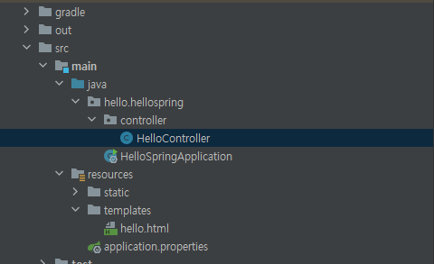

# day01

https://start.spring.io/


요즘 추세는 gradle로 넘어오는 추세임

spring 부트에서 snapshot은 만들고 있는 것

M1은 아직 정식 release 된 것이 아님

정식 릴리즈 중에서 가장 버전 큰 것으로 선택


## project metadata

- Group: 보통 회사명을 적어줌
- artifact: 빌드 결과물 이름(프로젝트 명)
- dependencies: 어떤 라이브러리를 사용할 것이냐
  - spring web
  - thymeleaf: html 템플릿 엔진
- generate 버튼 클릭


build.gradle은 빌드 설정파일입니다.

```
repositories {
	mavenCentral() # 여기에서 
}

dependencies {
	implementation 'org.springframework.boot:spring-boot-starter-thymeleaf'
	implementation 'org.springframework.boot:spring-boot-starter-web'
	testImplementation 'org.springframework.boot:spring-boot-starter-test'
}
```

dependencies를 mavenCentral()에서 다운 로드 받음


## 스프링부트 실행


이 에러페이지가 뜨면 성공입니다.


톰캣이라는 웹서버가 띄워지면서 스프링부트가 같이 올라갑니다.


## gradle을 통하지 않고, java 직접 실행

settings > gradle 검색






이렇게 실행하면 훨씬 빠름


## controller 만들기

```java
package hello.hellospring.controller;

import org.springframework.stereotype.Controller;
import org.springframework.ui.Model;
import org.springframework.web.bind.annotation.GetMapping;

@Controller
public class HelloController {
    @GetMapping("hello")
    public String hello(Model model){
        model.addAttribute("data", "hello!!");
        return "hello";
    }
}

```


```html
<!doctype html>
<html lang="en" xmlns:th="http://www.thymeleaf.org">
<head>
    <meta charset="UTF-8">
    <meta name="viewport"
          content="width=device-width, user-scalable=no, initial-scale=1.0, maximum-scale=1.0, minimum-scale=1.0">
    <meta http-equiv="X-UA-Compatible" content="ie=edge">
    <title>Document</title>
</head>
<body>
<p th:text="'안녕하세요. ' + ${data}">안녕하세요. 손님</p>
</body>
</html>
```





## static file

static 폴더 하위에 html 파일을 두면, 그대로 들어갈 수 있음

spring은 localhost:8080/hello-spring.html 로 접속하게 되면,

1. 컨트롤러가 있는 지 찾고,
2. 없으면, static file에서 찾음


## Done

스프링 웹 개발 기초의 정적 컨텐츠 까지 들었음