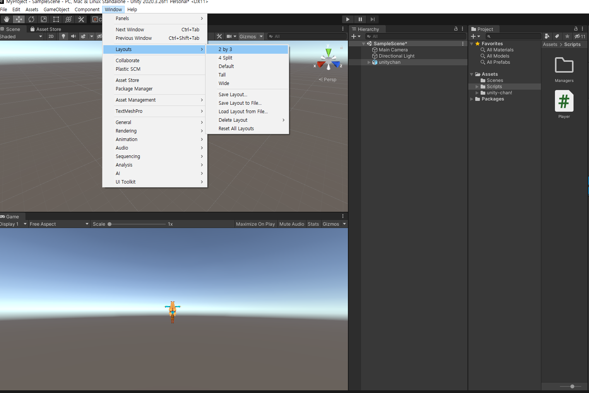
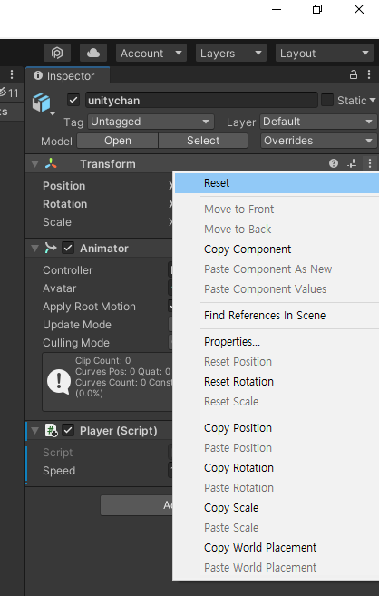
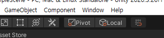

# Part3: 유니티 엔진(에셋관련)


화면은 다음과 같이 `Windows > Layouts > 2 by 3` 로 두는 것이 플레이 화면이랑 같이 봐서 좋습니다.

 




`Unity Chan!` 이라는 Asset을 Asset Market에서 무료로 다운로드 받을 수 있습니다.


> trouble shooting: Visual Studio에서 Unity의 함수, 변수등이 불러와지지 않았습니다. Player.cs 파일이 기타 파일로 되어 있었는데, visual studio installer에서 Unity 관련된 항목을 업데이트 해주면 됩니다.  그리고 프로젝트 다시 만들어야 할 수도 있음


### transform reset

대상에 대해서 transform을 잘 못한 경우에는 Reset 버튼이 있어서 다시 원래대로 돌릴 수 있습니다.




### 좌표계

- 좌표계의 종류

좌표계는 world 좌표와 로컬 좌표 두 개가 있습니다.

스크립트에서 변경할 때 캐릭터는 world 좌표를 기준으로 움직이게 되는데,

유니티에서 캐릭터를 클릭하고 X를 누르면 로컬좌표를 기준으로 볼 수 있습니다.

여기에서 Local이라고 적힌 토글 버튼을 누르는 것과 같습니다.



> 참고로 모든 물체는 자신만의 좌표계를 가지고 있습니다.


- 회전
  - 특정 축을 기준으로 degree를 사용해서 시계방향으로 360도 회전


- 코드

  ```c#
  transform.position += new Vector3(0.0f, 0.0f, 1.0f);	// 절대좌표 기준으로 position 변형
  transform.position += new Vector3.forward;				// 가독성 높이기
  transform.position += transform.TransformDirection(Vector3.forward * Time.deltaTime * _speed); // 상대좌표 기준으로 position 변형
  transform.Translate(Vector3.right * Time.deltaTime * _speed); // 로컬좌표 기준으로 포지션 변형
  ```

  


### 카메라

`Ctrl + Shift + F`  를 누르면, 현재 보고 있는 화면이랑 동일하게 카메라가 세팅됩니다. 카메라 오브젝트를 선택하고 단축키를 입력할 것!


### 오늘의 소스코드

```c#
// Player.cs

using System.Collections;
using System.Collections.Generic;
using UnityEngine;

public class Player : MonoBehaviour
{
    /*public float _speed = 10.0f;*/

    [SerializeField]
    float _speed = 10.0f;
    // Start is called before the first frame update
    void Start()
    {
        
    }

    // Update is called once per frame
    void Update()
    {
        // convert coordination system
        // Local -> World
        // TransformDirection

        // World -> Local
        // InverseTransformDirection

        // 로컬 좌표계를 이용해서 World 좌표계로 번역
        // transform.position += transform.TransformDirection(Vector3.forward * Time.deltaTime * _speed);

        if (Input.GetKey(KeyCode.W))
        {
            /*transform.position += new Vector3(0.0f, 0.0f, 1.0f) * Time.deltaTime * _speed;*/
            transform.Translate(Vector3.forward * Time.deltaTime * _speed);
        }
        if (Input.GetKey(KeyCode.S))
        {
            /*transform.position -= new Vector3(0.0f, 0.0f, 1.0f) * Time.deltaTime * _speed;*/
            transform.Translate(Vector3.back * Time.deltaTime * _speed);
        }
        if (Input.GetKey(KeyCode.A))
        {
            /*transform.position += new Vector3(1.0f, 0.0f, 0.0f) * Time.deltaTime * _speed;*/
            transform.Translate(Vector3.left * Time.deltaTime * _speed);
        }
        if (Input.GetKey(KeyCode.D))
        {
            /*transform.position -= new Vector3(1.0f, 0.0f, 0.0f) * Time.deltaTime * _speed;*/
            transform.Translate(Vector3.right * Time.deltaTime * _speed);
        }

    }
}

```

