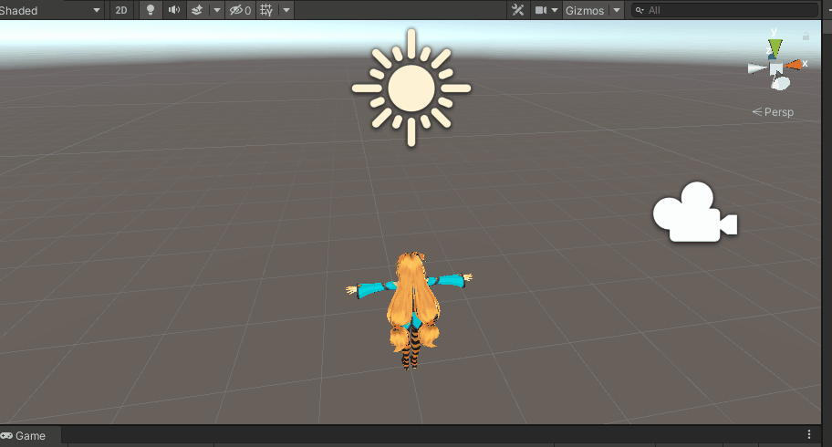
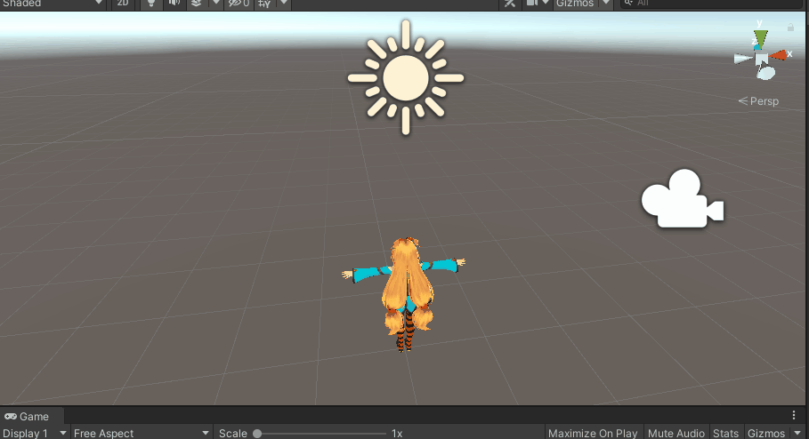

# Part3: 유니티엔진에서 회전


부드럽지 않게 회전하는 버전의 소스코드

```c#
using System.Collections;
using System.Collections.Generic;
using UnityEngine;


public class Player : MonoBehaviour
{
    /*public float _speed = 10.0f;*/

    [SerializeField]
    float _speed = 10.0f;
    // Start is called before the first frame update
    void Start()
    {
        
    }

    //float _yAngle = 0.0f;
    // Update is called once per frame
    void Update()
    {
        //// 회전 값을 줘서 회전
        //_yAngle += Time.deltaTime * _speed;
        //transform.eulerAngles = new Vector3(0.0f, _yAngle, 0.0f);

        //transform.Rotate(0.0f, Time.deltaTime * 100.0f, 0.0f);
        //transform.rotation = Quaternion.Euler(new Vector3(0.0f, _yAngle, 0.0f));

        if (Input.GetKey(KeyCode.W))
        {
            // transform.Translate(Vector3.forward * Time.deltaTime * _speed);
            transform.rotation = Quaternion.LookRotation(Vector3.forward);
        }
        if (Input.GetKey(KeyCode.S))
        {
            //transform.Translate(Vector3.back * Time.deltaTime * _speed);
            transform.rotation = Quaternion.LookRotation(Vector3.back);
        }
        if (Input.GetKey(KeyCode.A))
        {
            //transform.Translate(Vector3.left * Time.deltaTime * _speed);
            transform.rotation = Quaternion.LookRotation(Vector3.left);
        }
        if (Input.GetKey(KeyCode.D))
        {
            //transform.Translate(Vector3.right * Time.deltaTime * _speed);
            transform.rotation = Quaternion.LookRotation(Vector3.right);
        }

    }
}

```


### 회전과 이동을 동시에

아래와 같이 코드를 작성하면 조금 이상하게 움직이게 됩니다.

캐릭터가 코너에서 살짝 넓게 회전해서 돌아서 움직이는 느낌이 있습니다.



```c#
using System.Collections;
using System.Collections.Generic;
using UnityEngine;


public class Player : MonoBehaviour
{
    /*public float _speed = 10.0f;*/

    [SerializeField]
    float _speed = 10.0f;
    // Start is called before the first frame update
    void Start()
    {
        
    }

    //float _yAngle = 0.0f;
    // Update is called once per frame
    void Update()
    {
        //// 회전 값을 줘서 회전
        //_yAngle += Time.deltaTime * _speed;
        //transform.eulerAngles = new Vector3(0.0f, _yAngle, 0.0f);

        //transform.Rotate(0.0f, Time.deltaTime * 100.0f, 0.0f);
        //transform.rotation = Quaternion.Euler(new Vector3(0.0f, _yAngle, 0.0f));

        if (Input.GetKey(KeyCode.W))
        {
            transform.rotation = Quaternion.Slerp(transform.rotation, Quaternion.LookRotation(Vector3.forward), 0.05f);
            transform.Translate(Vector3.forward * Time.deltaTime * _speed);
        }
        if (Input.GetKey(KeyCode.S))
        {
            transform.rotation = Quaternion.Slerp(transform.rotation, Quaternion.LookRotation(Vector3.back), 0.05f);
            transform.Translate(Vector3.forward * Time.deltaTime * _speed);
        }
        if (Input.GetKey(KeyCode.A))
        {
            transform.rotation = Quaternion.Slerp(transform.rotation, Quaternion.LookRotation(Vector3.left), 0.05f);
            transform.Translate(Vector3.forward * Time.deltaTime * _speed);
        }
        if (Input.GetKey(KeyCode.D))
        {
            transform.rotation = Quaternion.Slerp(transform.rotation, Quaternion.LookRotation(Vector3.right), 1.0f);
            transform.Translate(Vector3.forward * Time.deltaTime * _speed);
        }
    }
}


```


아래와 같이 수정하면 좀 더 자연스럽게 움직입니다.




```c#
using System.Collections;
using System.Collections.Generic;
using UnityEngine;


public class Player : MonoBehaviour
{
    /*public float _speed = 10.0f;*/

    [SerializeField]
    float _speed = 10.0f;
    // Start is called before the first frame update
    void Start()
    {
        
    }

    //float _yAngle = 0.0f;
    // Update is called once per frame
    void Update()
    {
        //// 회전 값을 줘서 회전
        //_yAngle += Time.deltaTime * _speed;
        //transform.eulerAngles = new Vector3(0.0f, _yAngle, 0.0f);

        //transform.Rotate(0.0f, Time.deltaTime * 100.0f, 0.0f);
        //transform.rotation = Quaternion.Euler(new Vector3(0.0f, _yAngle, 0.0f));

        if (Input.GetKey(KeyCode.W))
        {
            transform.rotation = Quaternion.Slerp(transform.rotation, Quaternion.LookRotation(Vector3.forward), 0.05f);
            transform.position += Vector3.forward * Time.deltaTime * _speed;
        }
        if (Input.GetKey(KeyCode.S))
        {
            transform.rotation = Quaternion.Slerp(transform.rotation, Quaternion.LookRotation(Vector3.back), 0.05f);
            transform.position += Vector3.back * Time.deltaTime * _speed;
        }
        if (Input.GetKey(KeyCode.A))
        {
            transform.rotation = Quaternion.Slerp(transform.rotation, Quaternion.LookRotation(Vector3.left), 0.05f);
            transform.position += Vector3.left * Time.deltaTime * _speed;
        }
        if (Input.GetKey(KeyCode.D))
        {
            transform.rotation = Quaternion.Slerp(transform.rotation, Quaternion.LookRotation(Vector3.right), 1.0f);
            transform.position += Vector3.right * Time.deltaTime * _speed;
        }
    }
}

```


### 지금까지 소스코드 정리

- Scripts/Managers/Managers.cs

```c#
using System.Collections;
using System.Collections.Generic;
using UnityEngine;

public class Managers : MonoBehaviour
{
    static Managers s_instance;
    public static Managers Instance { get { Init(); return s_instance; } }

    InputManager _input = new InputManager();
    public static InputManager Input {  get { return Instance._input; } }

    void Start()
    {
        Init();
    }

    // Update is called once per frame
    void Update()
    {
        _input.OnUpdate();
    }

    static void Init()
    {
        if (s_instance == null)
        {
            GameObject go = GameObject.Find("@Managers");
            if (go == null)
            {
                go = new GameObject { name = "@Managers" };
                go.AddComponent<Managers>();
            }
            Managers mg = go.GetComponent<Managers>();

            DontDestroyOnLoad(go);
            s_instance = go.GetComponent<Managers>();
        }

        // 초기화
        
    }
}

```


- Scripts/Managers/InputManager.cs

```c#
using System;
using System.Collections;
using System.Collections.Generic;
using UnityEngine;

public class InputManager
{
    public Action KeyAction = null;

    // Update is called once per frame
    public void OnUpdate()
    {
        if (Input.anyKey == false)
            return;

        if (KeyAction != null)
        {
            KeyAction.Invoke();
        }
    }
}

```


- Scripts/Player.cs

```c#
using System.Collections;
using System.Collections.Generic;
using UnityEngine;


public class Player : MonoBehaviour
{
    /*public float _speed = 10.0f;*/

    [SerializeField]
    float _speed = 10.0f;
    // Start is called before the first frame update
    void Start()
    {
        // Input Manager에혹시 어떤키가 눌리게 되면 OnKeyboard 함수를 실행해라!
        Managers.Input.KeyAction -= OnKeyboard; // 혹시 한 번 더 추가했을까봐 실수 방지
        Managers.Input.KeyAction += OnKeyboard;
    }

    //float _yAngle = 0.0f;
    // Update is called once per frame
    void Update()
    {

    }

    void OnKeyboard()
    {
        if (Input.GetKey(KeyCode.W))
        {
            transform.rotation = Quaternion.Slerp(transform.rotation, Quaternion.LookRotation(Vector3.forward), 0.05f);
            transform.position += Vector3.forward * Time.deltaTime * _speed;
        }
        if (Input.GetKey(KeyCode.S))
        {
            transform.rotation = Quaternion.Slerp(transform.rotation, Quaternion.LookRotation(Vector3.back), 0.05f);
            transform.position += Vector3.back * Time.deltaTime * _speed;
        }
        if (Input.GetKey(KeyCode.A))
        {
            transform.rotation = Quaternion.Slerp(transform.rotation, Quaternion.LookRotation(Vector3.left), 0.05f);
            transform.position += Vector3.left * Time.deltaTime * _speed;
        }
        if (Input.GetKey(KeyCode.D))
        {
            transform.rotation = Quaternion.Slerp(transform.rotation, Quaternion.LookRotation(Vector3.right), 1.0f);
            transform.position += Vector3.right * Time.deltaTime * _speed;
        }
    }
}

```

