# prefab(Pre-Fabrication)


- ctrl + shift + N: 새 game object


- 이 체크박스를 해제하면 게임에서 더 이상 사용하지 않는 오브젝트라는 것을 알림
- 탱크를 만들기 위해서 잠시 꺼둡니다.


- 탱크 만들기
  - Ctrl + Shift + N으로 새로운 game object를 만들고
  - 그 아래에 3D object -> Cube를 선택한 후에
  - W, E, R 중에서 R을 눌러서 x축방향, y축방향으로 넓직하게 늘려줍니다.
  - 그리고 Ctrl + D로 카피를 해줍니다.

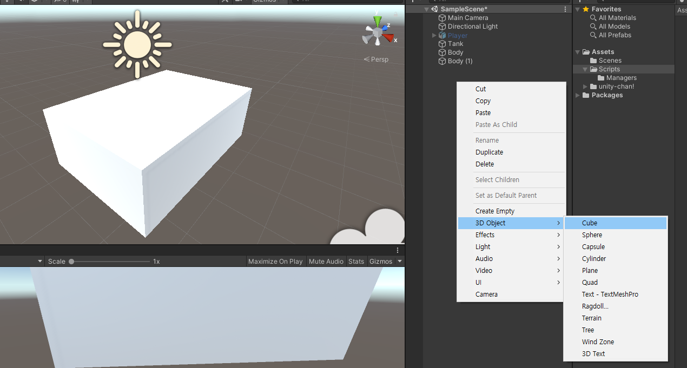


탱크 완성

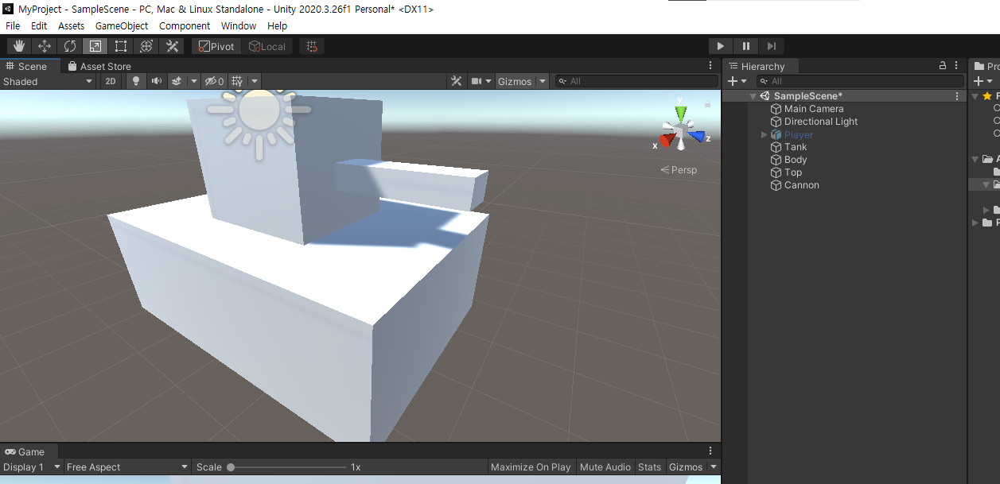


- prefab 만들기

  - Assets 밑에 Prefabs라는 새로운 폴더를 만들고, 그 밑에 Tank를 드래그 앤 드롭으로 넣으면 Tank가 Prefab이 됩니다.
  - prefab을 이렇게 만들게 되면, 스크린샷처럼 그 상태를 찍어서 저장했다고 볼 수 있습니다.
  - 그러면 씬에 있는 탱크는 지워도 상관 없습니다.
  - Prefab과 Prefab instance의 관계는 클래스와 오브젝트의 관계와 매우 유사합니다.

- prefab 모드로 들어가기/나오기

  - prefab은 drag&drop으로 인스턴스를 생성할 수 있는데, 아래처럼 버튼을 클릭해서 prefab 모드로 들어가거나 Assets 밑의 prefab을 더블클릭하면 prefab을 수정할 수 있는 prefab 모드로 들어갑니다.

    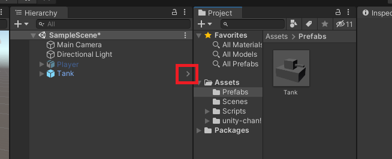

- prefab instance의 속성 변경(override)

  - Game Object에서 직접 Speed 등의 속성을 변경하게 되면 더 이상 prefab의 값을 바꾸거나 하더라도 적용이 되지 않습니다.

  - 마치, object에서 값을 덮어씌우기 하면 class의 값이 변경되더라도 적용이 되지 않는 것과 같습니다.

    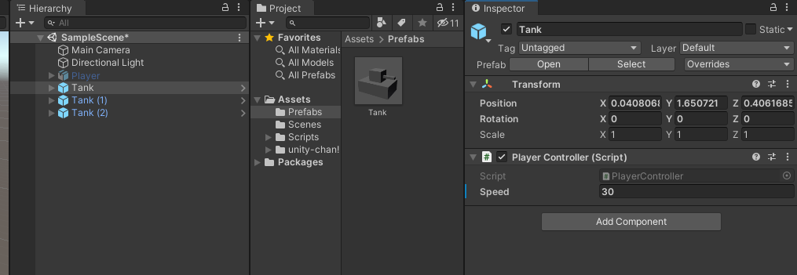

    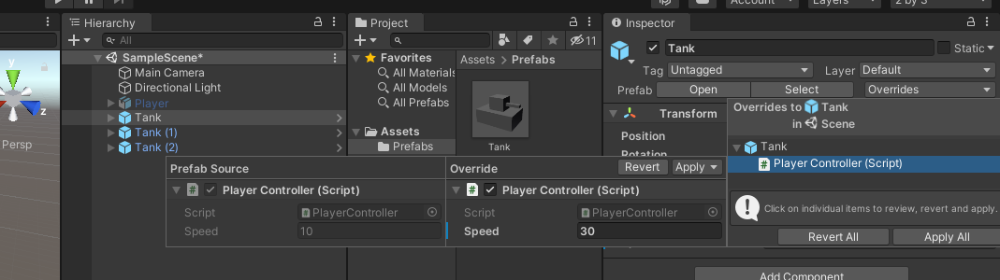

  - Overrides 메뉴를 선택하면 어떤 값이 어떻게 바뀌었는지 확인할 수 있습니다.


### Nested Prefab

- Nested Prefab은 클래스에서의 포함 관계와 같습니다.

  ```C#
  class Tank
  {
      // 온갖 정보
      public float speed = 10.0f;
      Player player; // 포함 관계 Nested(중첩된) Prefab
  }
  
  class Player
  {
      
  }
  ```

- Nested Prefab을 만드는 방법은 Ctrl + Shift + N으로 새로운 게임 오브젝트를 만들어서 플레이어와 탱크를 넣어준 후에 Prefabs 폴더로 Drag&Drop 해주면 Nested Prefab이 생성됩니다.

  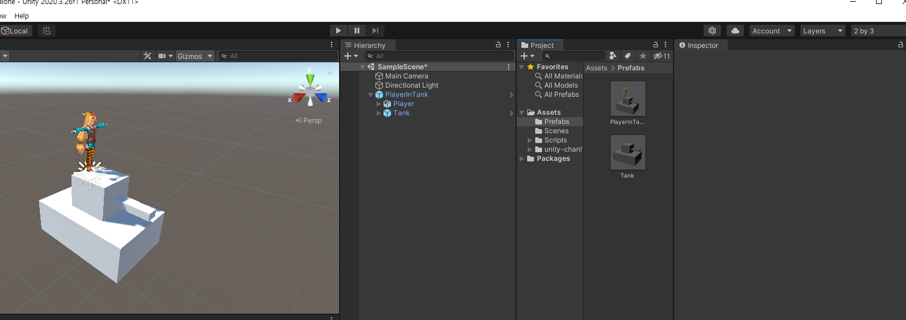

- Tank라는 Prefab의 속성을 변경을 하면, PlayerInTank라는 Nested Prefab에서도 그 변경된 값이 적용됩니다.


- Prefab Variant

  - 클래스의 상속과 동일한 개념

  - 만드는 방법은 Prefab Instance를 prefab 폴더로 Drag&Drop 하면 됩니다.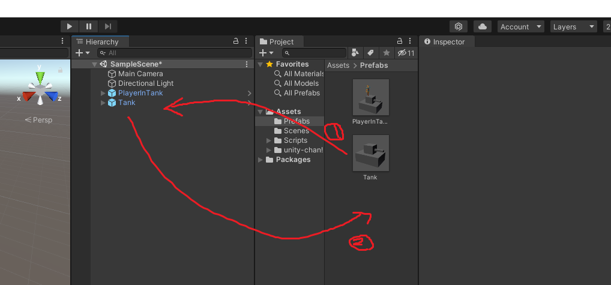

  - 이후에 Original Prefab을 만들지 아니면 Prefab Variant를 만들지 선택창이 뜨는데, Prefab Variant를 선택하면 됩니다. 이후 Prefab Instance의 모양도 원래 Prefab과는 약간 다른 모양이 됩니다.

    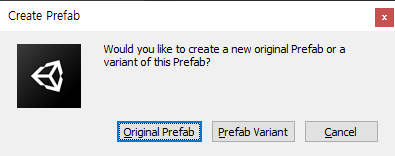

    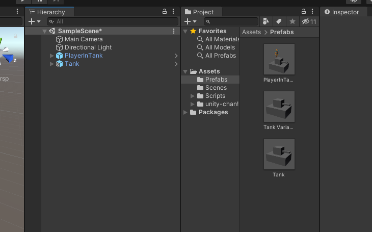

탱크만 남기고 화면 정리를 한 번 해줍니다.

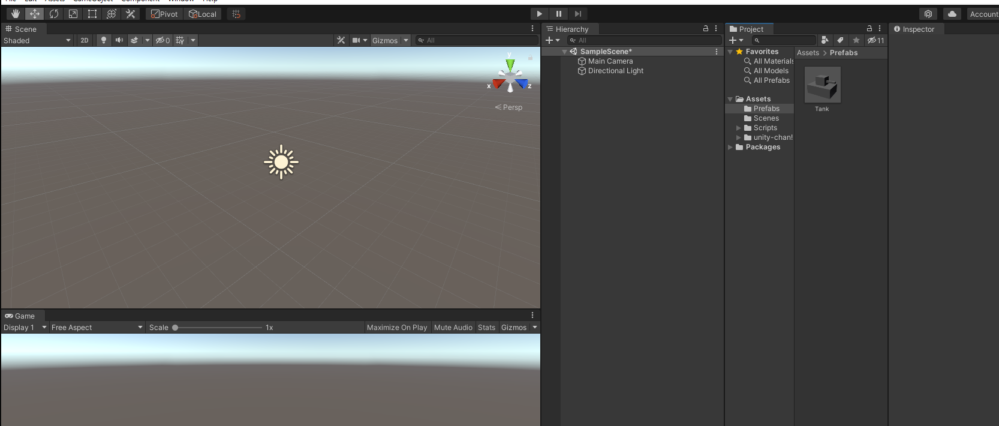


### Prefab을 스크립트에서 생성하는 방법

- Unity 툴을 사용하는 방법

  - 씬에서도 PrefabTest를 만들고, Scripts 밑에도 PrefabTest를 만들어줍니다.

    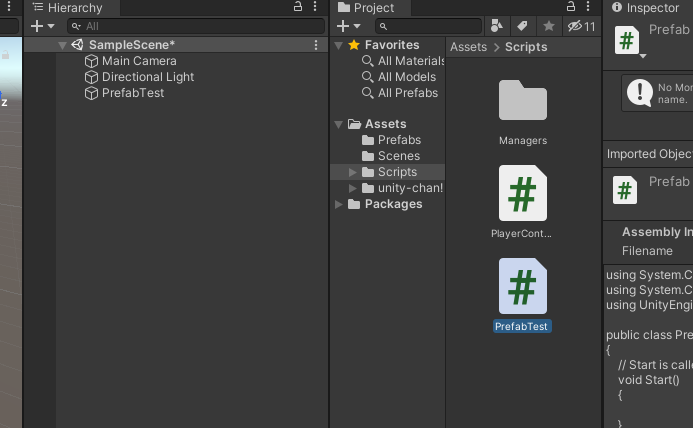

  - 아래와 같이 코드를 작성한 다음, PrefabTest.cs 스크립트를 연결한 다음 prefab에는 Tank를 넣어줍니다.

    ```c#
    // PrefabTest.cs
    using System.Collections;
    using System.Collections.Generic;
    using UnityEngine;
    
    public class PrefabTest : MonoBehaviour
    {
        public GameObject prefab;
        // Start is called before the first frame update
        void Start()
        {
            Object.Instantiate(prefab);
        }
    
        // Update is called once per frame
        void Update()
        {
            
        }
    }
    ```

  - 아래와 같이 탱크가 잘 나오는 것을 볼 수 있습니다.

  - 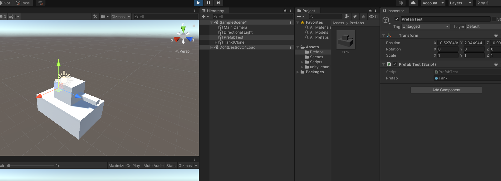

- Code로 Resource 불러오기

  - 아래와 같이 Resources 밑에 폴더를 두면 불러올 수 있습니다.

    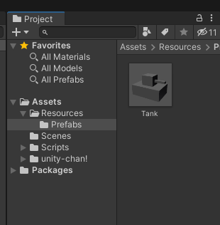

  - 코드

    ```c#
    using System.Collections;
    using System.Collections.Generic;
    using UnityEngine;
    
    public class PrefabTest : MonoBehaviour
    {
        GameObject tank;
        // Start is called before the first frame update
        void Start()
        {
            GameObject prefab = Resources.Load<GameObject>("Prefabs/Tank");
            tank = Instantiate(prefab);
            Destroy(tank, 3.0f);
        }
    
        // Update is called once per frame
        void Update()
        {
            
        }
    }
    
    ```


- Resource Manager를 만들어서 좀 더 깔끔하게 정리한 형태

  - scripts/Managers/ResourceManger.cs

    ```c#
    using System.Collections;
    using System.Collections.Generic;
    using UnityEngine;
    
    public class ResourceManager
    {
    
        public T Load<T>(string path) where T: Object
        {
            return Resources.Load<T>(path);
        }
    
        public GameObject Instantiate(string path, Transform parent=null)
        {
            GameObject prefab = Load<GameObject>($"Prefabs/{path}");
            if(prefab == null)
            {
                Debug.Log($"Failed to load prefab: {path}");
                return null;
            }
    
            return Object.Instantiate(prefab);
        }
    
        public void Destroy(GameObject go)
        {
            if (go == null)
            {
                return;
            }
            Object.Destroy(go);
        }
    
    }
    ```

  - scripts/Managers/Managers.cs

    ```c#
    using System.Collections;
    using System.Collections.Generic;
    using UnityEngine;
    
    public class Managers : MonoBehaviour
    {
        static Managers s_instance;
        public static Managers Instance { get { Init(); return s_instance; } }
    
        InputManager _input = new InputManager();
        ResourceManager _resource = new ResourceManager();
    
        public static InputManager Input {  get { return Instance._input; } }
        public static ResourceManager Resource { get { return Instance._resource; } }
    
        void Start()
        {
            Init();
        }
    
        void Update()
        {
            _input.OnUpdate();
        }
    
        static void Init()
        {
            if (s_instance == null)
            {
                GameObject go = GameObject.Find("@Managers");
                if (go == null)
                {
                    go = new GameObject { name = "@Managers" };
                    go.AddComponent<Managers>();
                }
                Managers mg = go.GetComponent<Managers>();
    
                DontDestroyOnLoad(go);
                s_instance = go.GetComponent<Managers>();
            }
        }
    }
    ```

  - scripts/PrefabTest.cs

    ```c#
    using System.Collections;
    using System.Collections.Generic;
    using UnityEngine;
    
    public class PrefabTest : MonoBehaviour
    {
        GameObject prefab;
        GameObject tank;
        // Start is called before the first frame update
        void Start()
        {
            tank = Managers.Resource.Instantiate("Tank");
            Managers.Resource.Destroy(tank);
        }
    
        // Update is called once per frame
        void Update()
        {
            
        }
    }
    ```

    


### 폴더 정리

art 밑에 다운로드 받은 리소스들을 넣습니다.

Models 폴더로부터 UnityChan 캐릭터는 prefab처럼 보이지만 그냥 별도의 asset 형태이기 때문에, prefab으로 만들어줘서 Prefabs 폴더에 넣어둡니다.

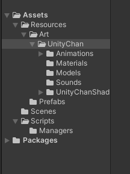