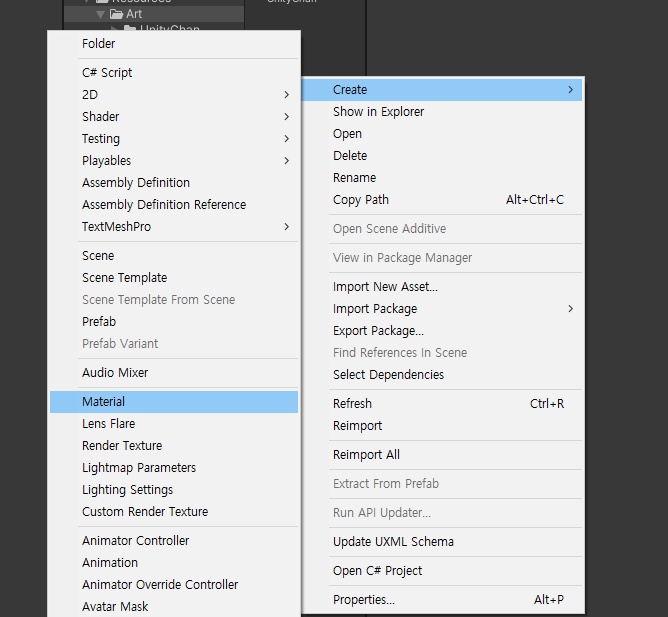
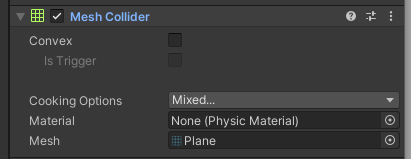
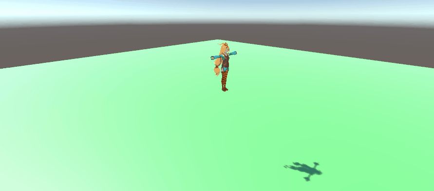
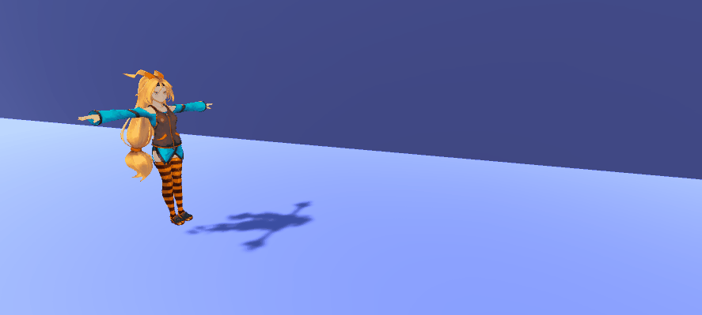
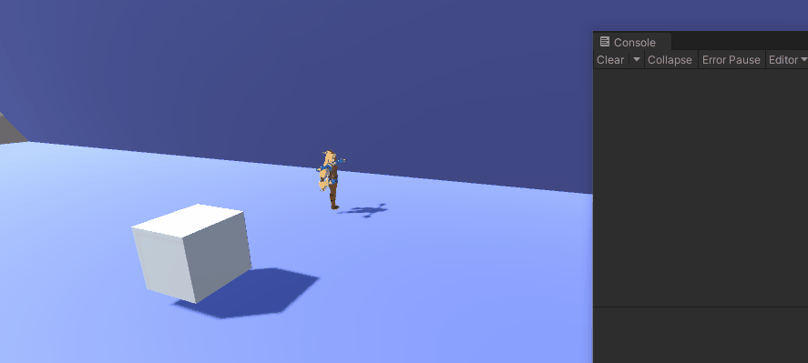
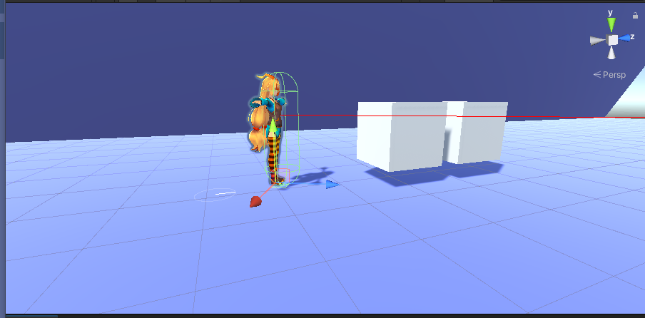
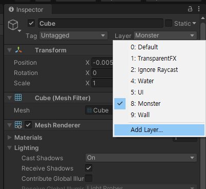
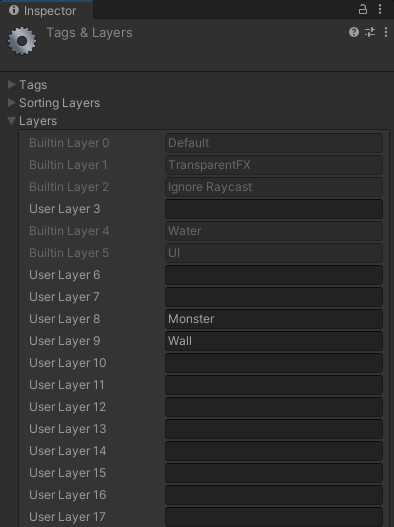

# Collision


땅을 만드는 방법은 Terrain과 Plain이 있습니다. 간단하게 만들 때는 Plain으로 할 수 있습니다.

plain의 색상을 입히려면 material이 있어야 합니다.




### 물리법칙을 적용하려면

Object에 RigidBody라는 Component를 붙여줘야 합니다. RigidBody라는 컴포넌트를 가지고 있으면 물리법칙이 적용되고,


충돌을 시키려고 한다면, Collider라는 것이 양 물체 간에 정의되어 있어야 합니다.

Plane을 만들면 기본적으로 Mesh Collider라는 것을 가지고 있는데,



캐릭터에는 아무런 Collider가 없으니 Capsule Collider 를 생성해서 캐릭터의 크기만큼 늘려줍니다.

그리고 실행버튼을 누르면 자연스럽게 충돌이 일어납니다.





캐릭터에 있는 isKinematic이라는 옵션을 체크하면 Unity의 물리에 영향을 받지 않습니다.

FPS게임 같은 경우에 이펙트를 화려하게 하고 싶으면 이 기능을 켜는 경우가 있지만,

일반적인 RPG게임은 이 기능을 평소에 켜지 않습니다.


### Collision vs Trigger

- Collision은 대체료 충돌이 있을 때 사용(총알 => 사람)

- Trigger는 범위 안에 들어갔는지 확인하고 싶을 때 사용

충돌하는 두 물체의 둘 중에 하나만 isTrigger가 체크되어 있어도 trigger로 처리가 됩니다.


```c#
// TestCollision.cs

using System.Collections;
using System.Collections.Generic;
using UnityEngine;

public class TestCollision : MonoBehaviour
{
    private void OnCollisionEnter(Collision collision)
    {
        Debug.Log("collision!!");
    }

    private void OnTriggerEnter(Collider other)
    {
        Debug.Log("Triggered!!");
    }

    // Start is called before the first frame update
    void Start()
    {
        
    }

    // Update is called once per frame
    void Update()
    {
        
    }
}

```


### RayCasting

3d 게임에서 캐릭터 등을 선택할 때, 광선을 쏴서 충돌하는 것을 선택하는 방식으로 할 수 있음

```c#
using System.Collections;
using System.Collections.Generic;
using UnityEngine;

public class TestCollision : MonoBehaviour
{
    private void OnCollisionEnter(Collision collision)
    {
        Debug.Log("collision!!");
    }

    private void OnTriggerEnter(Collider other)
    {
        Debug.Log("Triggered!!");
    }

    // Start is called before the first frame update
    void Start()
    {
        
    }

    // Update is called once per frame
    void Update()
    {
        Debug.DrawRay(transform.position + Vector3.up, Vector3.forward*10, Color.red);
        RaycastHit hit;
        if (Physics.Raycast(transform.position + Vector3.up, Vector3.forward, out hit, 10.0f)) 
        {
            Debug.Log($"ray cast!! {hit.collider.gameObject.name}");
        }
    }
}

```




- 문제점은 캐릭터가 바라보는 방향으로 ray가 쏴지지 않는 것입니다.

- 그리고 cube를 여러개 두게 되면 제일 첫 번째 것에만 hit이 됩니다.





### screen에서 ray쏘기

Local <=> World <=> (ViewPort <=> Screen 화면. screen과 viewport는 거의 유사. viewport는 2d좌표값이고 viewport는 비율로만 표시)


```c#
using System.Collections;
using System.Collections.Generic;
using UnityEngine;

public class TestCollision : MonoBehaviour
{
    private void OnCollisionEnter(Collision collision)
    {
        Debug.Log("collision!!");
    }

    private void OnTriggerEnter(Collider other)
    {
        Debug.Log("Triggered!!");
    }

    // Start is called before the first frame update
    void Start()
    {
        
    }

    // Update is called once per frame
    void Update()
    {
        // Local <=> World <=> View Port <=> Screen
        // Debug.Log(Input.mousePosition); // Screen
        // Debug.Log(Camera.main.ScreenToViewportPoint(Input.mousePosition)); // ViewPort
        if(Input.GetMouseButtonDown(0))
        {
            Ray ray = Camera.main.ScreenPointToRay(Input.mousePosition);

            Debug.DrawRay(Camera.main.transform.position, ray.direction * 100.0f, Color.red, 1.0f);

            RaycastHit hit;
            if (Physics.Raycast(ray, out hit, 100.0f))
            {
                Debug.Log($"RayCast Camera @ {hit.collider.gameObject.name}");
            }
        }

        // Vector3 mousePos = Camera.main.ScreenToWorldPoint(new Vector3(Input.mousePosition.x, Input.mousePosition.y, Camera.main.nearClipPlane));
        // Vector3 dir = mousePos - Camera.main.transform.position;
        // dir = dir.normalized;
    }
}

```


### Layer Mask를 이용한 연산 횟수 줄이기

ray를 사용하면 오브젝트들을 비교하는데 연산이 꽤 많이 듭니다. 또한 mesh collider처럼 면이 많은 collider를 사용하게 되면, 연산횟수가 매우 많아지게 되므로

Layer Mask를 이용해서 원하는 물체들에 대해서만 ray를 쏘도록 할 수 있습니다.


예를 들어서 Cube들에 대해서만 ray를 쏘려고 한다면, 8번에 새로운 Layer를 지정해주고 bitmasking으로 ray의 대상이 되는 것들만 선택하면 됩니다.





`int mask = 1 << 8;`

`Physics.Raycast(ray, out hit, 100.0f, mask);`
