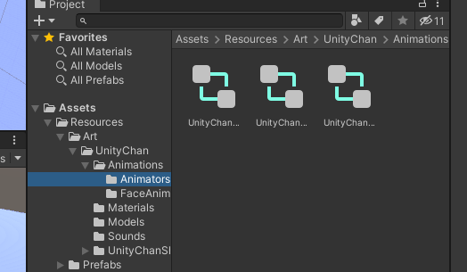
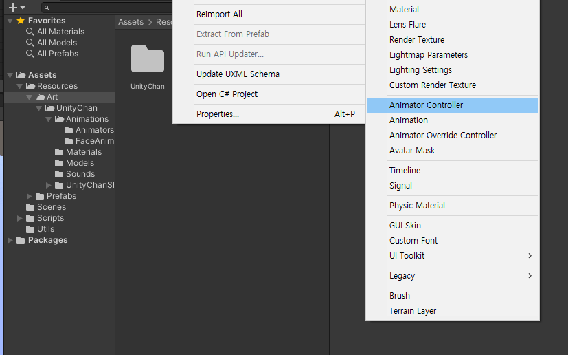
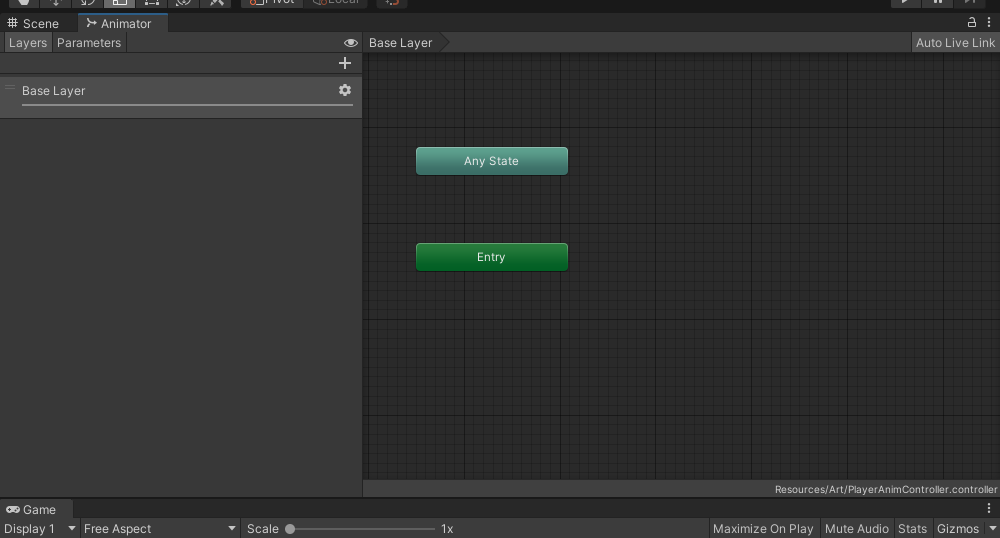
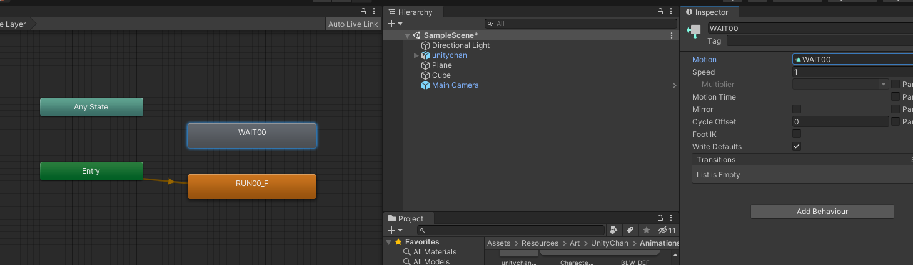
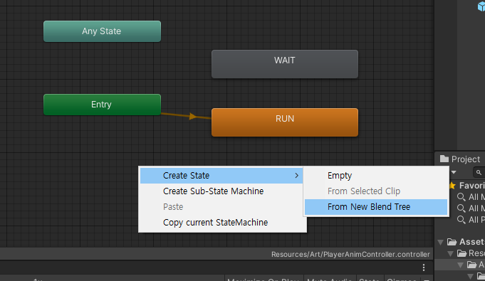
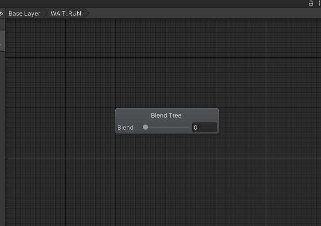
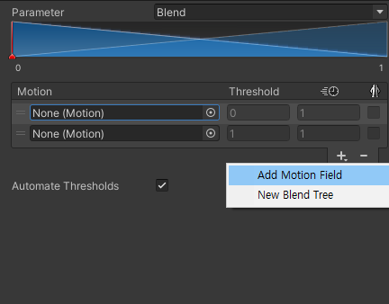
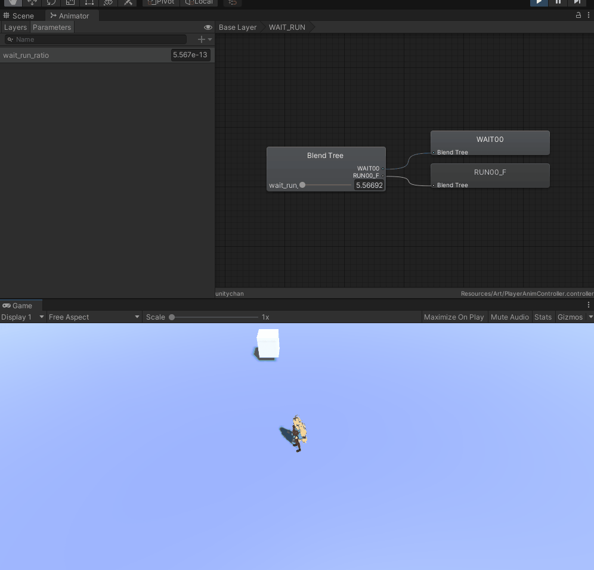

# Animation


캐릭터에 Add component로 Animation과 Animator를 붙일 수 있는데,

Animation은 Legacy Component라서 요즘엔 사용하지 않습니다.

요새  Animation의 방식은 Mecanim Animation 방식이라고 부릅니다.


Animator의 Controller 부분에는 Animations의 Animator 밑에 있는 것들을 연결할 수 있습니다.






새로 Animator Controller를 만들어주고, PlayerAnimController로 임시로(학습 목적으로 배우고 삭제 예정) 만들면 다음과 같은 창이 뜨게 되고,



`Alt + 마우스 왼쪽 클릭 + 드래그` 로 화면을 이동할 수 있고,

휠로 zoom in/out을 할 수 있습니다.





- Entry에서 SetStateMachine Default State를 선택한 후에 RUN00_F를 누르면 위와 같이 연결됩니다.
- 그리고 WAIT00처럼 표시된 부분은 변경해도 원래의 animation 관련된 파일에는 영향이 없습니다.


아래와 같이  PlayerController.cs 에 Update()함수 안에 다음의 부분을 넣으면 이동 중일 때 다른 종류의 애니메이션을 실행할 수 있습니다.

```c#
// Controllers/PlayerController.cs

if(_moveToDest)
{
    Animator anim = GetComponent<Animator>();
    anim.Play("RUN");
}else
{
    Animator anim = GetComponent<Animator>();
    anim.Play("WAIT");
}
```


- 전체 스크립트

```c#
// Controllers/PlayerController.cs
using System.Collections;
using System.Collections.Generic;
using UnityEngine;


public class PlayerController : MonoBehaviour
{
    /*public float _speed = 10.0f;*/

    [SerializeField]
    float _speed = 10.0f;

    bool _moveToDest = false;
    Vector3 _destPos;

    void Start()
    {
        // Input Manager에혹시 어떤키가 눌리게 되면 OnKeyboard 함수를 실행해라!
        Managers.Input.KeyAction -= OnKeyboard; // 혹시 한 번 더 추가했을까봐 실수 방지
        Managers.Input.KeyAction += OnKeyboard;
        Managers.Input.MouseAction -= OnMouseClicked;
        Managers.Input.MouseAction += OnMouseClicked;
    }

    //float _yAngle = 0.0f;
    // Update is called once per frame
    void Update()
    {
        if(_moveToDest)
        {
            Vector3 dir = _destPos - transform.position;
            if(dir.magnitude < 0.0001)
            {
                _moveToDest = false;
            }else
            {
                //float moveDist = _speed * Time.deltaTime;
                //if (moveDist >= dir.magnitude)
                //    moveDist = dir.magnitude;
                float moveDist = Mathf.Clamp(_speed * Time.deltaTime, 0, dir.magnitude);
                transform.position = transform.position + dir.normalized * moveDist*0.9f;
                transform.LookAt(_destPos); // LookAt을 하면 한 번에 많이 돌기 때문에 끊겨 보일 수 있음
                // transform.rotation = Quaternion.Slerp(transform.rotation, Quaternion.LookRotation(dir), 20 * Time.deltaTime);
            }
        }

        if(_moveToDest)
        {
            Animator anim = GetComponent<Animator>();
            anim.Play("RUN");
        }else
        {
            Animator anim = GetComponent<Animator>();
            anim.Play("WAIT");
        }
        
        
    }

    void OnKeyboard()
    {
        if (Input.GetKey(KeyCode.W))
        {
            transform.rotation = Quaternion.Slerp(transform.rotation, Quaternion.LookRotation(Vector3.forward), 0.05f);
            transform.position += Vector3.forward * Time.deltaTime * _speed;
        }
        if (Input.GetKey(KeyCode.S))
        {
            transform.rotation = Quaternion.Slerp(transform.rotation, Quaternion.LookRotation(Vector3.back), 0.05f);
            transform.position += Vector3.back * Time.deltaTime * _speed;
        }
        if (Input.GetKey(KeyCode.A))
        {
            transform.rotation = Quaternion.Slerp(transform.rotation, Quaternion.LookRotation(Vector3.left), 0.05f);
            transform.position += Vector3.left * Time.deltaTime * _speed;
        }
        if (Input.GetKey(KeyCode.D))
        {
            transform.rotation = Quaternion.Slerp(transform.rotation, Quaternion.LookRotation(Vector3.right), 1.0f);
            transform.position += Vector3.right * Time.deltaTime * _speed;
        }

        _moveToDest = false;
    }

    void OnMouseClicked(Define.MouseEvent evt)
    {
        //if (evt != Define.MouseEvent.Click)
        //    return;

        Ray ray = Camera.main.ScreenPointToRay(Input.mousePosition);
        Debug.DrawRay(Camera.main.transform.position, ray.direction * 100.0f, Color.red, 1.0f);

        RaycastHit hit;
        if (Physics.Raycast(ray, out hit, 100.0f, LayerMask.GetMask("Wall")))
        {
            _destPos = hit.point;
            _moveToDest = true;
            // Debug.Log($"RayCast Camera @ {hit.collider.gameObject.name}");
        }
    }
}

```


### 애니메이션 블렌딩

캐릭터가 뛰다가 멈추게 되면, 갑작스럽게 멈추기 때문에,

RUN 모션과 WAIT 모션을 적절한 비율로 섞어줘야 합니다.



WAIT_RUN이라고 이름을 바꾼 다음에 더블클릭으로 들어가면 다음과 같은 화면이 나옵니다.







아래 부분처럼 Lerp로 천천히 변화되도록 하고, SetFloat값으로 값을 변경시키면 천천히 멈추는 걸 볼 수 있습니다.

```c#
if(_moveToDest)
{
    wait_run_ratio = Mathf.Lerp(wait_run_ratio, 1, 10.0f * Time.deltaTime);
    Animator anim = GetComponent<Animator>();
    anim.SetFloat("wait_run_ratio", wait_run_ratio);
    anim.Play("WAIT_RUN");
}else
{
    wait_run_ratio = Mathf.Lerp(wait_run_ratio, 0, 10.0f * Time.deltaTime);
    Animator anim = GetComponent<Animator>();
    anim.SetFloat("wait_run_ratio", wait_run_ratio);
    anim.Play("WAIT_RUN");
}
```





```c#
using System.Collections;
using System.Collections.Generic;
using UnityEngine;


public class PlayerController : MonoBehaviour
{
    /*public float _speed = 10.0f;*/

    [SerializeField]
    float _speed = 10.0f;

    bool _moveToDest = false;
    Vector3 _destPos;

    void Start()
    {
        // Input Manager에혹시 어떤키가 눌리게 되면 OnKeyboard 함수를 실행해라!
        Managers.Input.KeyAction -= OnKeyboard; // 혹시 한 번 더 추가했을까봐 실수 방지
        Managers.Input.KeyAction += OnKeyboard;
        Managers.Input.MouseAction -= OnMouseClicked;
        Managers.Input.MouseAction += OnMouseClicked;
    }

    //float _yAngle = 0.0f;
    // Update is called once per frame
    float wait_run_ratio = 0;

    void Update()
    {
        if(_moveToDest)
        {
            Vector3 dir = _destPos - transform.position;
            if(dir.magnitude < 0.0001)
            {
                _moveToDest = false;
            }else
            {
                //float moveDist = _speed * Time.deltaTime;
                //if (moveDist >= dir.magnitude)
                //    moveDist = dir.magnitude;
                float moveDist = Mathf.Clamp(_speed * Time.deltaTime, 0, dir.magnitude);
                transform.position = transform.position + dir.normalized * moveDist*0.9f;
                transform.LookAt(_destPos); // LookAt을 하면 한 번에 많이 돌기 때문에 끊겨 보일 수 있음
                // transform.rotation = Quaternion.Slerp(transform.rotation, Quaternion.LookRotation(dir), 20 * Time.deltaTime);
            }
        }

        if(_moveToDest)
        {
            wait_run_ratio = Mathf.Lerp(wait_run_ratio, 1, 10.0f * Time.deltaTime);
            Animator anim = GetComponent<Animator>();
            anim.SetFloat("wait_run_ratio", wait_run_ratio);
            anim.Play("WAIT_RUN");
        }else
        {
            wait_run_ratio = Mathf.Lerp(wait_run_ratio, 0, 10.0f * Time.deltaTime);
            Animator anim = GetComponent<Animator>();
            anim.SetFloat("wait_run_ratio", wait_run_ratio);
            anim.Play("WAIT_RUN");
        }
        
        
    }

    void OnKeyboard()
    {
        if (Input.GetKey(KeyCode.W))
        {
            transform.rotation = Quaternion.Slerp(transform.rotation, Quaternion.LookRotation(Vector3.forward), 0.05f);
            transform.position += Vector3.forward * Time.deltaTime * _speed;
        }
        if (Input.GetKey(KeyCode.S))
        {
            transform.rotation = Quaternion.Slerp(transform.rotation, Quaternion.LookRotation(Vector3.back), 0.05f);
            transform.position += Vector3.back * Time.deltaTime * _speed;
        }
        if (Input.GetKey(KeyCode.A))
        {
            transform.rotation = Quaternion.Slerp(transform.rotation, Quaternion.LookRotation(Vector3.left), 0.05f);
            transform.position += Vector3.left * Time.deltaTime * _speed;
        }
        if (Input.GetKey(KeyCode.D))
        {
            transform.rotation = Quaternion.Slerp(transform.rotation, Quaternion.LookRotation(Vector3.right), 1.0f);
            transform.position += Vector3.right * Time.deltaTime * _speed;
        }

        _moveToDest = false;
    }

    void OnMouseClicked(Define.MouseEvent evt)
    {
        //if (evt != Define.MouseEvent.Click)
        //    return;

        Ray ray = Camera.main.ScreenPointToRay(Input.mousePosition);
        Debug.DrawRay(Camera.main.transform.position, ray.direction * 100.0f, Color.red, 1.0f);

        RaycastHit hit;
        if (Physics.Raycast(ray, out hit, 100.0f, LayerMask.GetMask("Wall")))
        {
            _destPos = hit.point;
            _moveToDest = true;
            // Debug.Log($"RayCast Camera @ {hit.collider.gameObject.name}");
        }
    }
}

```

